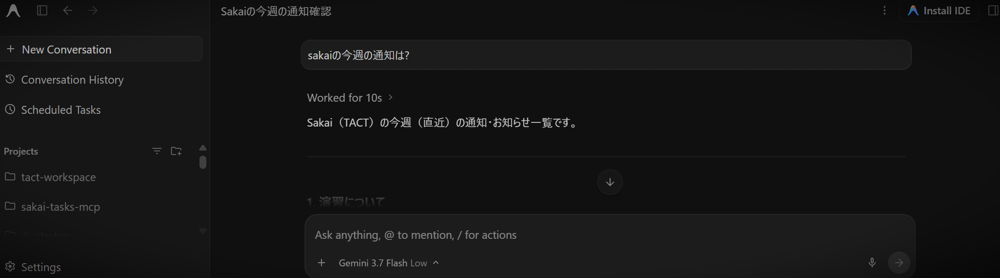

# Sakai Tasks MCP

大学の Sakai LMS と AI をつなぐ MCP サーバ



[Web サイト版ガイドはこちら](https://project-sakai-mcp.github.io/sakai-tasks-mcp/release/)

---

## 概要

**Sakai Tasks MCP** は、大学で利用されている Sakai LMS（京都大学 PandA、名古屋大学 TACT など）から、通知や課題の締め切り、講義資料などを取得し、Claude Desktop や Cursor などの AI アシスタントと連携するための MCP (Model Context Protocol) サーバーです。

「今週の課題の締切は？」「重要なお知らせはある？」「講義資料をダウンロードして」と AI に話しかけたら Sakai 上の情報を取得できるようにします。

---

## 機能

AI が呼び出せる MCP ツール一覧です。

| ツール名 | 説明 |
| :--- | :--- |
| `get_upcoming_deadlines` | 締切がある課題・小テストを取得し、期限順に整理して返します。 |
| `get_course_dashboard` | 指定した講義の状況（課題、小テスト、直近のお知らせ、授業資料）を取得します。 |
| `get_announcements` | 通知を取得します。 |
| `get_assignments` | 課題の一覧または詳細（提出期限、指示文、添付資料など）を取得します。 |
| `get_quizzes` | 小テスト・オンラインクイズの一覧や締切情報を取得します。 |
| `get_calendar_events` | カレンダーに登録されたスケジュールやイベント予定を取得します。 |
| `get_course_materials` | 講義の配布資料リンク・フォルダ一覧を取得します。 |
| `download_material` | 講義資料や添付ファイルを指定のローカルフォルダにダウンロードします。 |
| `list_courses` | 所属している講義一覧と講義IDを取得します。 |
| `open_settings` | 大学ドメインの変更や講義ごとの情報開示ポリシーなどを設定する GUI 画面を起動します。 |
| `check_auth_status` | 大学ポータルのログインセッションが有効かどうかを確認します。 |

---

## Windows インストール

[Windows 版 圧縮ファイルをダウンロード](https://github.com/project-sakai-mcp/sakai-tasks-mcp/releases/latest/download/sakai-tasks-mcp-windows.zip)

### セットアップ手順

1. ダウンロードした ZIP ファイルを任意のフォルダ（例: `C:\tools` など）に解凍します。
2. お使いの AI アプリ（Claude Desktop, Cursor 等）の MCP 設定に、解凍先フォルダ内の `run.bat` のパスを登録します。
   - 実行ファイルのパス例: `C:\tools\sakai-tasks-mcp-windows\run.bat`
   - **AI に設定ファイルへの追記を依頼する場合のプロンプト例:**
     ```text
     あなたのMCP設定ファイルに、以下のMCPサーバーを追加してください。
     名前: sakai-tasks
     コマンド: C:\tools\sakai-tasks-mcp-windows\run.bat
     ```
3. AI アプリを再起動します。
4. AI のチャット欄で「**初期設定を開いて**」と指示します。
5. 設定画面が開いたら、所属大学のドメイン（例: `tact.ac.thers.ac.jp` や `panda.ecs.kyoto-u.ac.jp` 等）を登録し、「保存して閉じる」を押します。

---

## macOS インストール

[macOS 版 圧縮ファイルをダウンロード](https://github.com/project-sakai-mcp/sakai-tasks-mcp/releases/latest/download/sakai-tasks-mcp-macos.tar.gz)

### セットアップ手順

1. ダウンロードしたアーカイブ（`.tar.gz`）を任意のフォルダ（例: `/Users/username/tools` や `~/tools` など）に展開（解凍）します。
2. お使いの AI アプリ（Claude Desktop, Cursor 等）の MCP 設定に、解凍先フォルダ内の `run.sh` のパスを登録します。
   - 実行ファイルのパス例: `/Users/username/tools/sakai-tasks-mcp-macos/run.sh`
   - **AI に設定ファイルへの追記を依頼する場合のプロンプト例:**
     ```text
     あなたのMCP設定ファイルに、以下のMCPサーバーを追加してください。
     名前: sakai-tasks
     コマンド: /Users/username/tools/sakai-tasks-mcp-macos/run.sh
     ```
3. AI アプリを再起動します。
4. AI のチャット欄で「**初期設定を開いて**」と指示します。
5. 設定画面が開いたら、所属大学のドメイン（例: `tact.ac.thers.ac.jp` や `panda.ecs.kyoto-u.ac.jp` 等）を登録し、「保存して閉じる」を押します。

---

## 📚 ドキュメント & 開発者向け情報

- **[全体設計書 (`docs/architecture.md`)](docs/architecture.md)** / **[Web 版](https://project-sakai-mcp.github.io/sakai-tasks-mcp/)**
- **[開発者ガイド (`docs/guide.md`)](docs/guide.md)**
- **[Sakai API リファレンス (`docs/sakai_api_reference.md`)](docs/sakai_api_reference.md)**
- **[認証・セッション仕様書 (`docs/auth_and_session_spec.md`)](docs/auth_and_session_spec.md)**
