# Sakai-Tasks-MCP アーキテクチャ設計書

本ドキュメントは、Sakai LMS 連携 MCP サーバー `sakai-tasks-mcp` の全体アーキテクチャ、内部レイヤ構造、データモデル、各モジュールの詳細仕様、セキュリティポリシー、およびユーザー設定 GUI の設計仕様を定義するものです。

---

## 目次 (Table of Contents)

- [1. 全体アーキテクチャ & データフロー](#1-全体アーキテクチャ--データフロー)
  - [1.1 システム概要 & 目的](#11-システム概要--目的)
  - [1.2 全体レイヤ構造と責務](#12-全体レイヤ構造と責務)
  - [1.3 代表的なエンドツーエンド・データフロー](#13-代表的なエンドツーエンドデータフロー)
  - [1.4 主要アーキテクチャ設計原則](#14-主要アーキテクチャ設計原則)
- [2. ディレクトリ構成 & ファイル責務](#2-ディレクトリ構成--ファイル責務)
- [3. 共通データモデル定義 (`src/models.py`)](#3-共通データモデル定義-srcmodelspy)
  - [3.1 データモデル設計方針](#31-データモデル設計方針)
  - [3.2 Pydantic モデル完全定義](#32-pydantic-モデル完全定義)
- [4. モジュール別詳細設計 & 公開インターフェース](#4-モジュール別詳細設計--公開インターフェース)
  - [4.1 認証・セッション管理モジュール (`src/auth/`)](#41-認証セッション管理モジュール-srcauth)
    - [4.1.1 公開インターフェース (`src/auth/__init__.py`)](#411-公開インターフェース-srcauth__init__py)
    - [4.1.2 セッションオーケストレーター (`src/auth/session_manager.py`)](#412-セッションオーケストレーター-srcauthsession_managerpy)
    - [4.1.3 セッション有効性チェッカー (`src/auth/session_checker.py`)](#413-セッション有効性チェッカー-srcauthsession_checkerpy)
    - [4.1.4 Cookie ストレージ管理 (`src/auth/cookie_storage.py`)](#414-cookie-ストレージ管理-srcauthcookie_storagepy)
    - [4.1.5 WebView 認証ハンドラー (`src/auth/webview_auth.py`)](#415-webview-認証ハンドラー-srcauthwebview_authpy)
  - [4.2 Sakai REST API クライアント & パーサー (`src/client/`)](#42-sakai-rest-api-クライアント--パーサー-srcclient)
    - [4.2.1 公開インターフェース (`src/client/__init__.py`)](#421-公開インターフェース-srcclient__init__py)
    - [4.2.2 Sakai API クライアント本体 (`src/client/sakai_client.py`)](#422-sakai-api-クライアント本体-srcclientsakai_clientpy)
    - [4.2.3 API エンドポイント定数 (`src/client/endpoints.py`)](#423-api-エンドポイント定数-srcclientendpointspy)
    - [4.2.4 パーサー基底・共通処理 (`src/client/parsers/base.py`)](#424-パーサー基底共通処理-srcclientparsersbasepy)
    - [4.2.5 お気に入り講義パーサー (`src/client/parsers/favorite_parser.py`)](#425-お気に入り講義パーサー-srcclientparsersfavorite_parserpy)
    - [4.2.6 講義一覧パーサー (`src/client/parsers/course_parser.py`)](#426-講義一覧パーサー-srcclientparserscourse_parserpy)
    - [4.2.7 課題パーサー (`src/client/parsers/assignment_parser.py`)](#427-課題パーサー-srcclientparsersassignment_parserpy)
    - [4.2.8 テスト・クイズパーサー (`src/client/parsers/quiz_parser.py`)](#428-テストクイズパーサー-srcclientparsersquiz_parserpy)
    - [4.2.9 お知らせパーサー (`src/client/parsers/announcement_parser.py`)](#429-お知らせパーサー-srcclientparsersannouncement_parserpy)
    - [4.2.10 カレンダーパーサー (`src/client/parsers/calendar_parser.py`)](#4210-カレンダーパーサー-srcclientparserscalendar_parserpy)
    - [4.2.11 講義資料・配布ファイルパーサー (`src/client/parsers/content_parser.py`)](#4211-講義資料配布ファイルパーサー-srcclientparserscontent_parserpy)
- [5. MCP サーバー & ツール仕様 (`src/server.py`, `src/policy/`)](#5-mcp-サーバー--ツール仕様-srcserverpy-srcpolicy)
  - [5.1 MCP サーバー設計方針](#51-mcp-サーバー設計方針)
  - [5.2 要求される MCP ツール一覧 & ポリシー適用対応](#52-要求される-mcp-ツール一覧--ポリシー適用対応)
  - [5.3 サーバーエントリポイント (`src/server.py: main()`)](#53-サーバーエントリポイント-srcserverpy-main)
  - [5.4 講義別 AI 利用ポリシーフィルタ (`src/policy/policy_filter.py`)](#54-講義別-ai-利用ポリシーフィルタ-srcpolicypolicy_filterpy)
  - [5.5 ツール実装における工夫・設計推奨事項 (Guidance)](#55-ツール実装における工夫設計推奨事項-guidance)
- [6. 設定管理 & ユーザー設定 GUI (`src/config.py`, `src/gui/`)](#6-設定管理--ユーザー設定-gui-srcconfigpy-srcgui)
  - [6.1 設定管理モジュール (`src/config.py`)](#61-設定管理モジュール-srcconfigpy)
  - [6.2 ユーザー設定 GUI モジュール群 (`src/gui/`)](#62-ユーザー設定-gui-モジュール群-srcgui)
    - [6.2.1 UI データ構築モジュール (`src/gui/data_builder.py`)](#621-ui-データ構築モジュール-srcguidata_builderpy)
    - [6.2.2 JS 通信ブリッジモジュール (`src/gui/api.py`)](#622-js-通信ブリッジモジュール-srcguiapipy)
    - [6.2.3 ウィンドウ起動制御モジュール (`src/gui/settings_window.py`)](#623-ウィンドウ起動制御モジュール-srcguisettings_windowpy)
    - [6.2.4 設定 GUI 画面 UI 要件一覧](#624-設定-gui-画面-ui-要件一覧)
    - [6.2.5 設定 GUI 画面 UI イメージテキスト図](#625-設定-gui-画面-ui-イメージテキスト図)
- [7. ポータブルパッケージ配布 & テスト方針](#7-ポータブルパッケージ配布--テスト方針)
  - [7.1 配布パッケージング仕様 (Portable Python Distribution)](#71-配布パッケージング仕様-portable-python-distribution)
  - [7.2 AI クライアント設定 & 登録仕様 (MCP Client Configuration)](#72-ai-クライアント設定--登録仕様-mcp-client-configuration)
  - [7.3 テスト自動化方針 (Testing Strategy)](#73-テスト自動化方針-testing-strategy)

---

## 1. 全体アーキテクチャ & データフロー

### 1.1 システム概要 & 目的

`sakai-tasks-mcp` は、大学等の教育機関で広く利用されている LMS（Learning Management System）**「Sakai」** から、課題・小テスト・お知らせ・講義資料などのタスク情報を安全に取得し、**Model Context Protocol (MCP)** を通じて AI アシスタント（Claude Desktop, Cursor, エージェント等）に提供するデスクトップ MCP サーバーです。

本システムは、学生が Python の事前インストールなしで即座に利用できるよう、ポータブル Python ランタイム（Windows: Embeddable Python / macOS: python-build-standalone）を同梱したパッケージとして配布されます。AI クライアントがサブプロセスとして本サーバーを起動し、標準入出力（stdio）を介してオンデマンドに JSON-RPC 通信を行います。常駐プロセスやバックグラウンドサービスを必要としません。

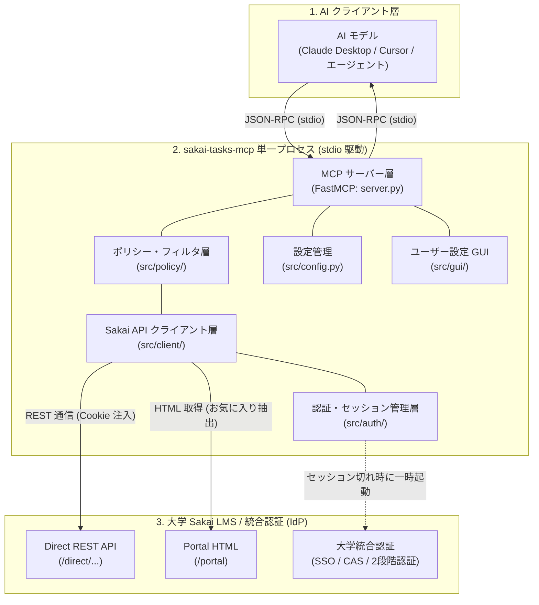

---

### 1.2 全体レイヤ構造と責務

本システムは、高凝集・疎結合な 6 つのレイヤで構成されています。

| レイヤ / モジュール | 主要ファイル | 主要な責務 |
| :--- | :--- | :--- |
| **① MCP サーバー層** | `src/server.py` | - FastMCP による stdio JSON-RPC 通信の受付・ルーティング。<br/>- CLI 引数処理、サーバーエントリポイント（`main`）。<br/>- 各ツールの入出力ハンドリングとポリシーフィルタ呼び出し。 |
| **② ポリシー・フィルタ層** | `src/policy/policy_filter.py` | - 講義ごとの AI 利用権限（`ALLOW_ALL`, `TEXT_ONLY`, `SCHEDULE_ONLY`, `BLOCKED`）に応じたデータマスキング・除外純粋関数群。<br/>- ファイルダウンロード可否のバリデーション。 |
| **③ API クライアント層** | `src/client/sakai_client.py`<br/>`src/client/parsers/` | - Sakai Direct REST API および `/portal` HTML の非同期 HTTP 通信（`httpx`）。<br/>- 各種レスポンスを共通 Pydantic モデルへ変換・正規化するパーサー群。 |
| **④ 認証・セッション層** | `src/auth/session_manager.py`<br/>`src/auth/webview_auth.py`<br/>`src/auth/cookie_storage.py` | - `Fernet` + `keyring` による Cookie の暗号化保存・読込。<br/>- `/session/current.json` によるセッション有効性判定（`userEid` 検査）。<br/>- `pywebview`（Edge WebView2）による自動素通り / 手動 SSO 認証ポップアップ。 |
| **⑤ 設定 & GUI 層** | `src/config.py`<br/>`src/gui/` | - `config.json` の管理・実行中同期（`platformdirs`）。<br/>- 設定画面（`settings_window.py`）用のデータ構築（`data_builder.py`）および JS ブリッジ（`api.py`）。 |
| **⑥ 共通データモデル層** | `src/models.py` | - システム全体で共通利用される型安全な Pydantic データモデル定義（`SakaiTask`, `CourseSite`, `Announcement` 等）。 |

---

### 1.3 代表的なエンドツーエンド・データフロー

#### シナリオ 1: 課題・直近締切の取得フロー (通常リクエスト)

学生が AI に「今週締切の課題はある？」と尋ねた場合のデータフローです。

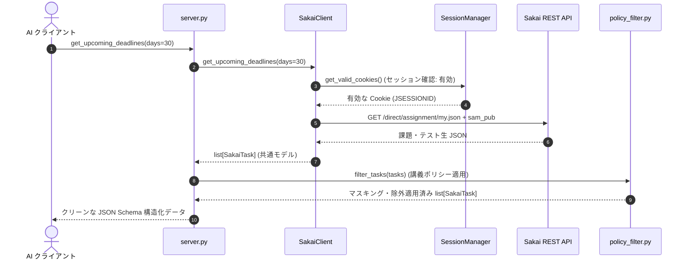

---

#### シナリオ 2: セッション失効時のオンデマンド認証フロー (On-demand Auth)

Cookie の有効期限（24時間スライディングタイムアウト等）が切れていた場合のデータフローです。

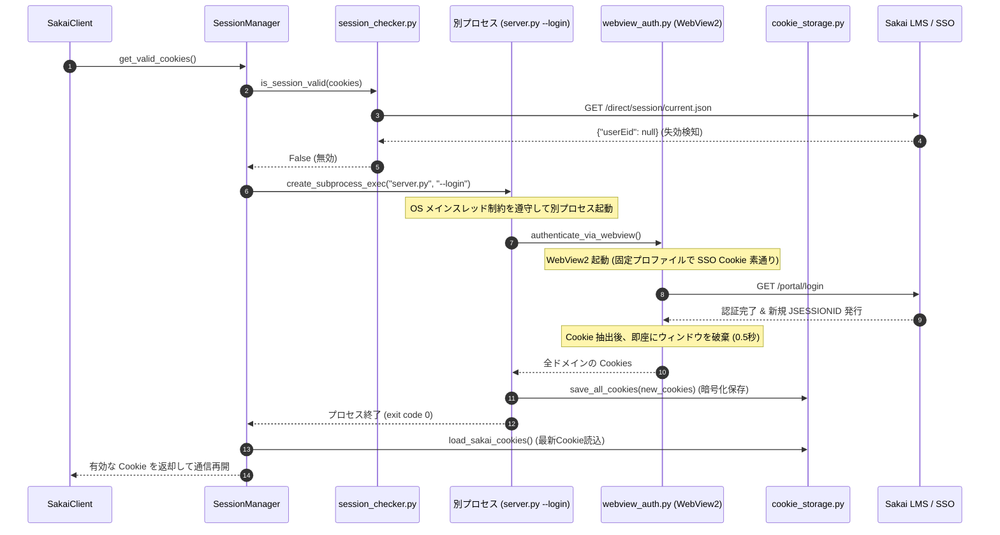

---

#### シナリオ 3: ユーザー設定変更フロー (GUI Interaction)

AI または CLI から設定画面を起動し、講義別ポリシーを変更するデータフローです。

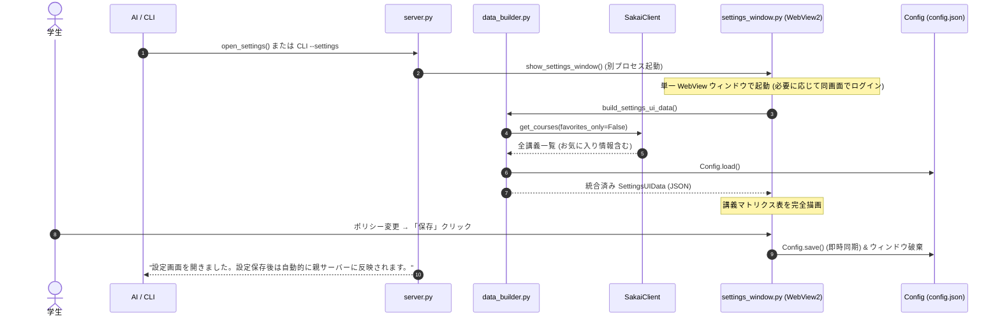

---

### 1.4 主要アーキテクチャ設計原則

1. **標準入出力 (stdio) の厳格な保護**:
   * MCP プロトコルは標準入出力を通信チャネルとして利用するため、`print()` や不要な stdout への出力は**厳禁**とします。すべてのログ、デバッグ情報、エラーメッセージは `sys.stderr` または `logging`（stderr ハンドラ）に出力します。
2. **セキュア・バイ・デフォルト (Secure by Default)**:
   * 講義別の AI 利用権限は、未設定・新規講義においてすべて **「強（`TEXT_ONLY`: ファイルDL禁止）」** をデフォルトとし、教員の講義資料ファイルが意図せず外部 AI に送信されるリスクを根本から防ぎます。
3. **高凝集・疎結合 & 純粋関数設計**:
   * レスポンスのパース（`parsers/`）、セキュリティフィルタ（`policy_filter.py`）、および UI データ構築（`data_builder.py`）は、外部状態や GUI に依存しない純粋関数として実装し、単体テストカバレッジを極限まで高めます。
4. **ゼロ・インストール配布 (Zero Dependency for Students)**:
   * Python 環境や Node.js を持たない学生でも、配布パッケージ（ZIP）を展開して設定ファイルにパスを追記するだけで即座に利用できる、公式ポータブル Python ランタイム同梱による安全なゼロ・セットアップ配布を前提とします。

---

## 2. ディレクトリ構成 & ファイル責務

```text
sakai-tasks-mcp/
├── docs/
│   ├── architecture.md                   # 本書（全体設計書・インターフェース仕様）
│   ├── guide.md                          # 開発者向けガイド＆ユースケース
│   ├── auth_and_session_spec.md          # 認証・セッション・Cookie仕様書
│   └── sakai_api_reference.md            # Sakai Direct REST API 完全リファレンス
├── src/
│   ├── __init__.py
│   ├── config.py                         # ホスト名、ファイルパス、定数、設定管理 (Config)
│   ├── models.py                         # 全体で利用する共通 Pydantic データモデル
│   ├── auth/                             # 【認証担当】pywebview と Cookie 管理
│   │   ├── __init__.py                   # get_valid_cookies 等の公開関数 export
│   │   ├── session_manager.py            # 認証全体のオーケストレーター (メイン)
│   │   ├── session_checker.py            # セッション有効性判定 (REST API / userEid 検査)
│   │   ├── cookie_storage.py             # Cookie のローカル暗号化保存・読込
│   │   └── webview_auth.py               # WebView2 によるログイン画面表示・Cookie 抽出
│   ├── client/                           # 【API担当】Sakai Direct REST API 通信
│   │   ├── __init__.py                   # SakaiClient の export
│   │   ├── sakai_client.py               # Sakai API クライアント本体 (httpx 非同期通信)
│   │   ├── endpoints.py                  # Sakai API エンドポイント URL 定義
│   │   └── parsers/                      # 各種 API / HTML レスポンスのパース・正規化関数
│   │       ├── __init__.py               # 各パーサー関数の export
│   │       ├── base.py                   # 日時変換 (秒/ミリ秒)・HTML タグ除去等の共通処理
│   │       ├── course_parser.py          # 講義一覧 API (/direct/site.json) レスポンス処理
│   │       ├── favorite_parser.py        # お気に入り講義 (/portal HTML の DOM) 抽出処理
│   │       ├── assignment_parser.py      # 課題一覧・詳細指示文レスポンス処理
│   │       ├── quiz_parser.py            # テスト・小テスト (sam_pub) レスポンス処理
│   │       ├── announcement_parser.py    # お知らせ (announcement) レスポンス処理
│   │       ├── calendar_parser.py        # カレンダー予定 (calendar) レスポンス処理
│   │       └── content_parser.py         # 講義資料・配布ファイル (content) レスポンス処理
│   ├── policy/                           # 【ポリシー担当】講義別 AI 利用権限に基づくデータマスキング
│   │   ├── __init__.py                   # filter_* 関数の export
│   │   └── policy_filter.py              # マスキング・除外純粋関数群 (filter_tasks 等)
│   ├── gui/                              # 【GUI担当】ユーザー設定用デスクトップ画面 (pywebview)
│   │   ├── __init__.py                   # show_settings_window 等の export
│   │   ├── settings_window.py            # pywebview ウィンドウ起動制御 (単一ウィンドウ)
│   │   ├── data_builder.py               # Sakai 講義取得 + Config マージ (SettingsUIData 構築)
│   │   ├── api.py                        # JS ↔ Python 連携ブリッジ (SettingsApi: 保存・返却)
│   │   └── templates/                    # 設定画面用 HTML/CSS/JS アセット
│   │       ├── settings.html             # 詳細設定画面 UI
│   │       └── initial_setup.html        # 初回大学プリセット選択画面 UI
│   └── server.py                         # 【MCP担当】FastMCP サーバー定義・ツール公開
├── tests/
│   ├── test_models.py                    # Pydantic モデルのバリデーションテスト
│   ├── test_policy_filter.py             # ポリシー別マスキング・除外ルールの単体テスト
│   ├── test_parsers.py                   # 各 API レスポンスのパース単体テスト
│   ├── test_gui_data_builder.py          # GUI データマージ・ソートの単体テスト
│   ├── test_cookie_storage.py            # Cookie 暗号化・復元の単体テスト
│   └── test_server.py                    # MCP サーバー結合テスト (stdio 経由)
├── scripts/                              # 【配布・ビルド担当】パッケージング＆ランチャー
│   ├── build_windows.py                  # Windows 用 Embeddable Python パッケージ作成
│   ├── build_macos.py                    # macOS 用 python-build-standalone パッケージ作成
│   ├── build_pyinstaller.py              # テスト用 PyInstaller 単一 exe ビルド
│   ├── run.bat                           # Windows 用 MCP 起動スクリプト (stdio 中継)
│   └── run.sh                            # macOS/Linux 用 MCP 起動スクリプト (stdio 中継)
├── requirements.txt                      # 依存パッケージ定義
├── AGENTS.md                             # AI・開発者向けコンテキスト共有
└── README.md                             # プロジェクト概要
```

---

## 3. 共通データモデル (`src/models.py`)

本モジュールは、Sakai Direct REST API および `/portal` HTML からパースされた各種データを正規化し、システム全体（クライアント、パーサー、FastMCP サーバー）および AI クライアント（Claude Desktop / Cursor 等）に対して提供する **単一のデータ定義源（Single Source of Truth）** です。

* **Pydantic v2 準拠**: 高速なバリデーションと厳格な型安全性を確保。
* **AI 親和性**: すべてのフィールドに明確な `Field(description="...")` を付与し、MCP プロトコル経由で AI が各項目の意味を正確に解釈できるように設計。
* **防御的設計**: 将来の Sakai バージョンアップに伴うフィールド追加に対応するため、`extra="ignore"` を基本方針とします。

---

### 3.1 データモデル関係図 (Mermaid クラス図)

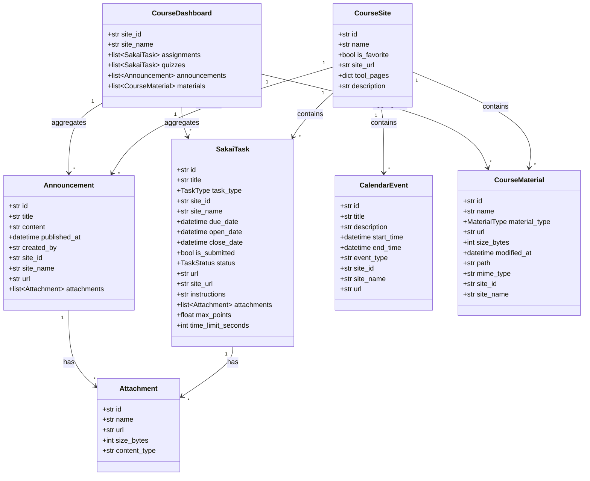

---

### 3.2 列挙型定義 (`Enum`)

タスクの種別および提出状態を表す標準列挙型です。

```python
from enum import Enum


class TaskType(str, Enum):
    """タスク種別"""
    ASSIGNMENT = "assignment"  # 通常の提出課題 (/direct/assignment)
    QUIZ = "quiz"              # 小テスト・オンラインテスト (/direct/sam_pub)


class TaskStatus(str, Enum):
    """タスクの進行状態"""
    OPEN = "open"              # 受付中 (未提出)
    SUBMITTED = "submitted"    # 提出済み
    CLOSED = "closed"          # 締切終了


class MaterialType(str, Enum):
    """授業資料アイテム種別"""
    FILE = "file"              # ダウンロード可能なファイル
    FOLDER = "folder"          # フォルダ (コレクション)
```

---

### 3.3 コアエンティティモデル定義 (Pydantic v2)

```python
from datetime import datetime
from pydantic import BaseModel, ConfigDict, Field


class BaseModelConfig(BaseModel):
    """全モデル共通の基底クラス (防御的パースと日時シリアライズ設定)"""
    model_config = ConfigDict(
        extra="ignore",            # 未知のフィールドを無視して安全にパース
        populate_by_name=True,    # エイリアス名での代入を許容
        use_enum_values=True      # JSON 出力時に Enum 値 (文字列) を直接出力
    )

#AIへの仕様理解のためField()を使う。

class Attachment(BaseModelConfig):
    """課題やお知らせに添付されたファイル情報"""
    id: str = Field(description="添付ファイル ID")
    name: str = Field(description="ファイル名 (拡張子含む)")
    url: str | None = Field(default=None, description="ダウンロード用 URL (TEXT_ONLY / SCHEDULE_ONLY 時は None にマスク)")
    size_bytes: int | None = Field(default=None, description="ファイルサイズ (バイト単位)")
    content_type: str | None = Field(default=None, description="MIME タイプ (例: application/pdf)")


class CourseSite(BaseModelConfig):
    """履修・所属している講義サイト情報"""
    id: str = Field(description="講義サイト ID (例: 2024_01_1234567)")
    name: str = Field(description="講義名 / サイトタイトル")
    is_favorite: bool = Field(default=False, description="トップバーにお気に入り登録されているか")
    site_url: str | None = Field(default=None, description="Sakai ポータル上の講義トップページ URL")
    tool_pages: dict[str, str] = Field(
        default_factory=dict,
        description="講義内の各ツールへの直通 URL マッピング (例: {'assignment': '...', 'quiz': '...', 'resource': '...'})"
    )
    description: str | None = Field(default=None, description="講義の説明文 / シラバス概要")


class SakaiTask(BaseModelConfig):
    """
    課題および小テストを共通フォーマットで表現する統合タスクモデル。
    AI アシスタントが締切管理や課題解答を行うための中心エンティティ。
    """
    id: str = Field(description="タスク一意 ID (課題 ID または テスト公開 ID)")
    title: str = Field(description="課題 / テストのタイトル")
    task_type: TaskType = Field(description="タスク種別 (assignment / quiz)")
    site_id: str = Field(description="所属する講義サイト ID")
    site_name: str = Field(description="所属する講義名")
    due_date: datetime | None = Field(default=None, description="締切日時 (UTC/JST タイムゾーン付き)")
    open_date: datetime | None = Field(default=None, description="受付開始日時")
    close_date: datetime | None = Field(default=None, description="最終受付終了日時 (遅延提出締切等)")
    is_submitted: bool = Field(default=False, description="提出済みフラグ (※小テストは Sakai SAMIGO API の制約上、学生別の受験完了フラグが取得できないため原則未受験判定となります)")
    status: TaskStatus = Field(default=TaskStatus.OPEN, description="タスク進行状態 (open / submitted / closed)")
    url: str | None = Field(default=None, description="Sakai 上の課題/テスト直通 Web 画面 URL")
    site_url: str | None = Field(default=None, description="所属講義トップページ URL")
    instructions: str | None = Field(default=None, description="課題の指示文 / テストの説明 (HTML 除去済みテキスト)")
    attachments: list[Attachment] = Field(default_factory=list, description="課題に付属する添付ファイル一覧")
    max_points: float | None = Field(default=None, description="満点配点 (設定されている場合)")
    time_limit_seconds: int | None = Field(default=None, description="制限時間秒数 (小テスト等の場合)")


class Announcement(BaseModelConfig):
    """講義またはシステムからのお知らせ・連絡事項"""
    id: str = Field(description="お知らせ ID")
    title: str = Field(description="お知らせタイトル")
    content: str | None = Field(default=None, description="お知らせ本文 (HTML 除去済みテキスト)")
    published_at: datetime | None = Field(default=None, description="公開日時")
    created_by: str | None = Field(default=None, description="発信者名 (教員名等)")
    site_id: str = Field(description="所属する講義サイト ID")
    site_name: str = Field(description="所属する講義名")
    url: str | None = Field(default=None, description="Sakai 上のお知らせ直通 Web 画面 URL")
    attachments: list[Attachment] = Field(default_factory=list, description="お知らせに添付されたファイル一覧")


class CalendarEvent(BaseModelConfig):
    """カレンダーに登録されたスケジュール・講義イベント"""
    id: str = Field(description="カレンダーイベント ID")
    title: str = Field(description="イベントタイトル")
    description: str | None = Field(default=None, description="イベント説明")
    start_time: datetime | None = Field(default=None, description="開始日時")
    end_time: datetime | None = Field(default=None, description="終了日時")
    event_type: str | None = Field(default=None, description="イベント種別 (例: Assignment, Quiz, Academic Calendar)")
    site_id: str | None = Field(default=None, description="所属する講義サイト ID (全学共通行事・祝日等の場合は None)")
    site_name: str | None = Field(default=None, description="所属する講義名")
    url: str | None = Field(default=None, description="Sakai 上のカレンダー直通 URL")


class CourseMaterial(BaseModelConfig):
    """講義サイト内の授業資料・配布ファイル・フォルダ情報"""
    id: str = Field(description="リソース ID (相対パス形式 /group/site_id/...)")
    name: str = Field(description="ファイル名またはフォルダ名")
    material_type: MaterialType = Field(default=MaterialType.FILE, description="資料種別 (file / folder)")
    is_collection: bool = Field(default=False, description="フォルダ (コレクション) であるか")
    url: str | None = Field(default=None, description="ダウンロード URL (Cookie 認証必須)")
    size_bytes: int | None = Field(default=None, description="ファイルサイズ (バイト単位)")
    modified_at: datetime | None = Field(default=None, description="最終更新日時")
    path: str | None = Field(default=None, description="フォルダ階層パス (例: /第1回講義資料/スライド.pdf)")
    mime_type: str | None = Field(default=None, description="MIME タイプ")
    site_id: str = Field(description="所属する講義サイト ID")
    site_name: str | None = Field(default=None, description="所属する講義名")


class CourseDashboard(BaseModelConfig):
    """特定講義の状況を一括集約した総合サマリーモデル"""
    site_id: str = Field(description="講義サイト ID")
    site_name: str = Field(description="講義名")
    assignments: list[SakaiTask] = Field(default_factory=list, description="未提出・提出済みの課題一覧")
    quizzes: list[SakaiTask] = Field(default_factory=list, description="小テスト・オンラインテスト一覧")
    announcements: list[Announcement] = Field(default_factory=list, description="直近のお知らせ一覧")
    materials: list[CourseMaterial] = Field(default_factory=list, description="授業資料・配布ファイル一覧")
```

---

### 3.4 Pydantic v2 の設計方針 & シリアライズ仕様

1. **タイムゾーン付き標準日時シリアライズ (ISO 8601)**:
   * `datetime` 型フィールドは、Pydantic v2 標準の ISO 8601 文字列（例: `2024-10-15T23:59:00+09:00` または UTC `2024-10-15T14:59:00Z`）として JSON シリアライズされます。
   * AI クライアント（Claude / Cursor）は ISO 8601 文字列を受け取ることで、時差や日付計算（「締切まであと何時間か」）を極めて高精度に行うことができます。
2. **未知フィールドに対する寛容なパース (`extra="ignore"`)**:
   * Sakai Direct REST API は大学の Sakai バージョン（19, 20, 21, 23 等）やプラグイン構成によってレスポンス JSON のフィールドが増減することがあります。
   * 全モデルの基底クラス `BaseModelConfig` で `extra="ignore"` を明示することで、未定義の拡張フィールドが存在しても実行時エラーにならず、安全に必要項目のみを抽出します。
3. **Enum の自動値展開 (`use_enum_values=True`)**:
   * `TaskType.ASSIGNMENT` などの Enum は、MCP JSON 出力時に自動的に文字列 `"assignment"` として展開されるため、呼び出し側の JSON シリアライザで余計な変換処理を挟む必要がありません。

---

## 4. モジュール別詳細設計 & 公開インターフェース

---

### 4.1 認証・セッション管理モジュール (`src/auth/`)

本モジュールは、外部（`client` や `server`）に対して内部の認証詳細（OS 標準 WebView の制御、IdP リダイレクト、Cookie ストレージ等）を完全に隠蔽（カプセル化）し、**「常に有効な Sakai Cookie 辞書をオンデマンドで取得・提供する」** 責務を担います。

* **完全カプセル化**: 呼び出し側は `get_valid_cookies()` を呼ぶだけでよく、セッションの有効期限切れや再ログインの有無を意識する必要がありません。
* **高速自動素通り**: OS 備え付けの WebView で永続プロファイルを利用し、大学 IdP のログイン記憶（Cookie）を活かして通常時は画面を出さずにバックグラウンドで自動再認証（約0.5秒）を完了します。
* **明確な責務分離**: 「ストレージ保存」「APIセッション判定」「WebView認証」「調停（オーケストレーション）」の 4 つの単機能に分解し、高いテスト容易性と保守性を確保しています。

---

#### 4.1.1 公開インターフェース (`src/auth/__init__.py`)

* **役割**: `src/auth` パッケージの外部（`client` や `server`）に対する公開窓口（Facade）。内部モジュールの詳細を隠蔽し、必要な関数のみを export する。

##### 公開関数定義

```python
from src.auth.session_manager import clear_session, get_valid_cookies, refresh_session

__all__ = [
    "get_valid_cookies",
    "refresh_session",
    "clear_session",
]
```

#### 4.1.2 セッションオーケストレーター (`src/auth/session_manager.py`)

* **役割**: `cookie_storage`（保存/読込）、`session_checker`（検証）、`webview_auth`（再認証）を統括し、外部に対して**「常に有効な Cookie 辞書を提供する」** 認証全体の司令塔。
* **使用技術**: `asyncio`, `time`, `sys`

##### 関数インターフェース & 実装設計

```python
import asyncio
import sys
import time
from src.config import Config
from src.auth import cookie_storage, session_checker

SESSION_CACHE_TTL: float = 300.0  # インメモリキャッシュ有効期間 (5分間)

_auth_lock: asyncio.Lock | None = None
_cached_sakai_cookies: dict[str, dict[str, str]] = {}  # host -> cookies
_last_auth_success_times: dict[str, float] = {}       # host -> timestamp
_last_auth_error_times: dict[str, float] = {}         # host -> timestamp


def _get_auth_lock() -> asyncio.Lock:
    """イベントループバインド事故を防ぐ遅延ロック生成"""
    global _auth_lock
    if _auth_lock is None:
        _auth_lock = asyncio.Lock()
    return _auth_lock


async def get_valid_cookies(
    force_refresh: bool = False,
    host: str = Config.SAKAI_HOST
) -> dict[str, str]:
    """
    有効な Sakai Cookie 辞書を取得する。
    Fast Path キャッシュ判定と Double-Checked Locking により、並行リクエスト時の多重通信と WebView 重複起動を防止する。

    Args:
        force_refresh: キャッシュを無視して強制的に再ログインを行うか
        host: Sakai ホスト名 (デフォルト: Config.SAKAI_HOST)

    Returns:
        dict[str, str]: 有効な Cookie 辞書 (例: {"SAKAI2SESSIONID": "..."})

    Raises:
        RuntimeError: ユーザーがログインウィンドウを閉じる等して認証に失敗した場合
    """
    global _cached_sakai_cookies, _last_auth_success_times, _last_auth_error_times

    # 1. ロック外判定 (Fast Path):
    #    通常時、ホスト別キャッシュが有効期間内 (SESSION_CACHE_TTL) ならロック待機なしで即返却 (0ms)
    now = time.monotonic()
    if not force_refresh and host in _cached_sakai_cookies:
        if now - _last_auth_success_times.get(host, 0.0) < SESSION_CACHE_TTL:
            return _cached_sakai_cookies[host]

    # 2. 排他ロック取得
    async with _get_auth_lock():
        now = time.monotonic()

        # 失敗直後のクールダウン判定 (キャンセル時の画面連打防止)
        if now - _last_auth_error_times.get(host, 0.0) < Config.AUTH_COOLDOWN_SECONDS:
            raise RuntimeError("直前のログイン認証がキャンセルまたは失敗したため、クールダウン中です。")

        # ダブルチェック (先行タスクが待機中に検証・更新を完了したか？)
        if not force_refresh and host in _cached_sakai_cookies:
            if now - _last_auth_success_times.get(host, 0.0) < SESSION_CACHE_TTL:
                return _cached_sakai_cookies[host]

        # 3. 通常時: 保存済み Cookie の検証 (先行タスクのみが 1 回実行)
        if not force_refresh:
            cookies = cookie_storage.load_sakai_cookies(host=host)
            if cookies and await session_checker.is_session_valid(cookies, host=host):
                _cached_sakai_cookies[host] = cookies
                _last_auth_success_times[host] = time.monotonic()
                return cookies

        # 4. セッション切れ / 初回 / force_refresh 時: 別プロセスとして WebView ログインを実行 (先行タスクのみが 1 回実行)
        # OS の GUI メインスレッド制約を遵守し、MCP stdio 通信ループを保護するため別プロセスとして起動
        if getattr(sys, "frozen", False):
            # PyInstaller 単一バイナリ実行時
            cmd = [sys.executable, "--login", "--host", host]
        else:
            cmd = [sys.executable, sys.argv[0], "--login", "--host", host]

        proc = await asyncio.create_subprocess_exec(
            *cmd,
            stdout=asyncio.subprocess.DEVNULL,
            stderr=asyncio.subprocess.DEVNULL
        )
        returncode = await proc.wait()

        # 認証キャンセルまたは失敗時 (戻り値 != 0)
        if returncode != 0:
            _last_auth_error_times[host] = time.monotonic()
            raise RuntimeError("ログインウィンドウが閉じられたか、認証に失敗しました。")

        # 別プロセスが暗号化保存した新 Cookie の読込とキャッシュ更新
        cookies = cookie_storage.load_sakai_cookies(host=host)
        if not cookies:
            _last_auth_error_times[host] = time.monotonic()
            raise RuntimeError("Sakai のセッション Cookie を取得できませんでした。")

        _cached_sakai_cookies[host] = cookies
        _last_auth_success_times[host] = time.monotonic()
        return cookies


async def refresh_session(host: str = Config.SAKAI_HOST) -> dict[str, str]:
    """
    強制的に再認証を行い、新しい Cookie を保存して返却する。
    """
    return await get_valid_cookies(force_refresh=True, host=host)


def clear_session(host: str | None = None) -> None:
    """
    インメモリキャッシュおよびディスク暗号化ファイルを破棄する。
    """
    global _cached_sakai_cookies, _last_auth_success_times
    if host:
        _cached_sakai_cookies.pop(host, None)
        _last_auth_success_times.pop(host, None)
    else:
        _cached_sakai_cookies.clear()
        _last_auth_success_times.clear()
    cookie_storage.delete_cookies()
```

##### 処理フロー (Mermaid)

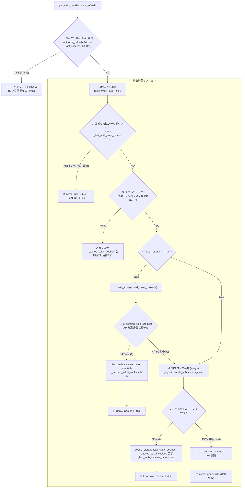

##### 実装上の重要ルール
1. **Fast Path ＋ Double-Checked Locking 最適化**:
   * 通常時はロックを取得せずに 5 分間（`SESSION_CACHE_TTL`）のインメモリキャッシュを即座に返却（0ms）し、不要な API 通信とロック競合を完全に排除する。
   * ロック取得後も再度 TTL 判定を行うことで、先行タスクが検証・更新を完了していれば待機していた後続タスクは追加通信なしで即座に最新 Cookie を取得する。
   * `force_refresh=True` 指定時はキャッシュを迂回し、確実に再認証フローを実行する。
2. **別プロセス起動による OS メインスレッド制約の遵守**:
   * WebView ウィンドウの起動（`webview.start()`）は、OS（Windows / macOS）の厳格なウィンドウシステム制約により「プロセスのメインスレッド」でしか実行できません。
   * ワーカースレッド（`asyncio.to_thread`）からの起動によるクラッシュや、MCP サーバーのメイン asyncio イベントループ（stdio 通信）のフリーズを防ぐため、認証 GUI は必ず `asyncio.create_subprocess_exec(sys.executable, sys.argv[0], "--login", ...)` により **完全に独立した別プロセスのメインスレッド** で実行します。
3. **認証キャンセル・失敗時の連鎖起動防止（クールダウン制御）**:
   * ユーザーがログインウィンドウを「×」で閉じるなどして認証がキャンセルされた場合、`RuntimeError` を送出するとともに `_last_auth_error_time = now` を記録する。
   * 待機中タスクはロック取得直後にクールダウン（3.0 秒以内）を検知して WebView を開かずに即座に同一の例外で終了し、画面の連打起動を防止する。

#### 4.1.3 セッション有効性チェッカー (`src/auth/session_checker.py`)

* **役割**: 与えられた Cookie を使って Sakai のセッション確認 API を叩き、現在ログイン中（`userEid` が存在するか）を判定する（同時にセッションの有効期限も自動延長される）。
* **使用技術**: `httpx.AsyncClient`
* **対象 API URL**: `https://<sakai-host>/direct/session/current.json`

##### 関数インターフェース

```python
from src.config import Config

async def is_session_valid(
    cookies: dict[str, str],
    host: str = Config.SAKAI_HOST,
    timeout: float = Config.SESSION_CHECK_TIMEOUT
) -> bool:
    """
    Cookie を用いて Sakai の /direct/session/current.json にアクセスし、
    セッションが有効であるかを判定する。

    Args:
        cookies: 検証対象の Cookie 辞書 (例: {"SAKAI2SESSIONID": "..."})
        host: Sakai のホスト名 (デフォルト: Config.SAKAI_HOST)
        timeout: リクエストのタイムアウト秒数 (デフォルト: Config.SESSION_CHECK_TIMEOUT)

    Returns:
        bool: userEid が文字列として存在すれば True、null や通信エラー・タイムアウト時は False
    """
    info = await get_session_info(cookies, host=host, timeout=timeout)
    return info is not None


async def get_session_info(
    cookies: dict[str, str],
    host: str = Config.SAKAI_HOST,
    timeout: float = Config.SESSION_CHECK_TIMEOUT
) -> dict[str, Any] | None:
    """
    Sakai の /direct/session/current.json にアクセスし、有効なセッション情報辞書を返却する。
    MCP ツール check_auth_status 等で利用される。

    Returns:
        dict[str, Any] | None: userEid を含むセッション辞書。未ログイン・エラー時は None。
    """
    ...
```

##### 実装上の重要ルール
1. **未認証時の判定基準**:
   * Sakai は未ログイン時でも `HTTP 200 OK` で `{"userEid": null}` を返すため、必ずレスポンス JSON の `data.get("userEid") is not None` で判定する。
2. **エラーハンドリング & タイムアウト**:
   * ネットワーク切断やタイムアウト（`Config.SESSION_CHECK_TIMEOUT` 秒）発生時は、例外で落とさずに安全に `False` / `None` を返す。

#### 4.1.4 Cookie ストレージ管理 (`src/auth/cookie_storage.py`)

* **役割**: WebView から取得した全ドメインの Cookie リストを `Fernet` + `keyring` により安全に暗号化保存・復号し、Sakai API 通信用に Sakai 専用 Cookie を抽出して提供する。
* **使用技術**: `cryptography.fernet.Fernet` (AES-128-CBC + HMAC-SHA256), `keyring` (Windows 資格情報マネージャー / macOS Keychain), `json`, `pathlib.Path`
* **対象プラットフォーム**: Windows / macOS

##### 関数インターフェース

```python
from pathlib import Path
from src.config import Config

def save_all_cookies(cookies: list[dict], file_path: Path = Config.SESSION_FILE_PATH) -> None:
    """
    WebView2 から取得した全ドメイン (Sakai, Shibboleth, Microsoft 等) の Cookie リストを
    JSON 化し、Fernet 共通鍵で暗号化して session.enc に保存する。
    保存時に親ディレクトリ (Config.APP_DATA_DIR) が存在しない場合は自動生成する。

    Args:
        cookies: WebView から取得した Cookie 辞書のリスト
        file_path: 保存先暗号化ファイルパス (デフォルト: Config.SESSION_FILE_PATH)
    """
    ...

def load_all_cookies(file_path: Path = Config.SESSION_FILE_PATH) -> list[dict] | None:
    """
    session.enc を keyring の共通鍵で復号し、全ドメインの Cookie リストを復元する (WebView2 再注入用)。

    Returns:
        list[dict] | None: Cookie 辞書リスト。ファイルが存在しない場合や復号失敗時は None。
    """
    ...

def load_sakai_cookies(
    host: str = Config.SAKAI_HOST,
    file_path: Path = Config.SESSION_FILE_PATH
) -> dict[str, str] | None:
    """
    復号された全 Cookie から Sakai サーバー (host) に必要な Cookie のみを抽出し、
    httpx.AsyncClient 用の辞書形式 (name: value) で返却する。

    Args:
        host: Sakai のホスト名 (例: "tact.ac.thers.ac.jp")
        file_path: 保存先暗号化ファイルパス

    Returns:
        dict[str, str] | None: Sakai 専用 Cookie 辞書 (例: {"SAKAI2SESSIONID": "...", "AWSALB": "..."})
    """
    ...

def delete_cookies(file_path: Path = Config.SESSION_FILE_PATH) -> None:
    """session.enc を削除する（ファイルが存在しない場合もエラーにしない: missing_ok=True）。"""
    ...
```

##### 暗号化 & 保存ファイル仕様 (`Config.SESSION_FILE_PATH`)

* **暗号化アルゴリズム**: `Fernet` (AES-128-CBC + HMAC-SHA256 認証付き暗号)
* **鍵管理 (`keyring`)**:
  * サービス名: `sakai-tasks-mcp`
  * ユーザー名: `fernet_key`
  * 初回実行時に `Fernet.generate_key()` で生成し、OS のセキュアストア（Windows: 資格情報マネージャー / macOS: Keychain）に保存して永続利用。
* **保存ファイル名**: `session.enc` (`Config.SESSION_FILE_PATH`)
* **復号時の JSON データ構造例**:
  ```json
  [
    {
      "name": "SAKAI2SESSIONID",
      "value": "6607aaef-baad-4303-a902-4e57715b5878.t-lms-5",
      "domain": "tact.ac.thers.ac.jp",
      "path": "/",
      "httponly": true,
      "secure": true
    },
    {
      "name": "shib_idp_consent",
      "value": "...",
      "domain": "shib.sys.thers.ac.jp",
      "path": "/idp",
      "httponly": true,
      "secure": true
    },
    {
      "name": "ESTSAUTHPERSISTENT",
      "value": "...",
      "domain": "login.microsoftonline.com",
      "path": "/",
      "httponly": true,
      "secure": true
    }
  ]
  ```

##### 実装上の重要ルール
1. **機密トークンの保護 & HTTP 400 回避 (`load_sakai_cookies`)**:
   * Sakai API（`httpx.AsyncClient`）には、Sakai のホスト名（`host`）に一致・後方一致する Cookie のみを選別して渡します。
   * これにより、Microsoft 等の巨大 Cookie 送信による `HTTP 400 (Request Header / Cookie Too Large)` エラーとトークン漏洩を二重に防止します。
2. **破損・不整合時の自動フォールバック**:
   * 復号エラー（`InvalidToken`）や JSON 破損時は例外でクラッシュさせず、安全に `None` を返して再認証（WebView ログイン）へフォールバックします。

---

#### 4.1.5 WebView 認証ハンドラー (`src/auth/webview_auth.py`)

* **役割**: OS 備え付けの組み込みブラウザエンジン（WebView）を起動し、大学 SSO ログイン画面（`/portal/login`）の認証を経て、全ドメインの有効な Cookie リストを抽出して返す。
* **使用技術**: `pywebview` (OS 標準の WebView を抽象化操作)
* **対象 URL**: `https://<sakai-host>/portal/login`

##### 関数インターフェース

```python
from pathlib import Path
from typing import Any
from src.config import Config

def authenticate_via_webview(
    host: str = Config.SAKAI_HOST,
    profile_dir: Path = Config.WEBVIEW_DATA_DIR,
    initial_cookies: list[dict[str, Any]] | None = None,
    auto_timeout_seconds: float = Config.WEBVIEW_AUTO_TIMEOUT
) -> list[dict[str, Any]]:
    """
    WebView を起動して Sakai ログインを実行し、全ドメインの Cookie リストを抽出して返す。

    Args:
        host: Sakai ホスト名 (デフォルト: Config.SAKAI_HOST)
        profile_dir: WebView2 永続プロファイル保存ディレクトリ (デフォルト: Config.WEBVIEW_DATA_DIR)
        initial_cookies: 起動時に WebView へ一括注入する保存済み Cookie リスト (素通り用)
        auto_timeout_seconds: 自動素通りの判定猶予秒数 (デフォルト: Config.WEBVIEW_AUTO_TIMEOUT)

    Returns:
        list[dict[str, Any]]: 全ドメインの Cookie 辞書リスト (name, value, domain, path, httponly, secure等)
                              ユーザーがログインせずにウィンドウを閉じた場合は空リスト []
    """
    ...
```

##### 詳細な処理フロー & ライフサイクル
1. **非表示ウィンドウの生成 & 永続プロファイルの指定**:
   * `initial_cookies`（前回保存された全 Cookie）が存在する場合、起動直後に WebView の `CookieManager` に一括注入。
   * `storage_path=str(profile_dir)`（永続プロファイル）を指定し、一度ログインに成功すれば Microsoft 等の「サインイン状態を維持」Cookie がディスクに保持されるようにする。
   * `https://<host>/portal/login` を読み込むウィンドウを非表示（`hidden=True`、サイズ `Config.WEBVIEW_WINDOW_WIDTH` × `Config.WEBVIEW_WINDOW_HEIGHT`）で起動。
2. **ワーカースレッド監視ループ (`webview.start(watch_loop, window)`)**:
   * `pywebview.start()` の第1引数に監視関数を渡し、GUI スレッドをブロックせずにバックグラウンドのワーカースレッドで 200ms 周期（`time.sleep(0.2)`）の監視ループを実行。
3. **URL 監視による 100% ログイン完了判定**:
   * **API ポーリングや DOM 解析は一切行わない（通信 0 回、HTML 構造非依存）**。
   * ログイン成功時は、大学の SSO 構成（Microsoft 365, Google, オンプレ Shibboleth 等）を問わず、Sakai 本体の仕様により **100% 確実に `https://<host>/portal`（または `/portal/site/...` 等の配下）へ着地** する。
   * したがって、完了判定条件は `url.startswith(f"https://{host}/portal") and not url.startswith(f"https://{host}/portal/login")` のみとする（未ログイン時の仮 Cookie 発行による誤判定を根絶）。
4. **★手動ログイン 5 分超過時の Shibboleth / 外部 IdP タイムアウト自動救済**:
   * 手動ログイン（スマホでの 2 要素認証など）に 5 分以上かかった場合、Microsoft 等の認証自体は成功してブラウザ内に認証 Cookie が保存されるが、前段の Shibboleth IdP のトランザクション制限（標準 300 秒 = 5 分）切れにより `HTTP 500 (Stale Request)` エラー画面で停止する。
   * 外部 IdP ドメインにおいて `/POST/SSO` や `Stale Request` で停止したことを検知した場合、**1 回だけ自動で `window.load_url(f"https://{host}/portal/login")` を実行** する。
   * ブラウザ内にはすでに有効な IdP 認証 Cookie があるため、2 度目はパスワード・MFA 入力を全スキップして一瞬（0.5 秒）で Sakai `/portal` まで突き抜け、自動で Cookie を保存してウィンドウを破棄する。
5. **単一ループによる表示切り替え**:
   * **最初の `auto_timeout_seconds` 秒間（パターン A: 高速自動素通り）**:
     * Cookie が有効であれば非表示のまま 0.5〜1 秒で `/portal` に着地し、画面を一切表示（チラつき）させずにウィンドウを即破棄。
   * **`auto_timeout_seconds` 秒経過後（パターン B: 手動ログイン要求）**:
     * 自動素通りできなかった場合は `window.show()` で画面を前面表示し、ユーザーの手動入力を受け付ける。
6. **全ドメイン Cookie 抽出 (`window.get_cookies`)**:
   * ログイン完了時に `window.get_cookies()` を呼び出し、特定のドメインで絞り込まずに **全ドメインの Cookie リストをそのまま取得して返却** する（ドメイン抽出は `cookie_storage.py` の責務）。
7. **ユーザーによる中断ハンドリング**:
   * ユーザーがログインを完了せずにウィンドウの「×」ボタンを押した場合は、空リスト `[]` を返却する。
8. **別プロセスのメインスレッドでの実行**:
   * OS の GUI メインスレッド制約を遵守し、MCP stdio 通信をフリーズさせないため、`session_manager.py` から `python server.py --login --host <host>` 経由で **独立したプロセスのメインスレッド** で呼び出されます。認証成功時は直ちに `cookie_storage.save_all_cookies()` で暗号化保存してステータスコード 0 で終了し、ユーザー中断・タイムアウト時は非 0 で終了します。

##### 内部実装構造イメージ

```python
import time
from pathlib import Path
from typing import Any
from urllib.parse import urlparse
import webview
from src.config import Config


def authenticate_via_webview(
    host: str = Config.SAKAI_HOST,
    profile_dir: Path = Config.WEBVIEW_DATA_DIR,
    initial_cookies: list[dict[str, Any]] | None = None,
    auto_timeout_seconds: float = Config.WEBVIEW_AUTO_TIMEOUT
) -> list[dict[str, Any]]:
    """
    WebView を起動して Sakai ログインを実行し、全ドメインの Cookie リストを抽出して返す。
    - API ポーリング: なし (0回 / 大学サーバー保護)
    - DOM スクレイピング: なし (HTML構造に依存しない)
    - 判定方法: URL が /portal に戻ったかのみを監視
    - 自動救済: 5分超過による Shibboleth Stale Request (500) 発生時の一度きりの自動リロード

    Args:
        host: Sakai ホスト名 (デフォルト: Config.SAKAI_HOST)
        profile_dir: WebView2 永続プロファイル保存ディレクトリ (デフォルト: Config.WEBVIEW_DATA_DIR)
        initial_cookies: 起動時に WebView へ注入する保存済み Cookie リスト
        auto_timeout_seconds: 自動素通りの判定猶予秒数 (デフォルト: Config.WEBVIEW_AUTO_TIMEOUT)

    Returns:
        list[dict[str, Any]]: 全ドメインの Cookie 辞書リスト。中断・失敗時は []
    """
    cookies_result: list[dict[str, Any]] = []

    def is_login_success(url: str) -> bool:
        # 全大学共通: ログイン成功時は必ず Sakai の /portal (またはその配下) に着地する
        # /portal/login の初期画面は除外
        return url.startswith(f"https://{host}/portal") and not url.startswith(f"https://{host}/portal/login")

    def is_stale_or_idp_error(url: str, title: str) -> bool:
        # 外部 IdP (Shibboleth等) でタイムアウトや Stale Request が発生して停止した状態を汎用検知
        netloc = urlparse(url).netloc
        if netloc and netloc != host:
            # Shibboleth 標準の SAML POST 完了待受パス (/POST/SSO) またはエラー画面
            if "/POST/SSO" in url or "Stale Request" in title or "エラー" in title:
                return True
        return False

    def watch_loop(window):
        nonlocal cookies_result
        elapsed = 0.0
        shown = False
        retried_stale = False  # タイムアウト自動救済の一度きり実行フラグ (無限ループ防止)

        while True:
            time.sleep(0.2)  # 200ms 周期で URL・タイトルのみ確認 (負荷 0)
            elapsed += 0.2

            url = window.get_current_url() or ""
            title = window.evaluate_js("document.title") or ""

            # 1. ログイン完了検知 (/portal に着地した瞬間)
            if is_login_success(url):
                cookies_result = window.get_cookies()
                window.destroy()
                return

            # 2. 外部 IdP でのタイムアウトエラー等の自動救済 (1回のみリロード)
            #    手動ログインに5分以上かかった場合、IdP側のCookieは書き込み完了しているため、
            #    再度 /portal/login に入れば0.5秒で一瞬で自動素通りできる
            if not retried_stale and is_stale_or_idp_error(url, title):
                retried_stale = True
                time.sleep(0.5)
                window.load_url(f"https://{host}/portal/login")
                continue

            # 3. 自動素通りできず手動入力画面で待機中の場合はウィンドウを表示
            if elapsed >= auto_timeout_seconds and not shown:
                window.show()
                shown = True

            # 4. 安全のための放置防止最大タイムアウト
            if elapsed >= Config.AUTH_MAX_TIMEOUT:
                window.destroy()
                return

    window = webview.create_window(
        title="Sakai ログイン",
        url=f"https://{host}/portal/login",
        width=Config.WEBVIEW_WINDOW_WIDTH,
        height=Config.WEBVIEW_WINDOW_HEIGHT,
        hidden=True,
    )

    # 保存済み Cookie の注入 (必要に応じて window 作成直後に実行)
    # ※ pywebview の永続プロファイル (storage_path) により、通常はディスク側で Cookie が保持される
    webview.start(watch_loop, window, storage_path=str(profile_dir), private_mode=False)
    return cookies_result
```

---

### 4.2 Sakai REST API クライアント & パーサー (`src/client/`)

本モジュールは、認証済み Cookie を利用して Sakai の Web API（Direct REST API）および Portal HTML に非同期アクセスし、AI が扱いやすい正規化されたデータ構造（共通データモデル / 辞書）へ整形して返却するデータ取得レイヤーです。

* **通信とパースの完全分離**: 通信を行うクライアント本体（`sakai_client.py`）と、レスポンスデータを正規化するパーサー群（`parsers/`）を分離し、API レスポンス構造の変更や単体テストが容易な構造としています。
* **URL 定数の一元管理**: Sakai の各種エンドポイント URL を `endpoints.py` に集約し、URL のハードコードやタイポを防止します。

---

#### 4.2.1 公開インターフェース (`src/client/__init__.py`)

* **役割**: `src/client` パッケージの外部（`server.py` 等）に対する公開窓口（Facade）。クライアントクラス `SakaiClient` を export する。

##### 公開定義

```python
from src.client.sakai_client import SakaiClient

__all__ = ["SakaiClient"]
```

---

#### 4.2.2 Sakai API クライアント本体 (`src/client/sakai_client.py`)

* **役割**: `SessionManager` による認証セッションと非同期 HTTP 通信（`httpx.AsyncClient`）を統合し、各種 API レスポンスを取得してパーサー群（`src/client/parsers/`）へ受け渡すデータ取得レイヤーの中核クライアント。MCP サーバー（`server.py`）に対して高レベルな非同期データ取得メソッドを提供する。
* **使用技術**: `httpx` (非同期 HTTP クライアント), `asyncio`, `logging`, `typing`, `datetime`, `time`

##### 処理フロー (Mermaid: データ取得シーケンス)

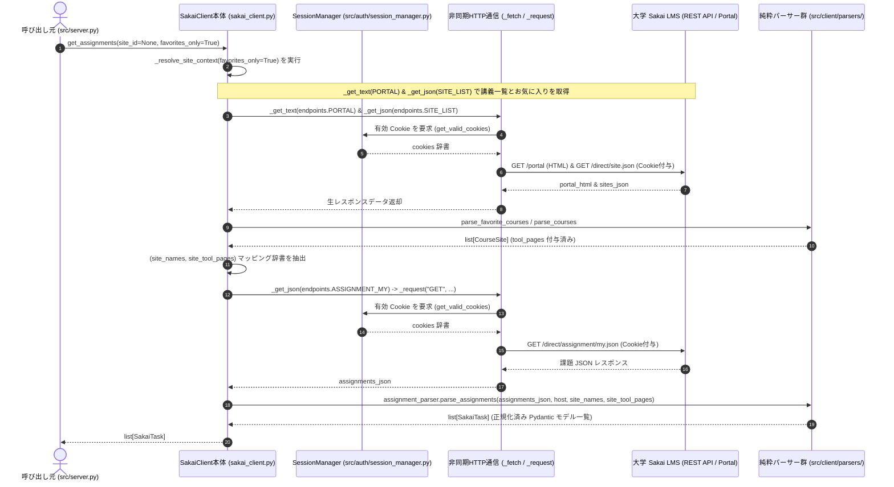

##### クラス定義 & 実装設計

```python
import asyncio
import logging
import time
from datetime import datetime, timedelta, timezone
from typing import Any
import httpx

from src.config import Config
from src.auth import get_valid_cookies
from src.client import endpoints
from src.client.parsers.favorite_parser import parse_favorite_courses
from src.client.parsers.course_parser import parse_courses
from src.client.parsers.assignment_parser import parse_assignments
from src.client.parsers.quiz_parser import parse_quizzes
from src.client.parsers.announcement_parser import parse_announcements
from src.client.parsers.calendar_parser import parse_calendar_events
from src.client.parsers.content_parser import parse_course_contents
from src.models import CourseSite, SakaiTask, Announcement, CalendarEvent, CourseMaterial

logger = logging.getLogger(__name__)


class SakaiClient:
    """
    Sakai LMS との非同期通信およびデータモデル変換を統括するクライアント。
    """

    def __init__(
        self,
        host: str = Config.SAKAI_HOST,
        timeout: float = Config.REQUEST_TIMEOUT,
        cache_ttl: float = Config.CACHE_TTL
    ):
        """
        Args:
            host: Sakai ホスト名 (デフォルト: Config.SAKAI_HOST)
            timeout: HTTP リクエストのタイムアウト秒数 (デフォルト: Config.REQUEST_TIMEOUT)
            cache_ttl: 講義一覧・ツール情報のインメモリキャッシュ有効秒数 (デフォルト: Config.CACHE_TTL)
        """
        self.host = host
        self.timeout = timeout
        self.cache_ttl = cache_ttl
        
        self._http_client: httpx.AsyncClient | None = None
        self._client_lock: asyncio.Lock | None = None
        
        # 通信中リクエストの多重防止・合流機構 (Singleflight: cache_key -> asyncio.Future)
        self._inflight_requests: dict[str, asyncio.Future] = {}
        self._inflight_lock: asyncio.Lock | None = None
        
        # レスポンス TTL キャッシュ (cache_key -> (data, cached_at_monotonic))
        self._response_cache: dict[str, tuple[Any, float]] = {}
        self._cache_lock: asyncio.Lock | None = None

    def _get_client_lock(self) -> asyncio.Lock:
        if self._client_lock is None:
            self._client_lock = asyncio.Lock()
        return self._client_lock

    def _get_inflight_lock(self) -> asyncio.Lock:
        if self._inflight_lock is None:
            self._inflight_lock = asyncio.Lock()
        return self._inflight_lock

    def _get_cache_lock(self) -> asyncio.Lock:
        if self._cache_lock is None:
            self._cache_lock = asyncio.Lock()
        return self._cache_lock

    async def __aenter__(self) -> "SakaiClient":
        await self.open()
        return self

    async def __aexit__(self, exc_type, exc_val, exc_tb) -> None:
        await self.close()

    async def open(self) -> None:
        """非同期 HTTP クライアントセッションを開始する (排他制御付き)。"""
        if self._http_client is None or self._http_client.is_closed:
            async with self._get_client_lock():
                if self._http_client is None or self._http_client.is_closed:
                    self._http_client = httpx.AsyncClient(
                        timeout=httpx.Timeout(self.timeout),
                        headers={
                            "User-Agent": "Mozilla/5.0 (Windows NT 10.0; Win64; x64) AppleWebKit/537.36 (KHTML, like Gecko) Chrome/128.0.0.0 Safari/537.36",
                            "Accept": "application/json, text/html, */*"
                        },
                        follow_redirects=True
                    )

    async def close(self) -> None:
        """非同期 HTTP クライアントセッションを安全に終了する。"""
        if self._http_client and not self._http_client.is_closed:
            await self._http_client.aclose()

    # ==========================================================================
    # 内部通信 & セッション管理メソッド
    # ==========================================================================

    async def _request(
        self,
        method: str,
        endpoint: str,
        params: dict[str, Any] | None = None,
        headers: dict[str, str] | None = None
    ) -> httpx.Response:
        """
        SessionManager から取得した Cookie を注入して HTTP リクエストを実行する。
        セッション失効を検知した場合は自動で再認証を行い、1 回のみ自動リトライする。
        """
        await self.open()
        assert self._http_client is not None
        
        url = f"https://{self.host}{endpoint}"
        cookies = await get_valid_cookies(host=self.host)
        
        resp = await self._http_client.request(
            method,
            url,
            params=params,
            headers=headers,
            cookies=cookies
        )
        
        # セッション切れ検知 (401 または ログイン画面へのリダイレクト等。403 は権限不足のため除外)
        if self._is_session_expired(resp):
            # 強制再認証を実行
            cookies = await get_valid_cookies(force_refresh=True, host=self.host)
            resp = await self._http_client.request(
                method,
                url,
                params=params,
                headers=headers,
                cookies=cookies
            )
            
        resp.raise_for_status()
        return resp

    def _is_session_expired(self, resp: httpx.Response) -> bool:
        """レスポンスからセッション失効を判定する (403はツール権限不足等のため失効とは見なさない)。"""
        if resp.status_code == 401:
            return True
        content_type = resp.headers.get("content-type", "")
        if "text/html" in content_type and ("/portal/login" in str(resp.url) or "login" in resp.text[:500].lower()):
            return True
        return False

    async def _fetch(
        self,
        method: str,
        endpoint: str,
        params: dict[str, Any] | None = None,
        ttl: float = 0.0,
        as_json: bool = True,
        default: Any = None
    ) -> Any:
        """
        API / Portal との通信を行い、レスポンス（JSON または テキスト）を返却する。
        同一エンドポイントへの多重通信防止およびインメモリキャッシュを内部で自動処理する。
        通信エラー時に default が指定されている場合は、標準エラー出力に詳細を記録した上で default 値にフォールバックする。
        """
        param_key = tuple(sorted(params.items())) if params else ()
        cache_key = f"{'JSON' if as_json else 'TEXT'}:{method}:{endpoint}:{param_key}"
        now = time.monotonic()

        # 1. キャッシュの確認 (有効期限内なら即返却)
        if ttl > 0:
            async with self._get_cache_lock():
                if cache_key in self._response_cache:
                    data, cached_at = self._response_cache[cache_key]
                    if now - cached_at < ttl:
                        return data

        # 2. 通信中リクエストの多重防止 (先行タスクの完了をロック外で待機)
        async with self._get_inflight_lock():
            if cache_key in self._inflight_requests:
                fut = self._inflight_requests[cache_key]
                is_leader = False
            else:
                loop = asyncio.get_running_loop()
                fut = loop.create_future()
                self._inflight_requests[cache_key] = fut
                is_leader = True

        if not is_leader:
            return await fut

        # 3. 実際の HTTP 通信を実行
        try:
            resp = await self._request(method, endpoint, params=params)
            result = resp.json() if as_json else resp.text

            # キャッシュ保存
            if ttl > 0:
                async with self._get_cache_lock():
                    self._response_cache[cache_key] = (result, time.monotonic())

            fut.set_result(result)
            return result
        except httpx.HTTPStatusError as e:
            if default is not None:
                logger.warning(
                    f"Sakai API HTTP error: {method} {endpoint} (params={params}) -> HTTP {e.response.status_code}. "
                    f"Falling back to default value."
                )
                fut.set_result(default)
                return default
            fut.set_exception(e)
            raise
        except BaseException as e:
            if default is not None and isinstance(e, Exception):
                logger.warning(
                    f"Sakai API communication error: {method} {endpoint} (params={params}) -> {e}. "
                    f"Falling back to default value."
                )
                fut.set_result(default)
                return default
            fut.set_exception(e)
            raise
        finally:
            async with self._get_inflight_lock():
                self._inflight_requests.pop(cache_key, None)

    async def _get_json(
        self,
        endpoint: str,
        params: dict[str, Any] | None = None,
        ttl: float = 0.0,
        default: Any = None
    ) -> dict[str, Any]:
        """JSON レスポンスを取得する。"""
        return await self._fetch("GET", endpoint, params=params, ttl=ttl, as_json=True, default=default)

    async def _get_text(
        self,
        endpoint: str,
        params: dict[str, Any] | None = None,
        ttl: float = 0.0,
        default: Any = None
    ) -> str:
        """HTML / テキストレスポンスを取得する。"""
        return await self._fetch("GET", endpoint, params=params, ttl=ttl, as_json=False, default=default)

    async def _get_all_courses_cached(self, force_refresh: bool = False) -> list[CourseSite]:
        """
        全講義一覧（お気に入りフラグ & tool_pages 付き）を取得する。
        """
        ttl = 0.0 if force_refresh else self.cache_ttl
        portal_task = self._get_text(endpoints.PORTAL, ttl=ttl)
        sites_task = self._get_json(endpoints.SITE_LIST, ttl=ttl)
        portal_html, sites_json = await asyncio.gather(portal_task, sites_task)

        fav_courses = parse_favorite_courses(portal_html, self.host)
        fav_site_ids = {c.id for c in fav_courses}

        return parse_courses(sites_json, self.host, favorite_site_ids=fav_site_ids)

    async def _resolve_site_context(
        self,
        site_id: str | None = None,
        favorites_only: bool = True
    ) -> tuple[dict[str, str], dict[str, dict[str, str]]]:
        """
        指定条件に応じた (site_names, site_tool_pages) のマッピング辞書を解決する。
        お気に入り講義が 0 件の場合は、自動的に全講義を対象にフォールバックする。
        """
        courses = await self._get_all_courses_cached()
        
        if site_id:
            target_courses = [c for c in courses if c.id == site_id]
        elif favorites_only:
            favs = [c for c in courses if c.is_favorite]
            # お気に入り未設定時のフォールバック
            target_courses = favs if len(favs) > 0 else courses
        else:
            target_courses = courses

        site_names = {c.id: c.name for c in target_courses}
        site_tool_pages = {c.id: c.tool_pages for c in target_courses}
        return site_names, site_tool_pages

    # ==========================================================================
    # 公開データ取得メソッド
    # ==========================================================================

    async def get_courses(self, favorites_only: bool = True) -> list[CourseSite]:
        """
        履修・所属している講義サイト一覧を取得する。

        Args:
            favorites_only: True の場合はお気に入り登録講義のみ、False の場合は全講義を返却 (デフォルト: True)

        Returns:
            list[CourseSite]: 講義サイトモデル一覧
        """
        courses = await self._get_all_courses_cached()
        if favorites_only:
            favs = [c for c in courses if c.is_favorite]
            return favs if len(favs) > 0 else courses
        return courses

    async def get_assignments(
        self,
        site_id: str | None = None,
        favorites_only: bool = True,
        assignment_id: str | None = None,
        include_details: bool = True
    ) -> list[SakaiTask]:
        """
        課題一覧または個別課題詳細を取得する。

        Args:
            site_id: 特定講義で絞り込む場合のサイト ID (未指定時は対象全講義)
            favorites_only: True の場合はお気に入り講義の課題のみ取得 (デフォルト: True)
            assignment_id: 特定の 1 課題のみを取得する場合の課題 ID
            include_details: True の場合は指示文・添付ファイル詳細を含める (デフォルト: True)

        Returns:
            list[SakaiTask]: 課題タスクモデル一覧 (task_type=TaskType.ASSIGNMENT)
        """
        # 1. 対象講義のコンテキスト (講義名マッピング・ツール直通 URL) を解決
        site_names, site_tool_pages = await self._resolve_site_context(site_id, favorites_only)
        
        # 2. 全講義課題 API (endpoints.ASSIGNMENT_MY) を通信層経由で取得
        data = await self._get_json(endpoints.ASSIGNMENT_MY)
        
        # 3. assignment_parser による共通データモデルへの正規化
        return parse_assignments(
            data=data,
            host=self.host,
            site_names=site_names,
            site_tool_pages=site_tool_pages,
            assignment_id=assignment_id,
            include_details=include_details
        )

    async def get_quizzes(
        self,
        site_id: str | None = None,
        favorites_only: bool = True
    ) -> list[SakaiTask]:
        """
        小テスト・クイズ一覧を取得する。対象講義の SAMIGO API を並行取得して統合する。

        Args:
            site_id: 特定講義で絞り込む場合のサイト ID (未指定時は対象全講義)
            favorites_only: True の場合はお気に入り講義のテストのみ取得 (デフォルト: True)

        Returns:
            list[SakaiTask]: テスト・クイズタスクモデル一覧 (task_type=TaskType.QUIZ)
        """
        # 1. 対象講義のコンテキストを解決
        site_names, site_tool_pages = await self._resolve_site_context(site_id, favorites_only)
        
        # 2. 講義別 SAMIGO API (endpoints.sam_pub_context) を並行取得 (同時最大5件に制限)
        sem = asyncio.Semaphore(5)

        async def fetch_one(s_id: str, s_name: str, t_pages: dict[str, str]) -> list[SakaiTask]:
            async with sem:
                endpoint = endpoints.sam_pub_context(s_id)
                tool_page = t_pages.get("quiz")
                # ツール無効等で 403/404 が発生しても _fetch が stderr に警告を記録し、安全に {} にフォールバック
                data = await self._get_json(endpoint, default={})
                return parse_quizzes(data, s_id, self.host, s_name, tool_page)

        tasks = [
            fetch_one(s_id, s_name, site_tool_pages.get(s_id, {}))
            for s_id, s_name in site_names.items()
        ]
        results = await asyncio.gather(*tasks)
        return [task for sublist in results for task in sublist]

    async def get_announcements(
        self,
        site_id: str | None = None,
        favorites_only: bool = True,
        announcement_id: str | None = None,
        n: int = Config.DEFAULT_ANNOUNCEMENT_LIMIT,
        include_details: bool = True
    ) -> list[Announcement]:
        """
        お知らせ一覧または個別お知らせ詳細を取得する。

        Args:
            site_id: 特定講義で絞り込む場合のサイト ID (未指定時は全講義)
            favorites_only: True の場合はお気に入り講義のお知らせのみ取得 (デフォルト: True)
            announcement_id: 特定の 1 件のみを取得する場合のお知らせ ID
            n: 取得件数 (デフォルト: Config.DEFAULT_ANNOUNCEMENT_LIMIT)
            include_details: True の場合は本文・添付ファイル詳細を含める (デフォルト: True)

        Returns:
            list[Announcement]: お知らせモデル一覧
        """
        # 1. 対象講義のコンテキストを解決
        site_names, site_tool_pages = await self._resolve_site_context(site_id, favorites_only)
        
        # 2. お知らせ API (endpoints.ANNOUNCEMENT_USER または endpoints.announcement_site) を取得
        # 全講義お知らせ API から取得する場合、お気に入り絞り込みで件数が激減するのを防ぐため大きめの件数を要求
        fetch_limit = max(n * 5, 50) if favorites_only and not site_id else n
        endpoint = endpoints.ANNOUNCEMENT_USER if not site_id else endpoints.announcement_site(site_id)
        data = await self._get_json(endpoint, params={"n": fetch_limit}, default={})
        
        # 3. announcement_parser による共通データモデルへの正規化
        announcements = parse_announcements(
            data=data,
            host=self.host,
            site_names=site_names,
            site_tool_pages=site_tool_pages,
            announcement_id=announcement_id,
            include_details=include_details
        )
        return announcements[:n]

    async def get_calendar_events(
        self,
        site_id: str | None = None,
        start_date: datetime | None = None,
        end_date: datetime | None = None,
        event_type: str | None = None
    ) -> list[CalendarEvent]:
        """
        カレンダー予定一覧を取得する。

        Args:
            site_id: 特定講義で絞り込む場合のサイト ID (未指定時は全講義)
            start_date: 期間絞り込みの開始日時
            end_date: 期間絞り込みの終了日時
            event_type: イベント種別による絞り込み ("Assignment", "Quiz" 等)

        Returns:
            list[CalendarEvent]: カレンダーイベント一覧
        """
        # 1. 対象講義のコンテキストを解決
        site_names, site_tool_pages = await self._resolve_site_context(site_id, favorites_only=False)
        
        # 2. カレンダー API (endpoints.CALENDAR_MY または endpoints.calendar_site) を取得
        endpoint = endpoints.CALENDAR_MY if not site_id else endpoints.calendar_site(site_id)
        data = await self._get_json(endpoint, default={})
        
        # 3. calendar_parser による共通データモデルへの正規化
        events = parse_calendar_events(
            data=data,
            host=self.host,
            site_names=site_names,
            site_tool_pages=site_tool_pages,
            event_type=event_type
        )
        if start_date:
            events = [e for e in events if e.start_time and e.start_time >= start_date]
        if end_date:
            events = [e for e in events if e.start_time and e.start_time <= end_date]
        return events

    async def get_course_materials(
        self,
        site_id: str,
        files_only: bool = False
    ) -> list[CourseMaterial]:
        """
        指定講義の授業資料・配布ファイル一覧を取得する。

        Args:
            site_id: 講義サイト ID (必須)
            files_only: True の場合はフォルダ項目を除外し、ファイルのみ返却 (デフォルト: False)

        Returns:
            list[CourseMaterial]: 講義資料・配布ファイル一覧
        """
        # 1. 講義一覧キャッシュから該当講義名と授業資料ツール URL を解決
        courses = await self._get_all_courses_cached()
        course = next((c for c in courses if c.id == site_id), None)
        site_name = course.name if course else None
        tool_page = course.tool_pages.get("resource") if course else None

        # 2. 講義別コンテンツ API (endpoints.content_site) を取得
        endpoint = endpoints.content_site(site_id)
        data = await self._get_json(endpoint, default={})
        
        # 3. content_parser による共通データモデルへの正規化
        return parse_course_contents(
            data=data,
            site_id=site_id,
            host=self.host,
            site_name=site_name,
            resource_tool_page_url=tool_page,
            files_only=files_only
        )

    async def get_upcoming_deadlines(
        self,
        days: int = Config.DEFAULT_DEADLINE_DAYS,
        favorites_only: bool = True
    ) -> list[SakaiTask]:
        """
        直近 N 日以内に締切のある未提出課題および小テストを統合し、締切日時昇順でソートして取得する。
        AI アシスタントが「直近の課題を教えて」と尋ねられた際に最適な統合メソッド。

        Args:
            days: 何日後までの締切を対象とするか (デフォルト: Config.DEFAULT_DEADLINE_DAYS)
            favorites_only: True の場合はお気に入り講義のみ対象 (デフォルト: True)

        Returns:
            list[SakaiTask]: 締切昇順でソートされた未提出タスク一覧
        """
        now = datetime.now(timezone.utc)
        limit_date = now + timedelta(days=days)

        # 1. 課題 (get_assignments) と小テスト (get_quizzes) を並行取得
        assignments_task = self.get_assignments(favorites_only=favorites_only, include_details=False)
        quizzes_task = self.get_quizzes(favorites_only=favorites_only)
        assignments, quizzes = await asyncio.gather(assignments_task, quizzes_task)

        all_tasks = assignments + quizzes
        
        # 2. 未提出かつ直近 N 日以内のものを抽出 (parse_datetime で UTC aware に統一済み)
        upcoming: list[SakaiTask] = []
        for t in all_tasks:
            if t.is_submitted:
                continue
            if t.due_date is not None:
                if now <= t.due_date <= limit_date:
                    upcoming.append(t)

        # 3. 締切日時昇順でソート
        upcoming.sort(key=lambda x: x.due_date or datetime.max.replace(tzinfo=timezone.utc))
        return upcoming

    async def get_course_dashboard(
        self,
        site_id: str
    ) -> CourseDashboard:
        """
        指定講義の総合状況（課題・小テスト・直近お知らせ・授業資料）を並行一括取得してサマリーを生成する。

        Args:
            site_id: 講義サイト ID (必須)

        Returns:
            CourseDashboard: 講義名および各データの総合サマリーモデル
        """
        # 1. 講義名を取得
        site_names, _ = await self._resolve_site_context(site_id, favorites_only=False)
        site_name = site_names.get(site_id, "名称未設定講義")

        # 2. 講義内の全タスク・お知らせ・資料を並行一括取得 (asyncio.gather)
        assignments_task = self.get_assignments(site_id=site_id)
        quizzes_task = self.get_quizzes(site_id=site_id)
        announcements_task = self.get_announcements(site_id=site_id, n=5)
        materials_task = self.get_course_materials(site_id=site_id)

        assignments, quizzes, announcements, materials = await asyncio.gather(
            assignments_task,
            quizzes_task,
            announcements_task,
            materials_task
        )

        return CourseDashboard(
            site_id=site_id,
            site_name=site_name,
            assignments=assignments,
            quizzes=quizzes,
            announcements=announcements,
            materials=materials,
        )

    async def download_material(
        self,
        url: str,
        save_path: str
    ) -> str:
        """
        Sakai 内の授業資料や課題添付ファイルをローカルにダウンロード保存する。
        FastMCP の stdio (JSON-RPC) 通信で安全に扱えるよう、保存先パスとファイルサイズ情報を返却する。

        Args:
            url: Sakai 相対パス (/access/content/...) または 完全修飾 URL
            save_path: 保存先のローカルファイルパス (必須)

        Returns:
            str: ダウンロード完了メッセージ (保存先絶対パス、サイズ等)
        """
        # 1. 相対パスへの正規化 (urllib.parse.urlparse により安全にパス部分を抽出)
        from urllib.parse import urlparse
        from pathlib import Path
        path = urlparse(url).path
        endpoint = path if path.startswith("/") else f"/{path}"
        
        # 2. セッション Cookie 付きでバイナリデータを取得
        resp = await self._request("GET", endpoint)
        content = resp.content

        # 3. ローカルファイルへの保存
        p = Path(save_path)
        p.parent.mkdir(parents=True, exist_ok=True)
        p.write_bytes(content)

        return f"ファイルが正常に保存されました: {p.resolve()} ({len(content)} バイト)"
```

##### 実装上の重要ルール

1. **お気に入り講義優先 (`favorites_only=True` デフォルト)**:
   * Sakai では過去学期の講義が多数蓄積されるため、デフォルトでは学生がトップバーにピン留めしているお気に入り講義（`is_favorite=True`）のみを対象とする。
   * **お気に入りが 0 件の場合（未設定時など）は、自動的に全講義を対象として扱う** セーフティ・フォールバックを適用する。
2. **通信層における多重リクエスト抑制とキャッシュによる高速化**:
   * API / Portal 通信は共通通信メソッド（`_fetch`）を経由し、同一エンドポイントへの多重並行リクエストの自動抑制やインメモリキャッシュ（TTL 5分）を内部で自動処理する。
3. **エラーの一元フォールバックと標準エラー出力記録**:
   * 403/404 や通信エラー時は、`_fetch` でメソッド・エンドポイント・パラメータを `stderr`（Python ロガー）に記録しつつ、安全にデフォルト値へフォールバックして処理を継続する。
4. **セッション失効の自動復旧**:
   * 通信中に Sakai セッション切れを検知した場合、内部で即座に `SessionManager` の強制再認証（WebView 起動）を呼び出し、ユーザーが意識することなく自動リトライを完了させる。
---

#### 4.2.3 API エンドポイント定数 (`src/client/endpoints.py`)

* **役割**: Sakai LMS の Direct REST API および `/portal` のパス文字列定数、ならびに ID を埋め込む動的パス生成ヘルパー関数を一元集約する。
* **使用技術**: 標準ライブラリのみ

##### パス定数 & ヘルパー関数定義

```python
# ==============================================================================
# 静的エンドポイント (パス定数)
# ==============================================================================

PORTAL = "/portal"                                      # トップページ (お気に入り講義の DOM 抽出用)
PORTAL_LOGIN = "/portal/login"                          # SSO ログイン画面

SESSION_CURRENT = "/direct/session/current.json"        # セッション有効性確認 & 有効期限延長
SITE_LIST = "/direct/site.json?_limit=0"                # 履修講義一覧 (全件取得のため _limit=0 を指定)
ASSIGNMENT_MY = "/direct/assignment/my.json?_limit=0"    # 履修中全講義の課題一覧 (全件取得のため _limit=0 を指定)
CALENDAR_MY = "/direct/calendar/my.json"                # カレンダー予定・イベント一覧
ANNOUNCEMENT_USER = "/direct/announcement/user.json"    # 全講義のお知らせ一覧 (?d=日数)

ATTACHMENT_ACCESS_PREFIX = "/access/content/attachment" # 添付ファイルダウンロード用 URL プレフィックス


# ==============================================================================
# 動的エンドポイント (講義IDや課題IDを埋め込む関数)
# ==============================================================================

def assignment_site(site_id: str) -> str:
    """指定講義の課題一覧 (/direct/assignment/site/{site_id}.json?_limit=0)"""
    return f"/direct/assignment/site/{site_id}.json?_limit=0"

def assignment_item(assignment_id: str) -> str:
    """特定課題の詳細情報・指示文・添付資料 (/direct/assignment/item/{assignment_id}.json)"""
    return f"/direct/assignment/item/{assignment_id}.json"

def sam_pub_context(site_id: str) -> str:
    """指定講義のテスト・クイズ一覧 (/direct/sam_pub/context/{site_id}.json)"""
    return f"/direct/sam_pub/context/{site_id}.json"

def sam_pub_item(published_assessment_id: str) -> str:
    """個別クイズの詳細メタデータ (/direct/sam_pub/{published_assessment_id}.json)"""
    return f"/direct/sam_pub/{published_assessment_id}.json"

def announcement_site(site_id: str) -> str:
    """指定講義のお知らせ一覧・添付資料 (/direct/announcement/site/{site_id}.json)"""
    return f"/direct/announcement/site/{site_id}.json"

def calendar_site(site_id: str) -> str:
    """指定講義のカレンダー予定一覧 (/direct/calendar/site/{site_id}.json)"""
    return f"/direct/calendar/site/{site_id}.json"

def content_site(site_id: str) -> str:
    """指定講義の配布資料・ファイル一覧 (/direct/content/site/{site_id}.json)"""
    return f"/direct/content/site/{site_id}.json"


# ==============================================================================
# Web 画面 URL 生成ヘルパー
# ==============================================================================

def get_site_url(host: str, site_id: str) -> str:
    """講義トップページ URL (https://<host>/portal/site/{site_id})"""
    return f"https://{host}/portal/site/{site_id}"
```

##### 実装上の重要ルール
1. **ホスト名を含めない相対パス**:
   * エンドポイント定数は常に `/direct/...` のような相対パス文字列で定義し、ホスト名は `sakai_client.py` 側で結合（`f"https://{self.host}{endpoint}"`）します。
2. **単一責任の原則**:
   * 通信処理やパラメータ加工はこのモジュールには持たせず、純粋な URL 文字列の定義・組み立てのみに徹します。

---

#### 4.2.4 パーサー基底・共通処理 (`src/client/parsers/base.py`)

* **役割**: 各種 API レスポンスや HTML のパース処理で共通して必要となる、日時変換・HTML サニタイズ・添付ファイル正規化などの純粋関数ユーティリティを提供する。
* **使用技術**: 標準ライブラリ（`datetime`, `re`, `html`, `urllib.parse`, `pathlib.Path`, `typing`）, `beautifulsoup4` (DOM 補助)

##### 関数インターフェース

```python
from datetime import datetime
from typing import Any
from src.models import Attachment

def parse_datetime(raw: Any) -> datetime | None:
    """
    Sakai API の多様な日時形式 (秒オブジェクト, ミリ秒数値, 秒数値, ISO文字列) を判定し、
    統一された datetime オブジェクト (UTC / ローカルタイムゾーン付き) に変換する。

    Args:
        raw: Sakai API から返される生の日時データ (例: {'epochSecond': 1712000000}, 1712000000000, "2026-08-31T00:00:00Z" 等)

    Returns:
        datetime | None: パースされた datetime (パース不能または None の場合は None)
    """
    ...

def clean_html_text(raw_html: str | None) -> str:
    """
    リッチエディタ等の生 HTML 文字列からタグを除去・整形し、AI や人間が読みやすい
    クリーンなプレーンテキストに変換する。

    Args:
        raw_html: 生 HTML 文字列 (指示文や連絡事項本文)

    Returns:
        str: サニタイズ・整形済みのプレーンテキスト
    """
    ...

def parse_attachments(
    raw_attachments: list[dict[str, Any]] | None,
    host: str
) -> list[Attachment]:
    """
    Sakai API から返される添付ファイル情報リストを正規化し、Attachment モデルのリストに変換する。
    相対パス (例: /access/content/...) を完全修飾 URL に補正し、日本語ファイル名をデコードする。

    Args:
        raw_attachments: 生の添付ファイル辞書リスト
        host: Sakai ホスト名 (例: tact.ac.thers.ac.jp)

    Returns:
        list[Attachment]: 正規化された添付ファイル一覧
    """
    ...
```

##### 実装上の重要ルール & 内部ロジック

1. **日時パースの堅牢性 & タイムゾーン統一 (`parse_datetime`)**:
   * 生成される `datetime` はすべて **`tz=timezone.utc` を指定した aware datetime** に統一し、環境依存のローカル naive datetime 混在による 9 時間の時差誤認・締切判定狂いを完全に防止する。
   * **秒オブジェクト形式 (`{"epochSecond": 1712000000, "nano": 0}`)**: 課題 API (`assignment/my.json`) などで利用。`datetime.fromtimestamp(raw["epochSecond"], tz=timezone.utc)` で変換。
   * **ミリ秒数値形式 (`1712000000000`)**: クイズ API やお知らせ API で利用。$10^{11}$ を超える数値はミリ秒と判定し、`raw / 1000` を `fromtimestamp(..., tz=timezone.utc)` に渡す。
   * **秒数値形式 (`1712000000`)**: 10桁前後の整数・小数は秒単位として変換。
   * **ISO 文字列 / 8桁日付文字列**: `datetime.fromisoformat()` や `strptime('%Y%m%d')` でフォールバックパース（naive の場合は `.replace(tzinfo=timezone.utc)` で補正）。
   * パース失敗時や `None`/空文字入力時は、例外を投げずに `None` を返却するフェイルセーフ設計。
2. **HTML サニタイズ (`clean_html_text`)**:
   * `<br>`, `<br/>`, `</p>`, `</div>`, `</li>` を適切な改行文字（`\n`）に置換。
   * 残りの HTML タグを正規表現または BeautifulSoup の `get_text()` で安全に除去。
   * `html.unescape()` で `&nbsp;`, `&lt;`, `&gt;`, `&amp;` などの HTML 実体参照をデコード。
   * 3 行以上の連続する空行を 2 行（段落区切り）に圧縮し、前後の余分な空白を除去。
3. **添付ファイルの URL 完全修飾 & 日本語デコード (`parse_attachments`)**:
   * 相対パス（例: `/access/content/attachment/site_id/...`）で返ってくる `url` に対し、`f"https://{host}{raw_url}"` として完全修飾 URL を組み立てる。
   * URL 内のエンコードされたファイル名（例: `%E8%A6%81%E9%A0%85.pdf`）を `urllib.parse.unquote` でデコードして `name` に設定。
   * `size` フィールド（バイト単位の文字列または数値）を安全に整数（`int`）に変換。

---

#### 4.2.5 お気に入り講義パーサー (`src/client/parsers/favorite_parser.py`)

* **役割**: ポータル画面（`GET /portal`）のレスポンス HTML 文字列を受け取り、ユーザーがお気に入り（スター）登録している講義サイト一覧を抽出して正規化する純粋関数。
* **対象データ**: `GET /portal` から取得された HTML レスポンス文字列
* **使用技術**: `beautifulsoup4`, `re`, 標準ライブラリ
* **リファレンス**: [Comfortable Sakai (`src/features/favorite.ts`)](https://github.com/kyoto-u/comfortable-sakai)

##### リファレンス (Comfortable Sakai の TypeScript 実装)

```typescript
/* Comfortable Sakai によるお気に入り講義サイト抽出処理 */
export const addFavoritedCourseSites = (
    doc: Document,
    courses: Array<Course>,
    baseURL: string
): Array<Course> => {
    const favorites = doc.getElementsByClassName("fav-sites-entry");
    for (const favorite of favorites) {
        const aTag = favorite.getElementsByTagName("a")[0];
        const m = aTag.href.match(/\/portal\/site-?[a-z]*\/([^/]+)/);
        if (m && !m[1].startsWith("~")) {
            const name = favorite.getElementsByTagName("span")[0];
            const course: Course = {
                id: m[1],
                name: name.title,
                link: baseURL + "/portal/site/" + m[1]
            };
            courses.push(course);
        }
    }
    return courses;
};
```

##### 関数インターフェース

```python
import re
from bs4 import BeautifulSoup
from src.models import CourseSite
from src.client import endpoints

SITE_HREF_PATTERN = re.compile(r"/portal/site-?[a-z]*/([^/]+)")

def parse_favorite_courses(html_content: str, host: str) -> list[CourseSite]:
    """
    /portal の HTML から「お気に入り」登録されている講義一覧を抽出する。

    Args:
        html_content: /portal から取得した HTML 文字列
        host: Sakai ホスト名 (講義 URL 生成用)

    Returns:
        list[CourseSite]: お気に入り講義モデル (is_favorite=True) のリスト
    """
    ...
```

##### 実装上の重要ルール & 内部ロジック

1. **DOM 抽出ターゲット (`.fav-sites-entry`)**:
   * BeautifulSoup で `soup.find_all(class_="fav-sites-entry")` を検索し、お気に入りバー内の各サイト項目を走査する。
2. **サイト ID 抽出とマイワークスペースの除外**:
   * `a` タグの `href` 属性に対して正規表現 `r"/portal/site-?[a-z]*/([^/]+)"` を適用し、講義サイト ID（`site_id`）を取得する。
   * サイト ID が `~` で始まるもの（例: `~user123`）は、講義ではなくユーザー専用の「マイワークスペース」であるため除外する。
3. **講義名の抽出**:
   * `a` タグの `title` 属性（存在しない場合は `a.get_text(strip=True)`）から講義名を取得する。
4. **講義トップページ URL の生成**:
   * `site_url = endpoints.get_site_url(host, site_id)` を使用して講義トップページ URL を設定する。
5. **Comfortable Sakai との互換性**:
   * 京都大学等で実績のある Comfortable Sakai の DOM パースロジックを忠実に再現し、Sakai のテーマやバージョン差異（`site-direct` 等のパス揺れ）にも対応。

---

#### 4.2.6 講義一覧パーサー (`src/client/parsers/course_parser.py`)

* **役割**: Sakai 公式 REST API（`/direct/site.json`）のレスポンス JSON を受け取り、所属・履修している全講義サイト一覧を正規化して返却する純粋関数。
* **対象レスポンス**: `GET /direct/site.json` のレスポンス JSON
* **使用技術**: 標準ライブラリのみ

##### レスポンス JSON の構造例 (Sakai 生データ)

```json
{
  "site_collection": [
    {
      "id": "n_2025_A_102503110002",
      "title": "人工知能概論 (春学期)",
      "description": "<p>本講義では機械学習の基礎を学びます。</p>",
      "type": "course",
      "published": true,
      "owner": "prof_yamada",
      "modifiedDate": 1712000000000,
      "sitePages": [
        {
          "id": "806d095b-0875-465a-8c73-44bdff0fdd34",
          "title": "お知らせ",
          "url": "https://tact.ac.thers.ac.jp/portal/site/n_2025_A_102503110002/page/806d095b-0875-465a-8c73-44bdff0fdd34"
        },
        {
          "id": "a727b22f-e366-4ed5-b0f5-7d66673a6650",
          "title": "授業資料（リソース）",
          "url": "https://tact.ac.thers.ac.jp/portal/site/n_2025_A_102503110002/page/a727b22f-e366-4ed5-b0f5-7d66673a6650"
        },
        {
          "id": "3b18920a-1951-4a0f-aefa-a667a6208d36",
          "title": "課題",
          "url": "https://tact.ac.thers.ac.jp/portal/site/n_2025_A_102503110002/page/3b18920a-1951-4a0f-aefa-a667a6208d36"
        }
      ]
    },
    {
      "id": "~user12345",
      "title": "マイワークスペース",
      "type": "myworkspace",
      "published": true
    }
  ]
}
```

##### 関数インターフェース

```python
from typing import Any
from src.models import CourseSite
from src.client.parsers.base import clean_html_text
from src.client import endpoints

def extract_tool_pages(site_pages: list[dict[str, Any]] | None) -> dict[str, str]:
    """
    sitePages 配列から主要ツール (課題, お知らせ, 資料, テスト) の Page URL 辞書を抽出する。

    Returns:
        dict[str, str]: {"assignment": "https://...", "announcement": "...", "resource": "...", "quiz": "..."}
    """
    ...

def parse_courses(
    data: dict[str, Any],
    host: str,
    favorite_site_ids: set[str] | None = None
) -> list[CourseSite]:
    """
    /direct/site.json のレスポンスをパースし、講義サイトモデルのリストに変換する。
    各講義の sitePages からツール Page URL 辞書 (tool_pages) も自動抽出して格納する。

    Args:
        data: /direct/site.json の JSON レスポンス ({"site_collection": [...]})
        host: Sakai ホスト名 (講義 URL 補正用)
        favorite_site_ids: お気に入り登録されているサイト ID の集合 (is_favorite 判定用)

    Returns:
        list[CourseSite]: 正規化された講義サイト一覧 (tool_pages 含む)
    """
    ...
```

##### 実装上の重要ルール & 内部ロジック

1. **全件データ (`site_collection`) のパース**:
   * `/direct/site.json` のレスポンス JSON（クライアントが `?_limit=0` で取得した全件データ）に含まれる講義情報をすべてパースする。
2. **コレクション走査 (`site_collection`)**:
   * `data.get("site_collection", [])` から各サイトオブジェクトを取り出して走査する。
3. **マイワークスペースの除外**:
   * `site.get("id", "").startswith("~")` または `site.get("type") == "myworkspace"` のサイトは講義ではないため除外する。
4. **お気に入りフラグのマージ**:
   * `favorite_site_ids`（`favorite_parser.py` で事前取得した ID 集合）と照合し、含まれていれば `is_favorite = True`、含まれていなければ `False` をセットする。
5. **ツール Page URL の自動抽出 (`sitePages`)**:
   * `site.get("sitePages", [])` を走査し、ページタイトル（「課題」「お知らせ」「授業資料」「テスト」等）からツール種別を判別して `tool_pages` 辞書に格納。
6. **講義メタデータの整形**:
   * `id`: 講義サイト ID（文字列）
   * `name`: `site.get("title")`（講義名）
   * `description`: `clean_html_text(site.get("description"))` で HTML タグを除去した講義説明文
   * `site_url`: `endpoints.get_site_url(host, site_id)` で講義トップページ URL を生成
   * `tool_pages`: 抽出された各ツールの Page URL 辞書

---

#### 4.2.7 課題パーサー (`src/client/parsers/assignment_parser.py`)

* **役割**: Sakai の課題 REST API（GET /direct/assignment/my.json?_limit=0）のレスポンス JSON を受け取り、指定された条件（全講義 / 講義ID絞り込み / 特定課題指定 / 詳細指示文の有無）に応じた共通タスクモデル（list[SakaiTask]）へ正規化する純粋関数。
* **設計方針 (`my.json` レスポンスの活用)**:
  * Sakai の `/direct/assignment/my.json` のレスポンス JSON には、**全講義の課題・締切・指示文（`instructions`）・添付ファイル（`attachments`）が網羅的に含まれています**。
  * そのため、パーサーは渡された JSON から条件（`target_site_ids`, `assignment_id`, `include_details`）に応じた抽出・整形を行うことで、全講義一覧・お気に入り講義一覧・個別詳細のすべてのユースケースを処理します。
* **対象レスポンス**: `GET /direct/assignment/my.json?_limit=0` のレスポンス JSON
* **使用技術**: 標準ライブラリのみ
* **リファレンス**: [Comfortable Sakai (`src/features/entity/assignment/decode.ts`)](https://github.com/kyoto-u/comfortable-sakai)

##### レスポンス JSON の構造例 (Sakai 生データ)

```json
{
  "assignment_collection": [
    {
      "id": "c8e2b834-8f2e-4e4b-b0b1-123456789abc",
      "title": "第3回復習レポート課題",
      "context": "2024_01_AI101",
      "instructions": "<p>講義スライド第3回を読み、<strong>変分法</strong>についてA4一枚でまとめて提出してください。</p>",
      "status": "OPEN",
      "draft": false,
      "submissionType": "ATTACHMENTS_ONLY",
      "openTime": { "epochSecond": 1712000000, "nano": 0 },
      "dueTime": { "epochSecond": 1712600000, "nano": 0 },
      "closeTime": { "epochSecond": 1712686400, "nano": 0 },
      "maxGradePoint": "100",
      "submissions": [],
      "attachments": [
        {
          "name": "レポート様式.docx",
          "url": "/access/content/attachment/2024_01_AI101/Assignments/uuid/%E3%83%AC%E3%83%9D%E3%83%BC%E3%83%88%E6%A7%98%E5%BC%8F.docx",
          "type": "application/vnd.openxmlformats-officedocument.wordprocessingml.document",
          "size": "24576"
        }
      ]
    }
  ]
}
```

##### リファレンス (Comfortable Sakai の TypeScript 実装)

```typescript
/* Comfortable Sakai による課題一覧デコード処理 */
export const decodeAssignmentFromAPI = (data: Record<string, any>): Array<AssignmentEntry> => {
    return data.assignment_collection
        .filter((json: any) => json.closeTime.epochSecond >= CurrentTime)
        .map((json: any) => {
            return new AssignmentEntry(
                json.id,
                json.title,
                json.dueTime.epochSecond ? json.dueTime.epochSecond : null,
                json.closeTime.epochSecond ? json.closeTime.epochSecond : null,
                false
            );
        });
};
```

##### 関数インターフェース

```python
from typing import Any
from src.models import SakaiTask, TaskType, TaskStatus
from src.client.parsers.base import parse_datetime, clean_html_text, parse_attachments
from src.client import endpoints

def parse_assignments(
    data: dict[str, Any],
    host: str,
    site_names: dict[str, str] | None = None,
    site_tool_pages: dict[str, dict[str, str]] | None = None,
    assignment_id: str | None = None,
    include_details: bool = True
) -> list[SakaiTask]:
    """
    /direct/assignment/my.json のレスポンスをパースし、
    条件に応じた SakaiTask のリストを生成する。

    Args:
        data: Sakai API の JSON レスポンス ({"assignment_collection": [...]})
        host: Sakai ホスト名 (リンク補正用)
        site_names: site_id -> site_name の対応辞書 (講義名マッピング兼、対象講義の絞り込み用)
        site_tool_pages: site_id -> {"assignment": "https://...", ...} のツール URL 辞書
        assignment_id: 特定の 1 課題のみを抽出する場合に指定
        include_details: True の場合は指示文 (instructions) や添付資料 (attachments) もパースして格納

    Returns:
        list[SakaiTask]: 正規化された課題タスク一覧 (task_type=TaskType.ASSIGNMENT)
    """
    ...
```

##### 実装上の重要ルール & 内部ロジック

1. **`my.json` レスポンスによる全要件の完結**:
   * `GET /direct/assignment/my.json?_limit=0` のレスポンス JSON には全講義・全課題の詳細情報が含まれているため、パーサー内でフィルタリングや整形を完結させ、全講義・お気に入り講義・個別詳細のすべてのデータを即座にメモリ上で抽出・返却する。
2. **対象講義の絞り込み & 講義名マッピング (`site_names`)**:
   * `site_names`（例: お気に入り講義の `{site_id: site_name}` 辞書）が渡された場合、キーに含まれない講義の課題はスキップし、含まれるものには講義名を自動セットする。
3. **特定課題の抽出 (`assignment_id`)**:
   * `assignment_id` が指定されている場合、該当する 1 件のみを抽出して返却する。
4. **詳細フラグ (`include_details`) の制御**:
   * `include_details=True` の場合: `clean_html_text(item.get("instructions"))` で指示文を整形し、`parse_attachments(item.get("attachments"), host)` で添付資料モデルリストを生成して格納。
   * `include_details=False` の場合: 指示文や添付資料を省略し、タイトル・締切・提出状態のみの超軽量モデルを返却（AI トークン節約・高速一覧用）。
5. **日時パース & 提出判定**:
   * `dueTime`, `openTime`, `closeTime` の秒オブジェクト（`{"epochSecond": ...}`）を `parse_datetime()` で `datetime` に変換。
   * `item.get("status") == "SUBMITTED"` または `len(item.get("submissions", [])) > 0` の場合は提出済み（`is_submitted = True`）と判定。
6. **講義名（`site_name`）の自動補完**:
   * `item.get("context")`（`site_id`）を `site_names` 辞書でルックアップして講義名をセット。
7. **URL の設定 (サイト URL & ツール直通 URL)**:
   * `site_url`: `endpoints.get_site_url(host, site_id)`（講義トップページ URL）
   * `url`: `site_tool_pages` から課題ツールの Page URL を取得してセットし、存在しない場合は `site_url` をセットする。

---

#### 4.2.8 テスト・クイズパーサー (`src/client/parsers/quiz_parser.py`)

* **役割**: Sakai SAMIGO（テスト・クイズ）API（`GET /direct/sam_pub/context/{siteId}.json`）のレスポンス JSON を受け取り、小テストタスクモデル（`list[SakaiTask]`, `task_type=TaskType.QUIZ`）へ正規化する純粋関数。
* **設計方針**:
  * SAMIGO は全講義横断 API が存在しないため、本パーサーは単一講義（`site_id`）の JSON 変換に特化した純粋同期関数として設計する。
  * 全講義や複数お気に入り講義のクイズ一括取得は、上位層（`sakai_client.py`）が `asyncio.gather` で並行リクエストを行い、結果を統合する。
* **対象レスポンス**: `GET /direct/sam_pub/context/{siteId}.json` のレスポンス JSON
* **使用技術**: 標準ライブラリのみ
* **リファレンス**: [Comfortable Sakai (`src/features/entity/quiz/decode.ts`)](https://github.com/kyoto-u/comfortable-sakai)

##### レスポンス JSON の構造例 (Sakai 生データ)

```json
{
  "sam_pub_collection": [
    {
      "publishedAssessmentId": 123456,
      "title": "第2回確認小テスト (線形代数)",
      "startDate": 1712000000000,
      "dueDate": 1712600000000,
      "retractDate": 1712686400000,
      "timeLimit": 1800,
      "status": "1"
    }
  ]
}
```

##### リファレンス (Comfortable Sakai の TypeScript 実装)

```typescript
/* Comfortable Sakai による小テストデコード処理 */
export const decodeQuizFromAPI = (data: Record<string, any>): Array<QuizEntry> => {
    return data.sam_pub_collection
        .filter((json: any) => json.startDate < CurrentTime * 1000 && (json.dueDate >= CurrentTime * 1000 || json.dueDate == null))
        .map((json: any) => {
            return new QuizEntry(
                json.publishedAssessmentId,
                json.title,
                json.dueDate ? json.dueDate / 1000 : MaxTimestamp,
                false
            );
        });
};
```

##### 関数インターフェース

```python
from typing import Any
from src.models import SakaiTask, TaskType, TaskStatus
from src.client.parsers.base import parse_datetime
from src.client import endpoints

def parse_quizzes(
    data: dict[str, Any],
    site_id: str,
    host: str,
    site_name: str | None = None,
    tool_page_url: str | None = None
) -> list[SakaiTask]:
    """
    /direct/sam_pub/context/{siteId}.json のレスポンスをパースし、
    SakaiTask (task_type=TaskType.QUIZ) のリストに変換する。

    Args:
        data: SAMIGO API の JSON レスポンス ({"sam_pub_collection": [...]})
        site_id: 講義サイト ID
        host: Sakai ホスト名
        site_name: 講義名 (省略時は None)
        tool_page_url: テスト・クイズツールの Page URL

    Returns:
        list[SakaiTask]: 正規化されたテスト・クイズタスク一覧
    """
    ...
```

##### 実装上の重要ルール & 内部ロジック

1. **ミリ秒日時の自動変換**:
   * `dueDate`, `startDate`, `retractDate`（ミリ秒数値）を `base.py` の `parse_datetime()` に渡し、統一された `datetime` に変換。
2. **ID の正規化**:
   * `publishedAssessmentId`（数値または文字列）を文字列の `id = str(item["publishedAssessmentId"])` に変換。
3. **タスク種別と制限時間**:
   * `task_type = TaskType.QUIZ` をセット。
   * `timeLimit`（秒数、例: 1800）が存在する場合は `time_limit_seconds` に格納。
4. **提出状態 (`is_submitted`) の制約ハンドリング**:
   * Sakai SAMIGO API (`/direct/sam_pub/context/{siteId}.json`) には教員の公開ステータス (`status`) のみが含まれ、学生個別の受験・提出履歴フラグは存在しない仕様であるため、`is_submitted` は一律 `False` (未提出扱い) となる。
5. **URL の生成 (サイト URL & ツール直通 URL)**:
   * `site_url`: `endpoints.get_site_url(host, site_id)`（講義トップページ URL）
   * `url`: `tool_page_url`（テスト・クイズツール Page URL）が存在すれば優先セットし、なければ `site_url` をセット。
6. **非公開・無効テストのハンドリング**:
   * `status == "0"`（下書き / 非公開）や ID が存在しない項目は安全にスキップ。

---

#### 4.2.9 お知らせパーサー (`src/client/parsers/announcement_parser.py`)

* **役割**: Sakai のお知らせ REST API（`GET /direct/announcement/user.json` 等）のレスポンス JSON を受け取り、お知らせモデル（`list[Announcement]`）へ正規化する純粋関数。
* **設計方針 (`user.json` レスポンスの活用)**:
  * Sakai の `/direct/announcement/user.json` のレスポンス JSON には、**全講義のお知らせ・発行日時・連絡本文（`body`）・添付ファイル（`attachments`）・講義名（`siteTitle`）が網羅的に含まれています**。
  * そのため、パーサーは渡された JSON から条件（`site_names` による絞り込み、`announcement_id` による個別抽出、`include_details` による本文有無）に応じた抽出・整形を行うことで、全講義一覧・お気に入り講義一覧・個別詳細のすべてのユースケースを処理します。
* **対象レスポンス**:
  * 全講義のお知らせ一覧: `GET /direct/announcement/user.json?d=30&n=50` のレスポンス JSON
  * 指定講義のお知らせ一覧: `GET /direct/announcement/site/{siteId}.json` のレスポンス JSON
  * システム全体のお知らせ: `GET /direct/announcement/motd.json` のレスポンス JSON
* **使用技術**: 標準ライブラリのみ

##### レスポンス JSON の構造例 (Sakai 生データ)

```json
{
  "announcement_collection": [
    {
      "announcementId": "7a8b9c0d-1234-5678-abcd-ef0123456789",
      "id": "7a8b9c0d-1234-5678-abcd-ef0123456789",
      "title": "【重要】第4回講義の教室変更について",
      "body": "<p>来週の講義は、情報棟3階の<strong>第2演習室</strong>で行います。<br/>各自ノートPCを持参してください。</p>",
      "createdByDisplayName": "山田 太郎 (教員)",
      "createdOn": 1712000000000,
      "siteId": "2024_01_AI101",
      "siteTitle": "人工知能概論 (春学期)",
      "attachments": [
        {
          "name": "教室案内図.pdf",
          "url": "/access/content/attachment/2024_01_AI101/Announcements/uuid/%E6%95%99%E5%AE%A4%E6%A1%88%E5%86%85%E5%9B%B3.pdf",
          "type": "application/pdf",
          "size": "512000"
        }
      ]
    }
  ]
}
```

##### 関数インターフェース

```python
from typing import Any
from src.models import Announcement
from src.client.parsers.base import parse_datetime, clean_html_text, parse_attachments
from src.client import endpoints

def parse_announcements(
    data: dict[str, Any],
    host: str,
    site_names: dict[str, str] | None = None,
    site_tool_pages: dict[str, dict[str, str]] | None = None,
    announcement_id: str | None = None,
    include_details: bool = True
) -> list[Announcement]:
    """
    /direct/announcement/user.json または site/{siteId}.json のレスポンスをパースし、
    条件に応じた Announcement モデルのリストを生成する。

    Args:
        data: Sakai API の JSON レスポンス ({"announcement_collection": [...]})
        host: Sakai ホスト名 (添付ファイルリンク補正用)
        site_names: site_id -> site_name の対応辞書 (指定時は対象講義に絞り込み)
        site_tool_pages: site_id -> {"announcement": "https://...", ...} のツール URL 辞書
        announcement_id: 特定の 1 件のみを抽出する場合に指定
        include_details: True の場合は本文 (body) や添付資料 (attachments) もパースして格納

    Returns:
        list[Announcement]: 正規化されたお知らせモデル一覧
    """
    ...
```

##### 実装上の重要ルール & 内部ロジック

1. **`user.json` レスポンスによる全要件の完結**:
   * `GET /direct/announcement/user.json` のレスポンス JSON には全講義のお知らせの詳細情報が含まれているため、パーサー内でフィルタリングや整形を完結させ、全講義・お気に入り講義・個別詳細のすべてのデータを即座にメモリ上で抽出・返却する。
2. **対象講義の絞り込み (`site_names`)**:
   * `site_names`（例: お気に入り講義の `{site_id: site_name}` 辞書）が渡された場合、キーに含まれない講義のお知らせはスキップする。
3. **特定お知らせの抽出 (`announcement_id`)**:
   * `announcement_id` が指定されている場合、該当する 1 件のみを抽出して返却する。
4. **詳細フラグ (`include_details`) の制御**:
   * `include_details=True` の場合: `clean_html_text(item.get("body"))` で連絡本文を整形し、`parse_attachments(item.get("attachments"), host)` で添付資料モデルリストを生成して格納。
   * `include_details=False` の場合: 本文や添付資料を省略し、タイトル・発行日時・講義名のみの超軽量モデルを返却（AI トークン節約・高速一覧用）。
5. **発行日時のミリ秒パース**:
   * `item.get("createdOn")`（ミリ秒数値 `1712000000000`）を `base.py` の `parse_datetime()` で `datetime` に変換。
6. **講義名の自動補完**:
   * `item.get("siteTitle")` を優先利用し、空の場合は `site_names` 辞書から補完。
7. **URL の設定 (サイト URL & ツール直通 URL)**:
   * `site_url`: `endpoints.get_site_url(host, site_id)`（講義トップページ URL）
   * `url`: `site_tool_pages` にお知らせツールの Page URL があればそれをセットし、なければ `site_url` をセット。

---

#### 4.2.10 カレンダーパーサー (`src/client/parsers/calendar_parser.py`)

* **役割**: Sakai のカレンダー REST API（`GET /direct/calendar/my.json` 等）のレスポンス JSON を受け取り、講義予定・イベント・提出締切などのカレンダーモデル（`list[CalendarEvent]`）へ正規化する純粋関数。
* **対象レスポンス**:
  * 全講義のカレンダー予定一覧: `GET /direct/calendar/my.json` のレスポンス JSON
  * 指定講義のカレンダー予定一覧: `GET /direct/calendar/site/{siteId}.json` のレスポンス JSON
* **使用技術**: 標準ライブラリのみ

##### レスポンス JSON の構造例 (Sakai 生データ)

```json
{
  "calendar_collection": [
    {
      "eventId": "cal-uuid-12345678",
      "title": "課題提出締切: 第3回レポート",
      "siteId": "2024_01_AI101",
      "siteName": "人工知能概論",
      "description": "<p>第3回レポートの提出締切です。</p>",
      "firstTime": {
        "time": 1712600000000
      },
      "duration": 3600000,
      "type": "Assignment",
      "assignmentId": "c8e2b834-8f2e-4e4b-b0b1-123456789abc",
      "entityURL": "https://tact.ac.thers.ac.jp/portal/site/2024_01_AI101"
    }
  ]
}
```

##### 関数インターフェース

```python
from typing import Any
from src.models import CalendarEvent
from src.client.parsers.base import parse_datetime, clean_html_text
from src.client import endpoints

def parse_calendar_events(
    data: dict[str, Any],
    host: str,
    site_names: dict[str, str] | None = None,
    site_tool_pages: dict[str, dict[str, str]] | None = None,
    event_type: str | None = None
) -> list[CalendarEvent]:
    """
    /direct/calendar/my.json または site/{siteId}.json のレスポンスをパースし、
    CalendarEvent モデルのリストを生成する。

    Args:
        data: Sakai API の JSON レスポンス ({"calendar_collection": [...]})
        host: Sakai ホスト名 (リンク補正用)
        site_names: site_id -> site_name の対応辞書 (指定時は対象講義に絞り込み)
        site_tool_pages: site_id -> {"assignment": "https://...", ...} のツール URL 辞書
        event_type: イベント種別による絞り込み ("Assignment", "Quiz" 等)

    Returns:
        list[CalendarEvent]: 正規化されたカレンダーイベント一覧
    """
    ...
```

##### 実装上の重要ルール & 内部ロジック

1. **`my.json` レスポンスによる全講義予定の完結**:
   * `GET /direct/calendar/my.json` のレスポンス JSON にはユーザーが所属する全講義のカレンダー予定が含まれているため、パーサー内で全講義の予定を一括でモデル化する。
2. **開始日時 & 終了日時のパース**:
   * `item.get("firstTime", {}).get("time")`（ミリ秒数値 `1712600000000`）を `parse_datetime()` で `start_time`（`datetime`）に変換。
   * `duration`（ミリ秒数値、例: `3600000` = 1時間）が存在する場合、`end_time = start_time + timedelta(milliseconds=duration)` を自動計算。
3. **説明文のクリーン化**:
   * `item.get("description")` の生 HTML を `clean_html_text()` に通し、テキスト化して格納。
4. **イベント種別と関連 ID**:
   * `event_type`: `item.get("type")`（`"Assignment"`, `"Quiz"`, `"Lecture"`, `"General"` 等）を小文字正規化。
   * `assignment_id`: `item.get("assignmentId")` が存在する場合はセット。
5. **URL の設定 (サイト URL & ツール直通 URL)**:
   * `site_url`: `endpoints.get_site_url(host, site_id)`（講義トップページ URL）
   * `url`: 課題締切イベントなら課題ツールの Page URL、通常予定ならスケジュールツールの Page URL（なければ `site_url`）をセット。
---

#### 4.2.11 講義資料・配布ファイルパーサー (`src/client/parsers/content_parser.py`)

* **役割**: Sakai の講義資料・リソース REST API（`GET /direct/content/site/{siteId}.json`）のレスポンス JSON を受け取り、講義資料・フォルダ構造・配布ファイル一覧モデル（`list[CourseMaterial]`）へ正規化する純粋関数。
* **設計方針**:
  * Sakai の Content API は講義（`siteId`）ごとに独立して配布資料・フォルダの階層構造を返却します。
  * 本パーサーは単一講義のレスポンス JSON を受け取り、フォルダ（`collection`）とファイル（`resource`）を区別したクリーンなモデルリストへ変換します。
* **対象レスポンス**: `GET /direct/content/site/{siteId}.json` のレスポンス JSON
* **使用技術**: 標準ライブラリ（`urllib.parse`, `typing`, `datetime`）

##### レスポンス JSON の構造例 (Sakai 生データ)

```json
{
  "content_collection": [
    {
      "entityId": "/group/n_2025_A_102503110002/",
      "container": "/group/n_2025_A_102503110002/",
      "title": "人工知能概論",
      "type": "collection",
      "url": "https://tact.ac.thers.ac.jp/access/content/group/n_2025_A_102503110002/",
      "numChildren": 3
    },
    {
      "entityId": "/group/n_2025_A_102503110002/第1回講義スライド.pdf",
      "container": "/group/n_2025_A_102503110002/",
      "title": "第1回講義スライド.pdf",
      "type": "resource",
      "url": "https://tact.ac.thers.ac.jp/access/content/group/n_2025_A_102503110002/%E7%AC%AC1%E5%9B%9E%E8%AC%9B%E7%BE%A9%E3%82%B9%E3%83%A9%E3%82%A4%E3%83%89.pdf",
      "mimeType": "application/pdf",
      "size": 2048576,
      "author": "山田 太郎",
      "modifiedDate": 1712000000000,
      "createdDate": 1711900000000
    },
    {
      "entityId": "/group/n_2025_A_102503110002/第1章_導入/演習データ.zip",
      "container": "/group/n_2025_A_102503110002/第1章_導入/",
      "title": "演習データ.zip",
      "type": "resource",
      "url": "https://tact.ac.thers.ac.jp/access/content/group/n_2025_A_102503110002/%E7%AC%AC1%E7%AB%A0_%E5%B0%8E%E5%85%A5/%E6%BC%94%E7%BF%92%E3%83%87%E3%83%BC%E3%82%BF.zip",
      "mimeType": "application/zip",
      "size": 10485760,
      "author": "山田 太郎",
      "modifiedDate": 1712100000000
    }
  ]
}
```

##### 関数インターフェース

```python
from typing import Any
from src.models import CourseMaterial, MaterialType
from src.client.parsers.base import parse_datetime
from src.client import endpoints

def parse_course_contents(
    data: dict[str, Any] | list[dict[str, Any]],
    site_id: str,
    host: str,
    site_name: str | None = None,
    resource_tool_page_url: str | None = None,
    files_only: bool = False
) -> list[CourseMaterial]:
    """
    /direct/content/site/{siteId}.json のレスポンスをパースし、
    CourseMaterial モデルのリストに変換する。
    Sakai バージョンによって {"content_collection": [...]} の辞書形式、
    または [...] の直接配列形式の双方が返るため両構造に自動対応する。

    Args:
        data: Sakai API の JSON レスポンス (辞書または配列)
        site_id: 講義サイト ID
        host: Sakai ホスト名 (ダウンロード URL 補正用)
        site_name: 講義名 (省略時は None)
        resource_tool_page_url: 講義の「授業資料（リソース）」ツール直通 Page URL
        files_only: True の場合はフォルダ項目を除外し、ダウンロード可能なファイルのみを返却

    Returns:
        list[CourseMaterial]: 正規化された講義資料・配布ファイル一覧
    """
    ...
```

##### 実装上の重要ルール & 内部ロジック

1. **コレクション形式の安全な抽出**:
   * `items = data if isinstance(data, list) else data.get("content_collection", [])` により、Sakai のバージョン差異（トップレベル配列か辞書ラップか）を安全に吸収して走査する。
2. **ルートフォルダ項目の除外**:
   * `entityId == f"/group/{site_id}/"` の項目は講義サイト自体のルートコンテナであり、中身のファイル・フォルダではないため除外する。
3. **アイテム種別（`type`）の正規化**:
   * `item.get("type") == "collection"` $\rightarrow$ `material_type = MaterialType.FOLDER`
   * `item.get("type") == "resource"` $\rightarrow$ `material_type = MaterialType.FILE`
   * `files_only=True` が指定されている場合、`MaterialType.FOLDER` の項目はスキップする。
4. **ファイル名 / タイトルのデコード**:
   * `item.get("title")` が URL エンコードされている場合（例: `%E8%AC%9B%E7%BE%A9.pdf`）は `urllib.parse.unquote` で人間が読める日本語にデコードする。
5. **URL の設定 (サイト URL & ダウンロード/ツール URL)**:
   * `site_url`: `endpoints.get_site_url(host, site_id)`（講義トップページ URL）
   * ファイルの場合（`resource`）: `item.get("url")`（`/access/content/...`）の相対パスに対して `f"https://{host}{raw_url}"` として直接ダウンロード可能な完全修飾 URL を生成。
   * フォルダの場合（`collection`）: `resource_tool_page_url`（授業資料ツールの Page URL）をセットし、未指定時は `site_url` をセット。
6. **サイズと最終更新日時のパース**:
   * `size`: 文字列または数値から `int` に変換（フォルダの場合は `None`）。
   * `modifiedDate`: ミリ秒数値 `1712000000000` を `base.py` の `parse_datetime()` で `datetime` に変換。
7. **相対パス・階層構造の抽出 (`path`)**:
   * `container`（例: `/group/n_2025_A_102503110002/第1章_導入/`）から先頭の `/group/{site_id}/` を除去し、講義ルートからの相対フォルダパス（例: `第1章_導入/`）として `path` フィールドに格納（AI によるフォルダ階層の把握用）。

---

## 5. FastMCP サーバー定義 & MCP ツール公開 (`src/server.py`)

本モジュールは、`SakaiClient` および認証レイヤー（`src/auth`）を **Model Context Protocol (MCP)** のエンドポイントとして公開し、AI クライアント（Claude Desktop, Cursor, エージェント等）が stdio 経由でオンデマンドに呼び出せるようにするサーバーレイヤーです。

* **使用技術**: `mcp.server.fastmcp` (`FastMCP`), `asyncio`, `sys`, `argparse`, `logging`
* **配布・実行形態**: AI クライアントからサブプロセスとして直接起動され、標準入出力（`stdio`）で JSON-RPC 通信を行う。

---

### 5.1 MCP サーバー基本構成 & stdio 通信要件

1. **サーバーインスタンスの生成**:
   * `FastMCP("sakai-tasks-mcp")` を初期化してツールを登録する。
2. **stdio プロトコル通信の厳守 (最重要ルール)**:
   * 標準出力（`stdout`）は MCP の JSON-RPC 通信メッセージ専用です。
   * 通常の `print()` や不要な標準出力への書き込みは MCP 通信を破壊するため**厳禁**とします。すべてのログ・デバッグ・エラーメッセージは `sys.stderr` または Python 標準の `logging`（stderr ハンドラ）に出力すること。
3. **クライアントセッションのライフサイクル管理**:
   * MCP サーバー起動時に `SakaiClient` の非同期接続を開始し、終了時に安全にクローズする。

---

### 5.2 要求される MCP ツール一覧 & ポリシー適用対応

実装者は、Sakai API クライアント（`src.client.sakai_client: SakaiClient`）、セッション検証（`src.auth.session_checker`）、および設定 GUI（`src.gui.settings_window`）の各機能をラップし、データ返却直前にポリシーフィルタ（`src.policy.policy_filter`）を適用した上で、以下の MCP ツール群（`@mcp.tool()`）を実装・公開することを要求します。

| MCP ツール名 | 取得元モジュール & 関数 | 適用するポリシーフィルタ (`src.policy.policy_filter`) | 役割 / 要求される引数・振る舞い |
| :--- | :--- | :--- | :--- |
| **`list_courses`** | `src.client.sakai_client:`<br/>`SakaiClient.get_courses` | `filter_courses(courses)` | **履修・所属講義一覧を取得**。<br/>- `favorites_only: bool = True` (お気に入り講義優先、未設定時は全講義にフォールバック) |
| **`get_assignments`** | `src.client.sakai_client:`<br/>`SakaiClient.get_assignments` | `filter_tasks(tasks)` | **課題一覧または個別課題詳細を取得**。<br/>- `site_id: str \| None = None` (講義絞り込み)<br/>- `assignment_id: str \| None = None` (個別課題抽出)<br/>- `favorites_only: bool = True`<br/>- `include_details: bool = True` (指示文・添付ファイル詳細を含めるか) |
| **`get_quizzes`** | `src.client.sakai_client:`<br/>`SakaiClient.get_quizzes` | `filter_tasks(tasks)` | **小テスト・クイズ一覧を取得**。<br/>- `site_id: str \| None = None`<br/>- `favorites_only: bool = True`<br/>- 対象講義の SAMIGO API を並行取得して統合。<br/>- ※Sakai 仕様上、全テストが未受験判定となります。 |
| **`get_upcoming_deadlines`** | `src.client.sakai_client:`<br/>`SakaiClient.get_upcoming_deadlines` | `filter_tasks(tasks)` | **直近の未提出課題・テストを締切順に統合取得**。<br/>- `days: int \| None = None` (何日先までの締切を対象とするか。未指定時は動的に最新の `Config.DEFAULT_DEADLINE_DAYS` を適用)<br/>- `favorites_only: bool = True`<br/>- AI が「今週の課題ある？」と尋ねられた際の第一選択ツール。 |
| **`get_announcements`** | `src.client.sakai_client:`<br/>`SakaiClient.get_announcements` | `filter_announcements(announcements)` | **お知らせ・連絡事項一覧または個別詳細を取得**。<br/>- `site_id: str \| None = None`<br/>- `announcement_id: str \| None = None`<br/>- `n: int \| None = None` (取得件数上限。未指定時は最新の `Config.DEFAULT_ANNOUNCEMENT_LIMIT` を適用)<br/>- `favorites_only: bool = True`<br/>- `include_details: bool = True` |
| **`get_calendar_events`** | `src.client.sakai_client:`<br/>`SakaiClient.get_calendar_events` | `filter_calendar_events(events)` | **カレンダー予定・イベント一覧を取得**。<br/>- `site_id: str \| None = None`<br/>- `start_date: str \| None = None` (ISO 8601 文字列。ツール層で datetime にパース)<br/>- `end_date: str \| None = None`<br/>- `event_type: str \| None = None` |
| **`get_course_materials`** | `src.client.sakai_client:`<br/>`SakaiClient.get_course_materials` | `filter_course_materials(materials, site_id)` | **指定講義の授業資料・配布ファイル一覧を取得**。<br/>- `site_id: str` (必須)<br/>- `files_only: bool = False` (ファイルのみかフォルダも含めるか) |
| **`get_course_dashboard`** | `src.client.sakai_client:`<br/>`SakaiClient.get_course_dashboard` | `filter_dashboard(dashboard)` | **指定講義の総合状況（課題・テスト・お知らせ・資料）を 1 発で並行取得**。<br/>- `site_id: str` (必須)<br/>- AI が「この講義の状況を全部教えて」と言われた際の最適ツール。 |
| **`download_material`** | `src.client.sakai_client:`<br/>`SakaiClient.download_material` | `check_download_allowed_by_url(url)` | **講義資料や課題添付ファイルをダウンロード**。<br/>- `url: str` (ダウンロード対象の Sakai 相対/絶対 URL)<br/>- `save_path: str` (ローカル保存先パス。必須)<br/>- 戻り値: ダウンロード成功メッセージと絶対パス、サイズ文字列。 |
| **`open_settings`** | `src.server:`<br/>`open_settings` (MCPツール) | *(フィルタ不要)* | **ユーザー設定画面 (WebView GUI) を別プロセスで起動**。<br/>- 引数なし。<br/>- `subprocess.Popen` により別プロセスで `--settings` を起動するため、MCP 通信 (stdio) を一切ブロックせず設定中も AI と対話可能。<br/>- 設定保存後は `Config.get_course_policy()` の mtime 動的検知により即時反映される。 |
| **`get_settings`** | `src.config:`<br/>`Config.load` | *(フィルタ不要)* | **現在の設定一覧（ホスト名・講義別ポリシー等）を取得**。<br/>- 引数なし。<br/>- ポリシーによる制限理由の確認や、ユーザーへの設定変更案内時に利用。 |
| **`check_auth_status`** | `src.auth.session_checker:`<br/>`get_session_info` | *(フィルタ不要)* | **現在の Sakai ログインセッションの有効性を確認**。<br/>- `cookie_storage.load_sakai_cookies()` で静的に検証し、有効なユーザー情報（`userEid` 等）を返却。未ログイン・失効時は再ログイン案内を返し、強制画面表示は行わない。 |

---

### 5.3 サーバーエントリポイント (`src/server.py: main()`)

プロセス全体の初期化・エントリポイントは以下の通り `main()` に実装します。

```python
import argparse
import subprocess
import sys
from mcp.server.fastmcp import FastMCP
from src.config import Config

mcp = FastMCP("sakai-tasks-mcp")


@mcp.tool()
def open_settings() -> str:
    """
    ユーザー設定画面 (GUI) を別プロセスでポップアップ起動します。
    stdio 通信をブロックしないため、設定画面を開いたまま AI との対話を継続できます。
    """
    if getattr(sys, "frozen", False):
        cmd = [sys.executable, "--settings"]
    else:
        cmd = [sys.executable, sys.argv[0], "--settings"]

    subprocess.Popen(
        cmd,
        stdout=subprocess.DEVNULL,
        stderr=subprocess.DEVNULL,
        close_fds=True
    )
    return "ユーザー設定画面を開きました。設定保存後は自動的に最新設定が反映されます。"


def main():
    """
    MCP サーバープロセスのメインエントリポイント。
    CLI 引数の処理、設定の初期解決、GUI 起動制御、stdio サーバー実行を管理する。
    """
    parser = argparse.ArgumentParser(description="Sakai Tasks MCP Server")
    parser.add_argument("--host", type=str, help="Sakai LMS のホスト名 (例: tact.ac.thers.ac.jp)")
    parser.add_argument("--settings", action="store_true", help="ユーザー設定 GUI 画面を起動する")
    parser.add_argument("--setup", action="store_true", help="初回大学プリセット選択ダイアログを起動する")
    parser.add_argument("--login", action="store_true", help="WebView ログイン画面を別プロセスのメインスレッドで実行して Cookie を保存する")
    args = parser.parse_args()

    # 1. --login 引数指定時: メインスレッドで WebView ログインを実行して終了 (OS制約遵守)
    if args.login:
        from src.auth.webview_auth import authenticate_via_webview
        from src.auth import cookie_storage
        target_host = args.host or Config.SAKAI_HOST
        cookies = authenticate_via_webview(host=target_host)
        if not cookies:
            sys.exit(1)
        cookie_storage.save_all_cookies(cookies)
        sys.exit(0)

    # 2. --settings 引数指定時: 設定画面 GUI を起動して終了
    if args.settings:
        from src.gui.settings_window import show_settings_window
        show_settings_window()
        sys.exit(0)

    # 3. --setup 引数指定時: 初回大学プリセット選択ダイアログを起動して終了
    if args.setup:
        from src.gui.settings_window import show_initial_setup_window
        show_initial_setup_window()
        sys.exit(0)

    # 4. 通常起動時: Config を安全に初期化 (stdio タイムアウト防止のためブロッキング GUI は出さない)
    Config.init(cli_host=args.host)

    # 5. stdio 通信で FastMCP サーバーを開始
    mcp.run(transport="stdio")


if __name__ == "__main__":
    main()
```

---

### 5.4 講義別 AI 利用ポリシーフィルタ (`src/policy/policy_filter.py`)

* **役割**: `SakaiClient` が取得した Pydantic モデルを受け取り、該当講義のポリシー（`Config.get_course_policy(site_id)`）に従って **除外（フィルタリング）およびマスキングを行う純粋関数モジュール**。
* **設計方針**:
  * サーバー層（`server.py`）からマスキング責務を完全に分離し、モックデータを用いた単体テスト（`test_policy_filter.py`）を容易にする。
  * 元のオブジェクトを破壊せず、Pydantic の `model_copy(update={...})` を用いて安全にマスキング済みモデルを生成・返却する。

#### ポリシー別マスキング・除外ルール完全対照表

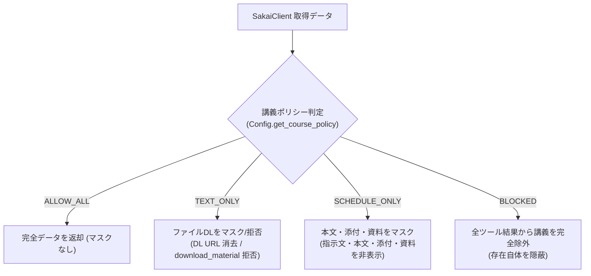

| ポリシー (Enum) | 対象データ型 | 対象プロパティ | マスキング・フィルタリング処理 |
| :--- | :--- | :--- | :--- |
| **`ALLOW_ALL`**<br/>(全て / 完全アクセス) | 全モデル | すべてのプロパティ | **マスクなし**（すべてのデータを完全な状態で提供）。 |
| **`TEXT_ONLY`**<br/>(強 / ファイルDL禁止) | `CourseMaterial` | `url` | **`None` にマスク**（ダウンロード URL を消去）。 |
| | `Attachment` | `url` | **`None` にマスク**（ダウンロード URL を消去）。 |
| | `download_material` | *(ツール実行)* | **`PermissionError` を送出**（「講義ポリシーによりファイルDLは禁止されています」と AI に通知）。 |
| | *(その他)* | `instructions`, `content` 等 | **通常通り返却** |
| **`SCHEDULE_ONLY`**<br/>(弱 / 締切・予定のみ) | `SakaiTask` | `instructions` | **`"[講義ポリシー (SCHEDULE_ONLY) により指示文は非表示]"` にマスク**。 |
| | | `attachments` | **`[]` (空リスト) にマスク**。 |
| | | `max_points` | **`None` にマスク**。 |
| | `Announcement` | `content` | **`"[講義ポリシー (SCHEDULE_ONLY) により本文は非表示]"` にマスク**。 |
| | | `attachments` | **`[]` (空リスト) にマスク**。 |
| | `CalendarEvent` | `description` | **`None` にマスク**。 |
| | `CourseMaterial` | `get_course_materials` | **`[]` (空リスト) を返却**（資料一覧自体を非公開）。 |
| | `download_material` | *(ツール実行)* | **`PermissionError` を送出**（実行を拒否）。 |
| | `CourseDashboard` | `assignments`, `quizzes`<br/>`announcements`, `materials` | **含まれる各子エンティティに上記マスキングを適用**。 |
| | *(維持されるプロパティ)* | `id`, `title`, `due_date`, `status`, `site_id`, `site_name` 等 | **通常通り返却**（スケジュール・締切管理に必要な基本メタデータは保持）。 |
| **`BLOCKED`**<br/>(無効 / 完全隠蔽) | `CourseSite` | `list_courses` | **講義一覧から該当講義を完全除外（削除）**。 |
| | `SakaiTask` | `get_assignments`<br/>`get_quizzes`<br/>`get_upcoming_deadlines` | **課題・テスト一覧から該当講義のタスクを完全除外（削除）**。 |
| | `Announcement` | `get_announcements` | **お知らせ一覧から該当講義のお知らせを完全除外（削除）**。 |
| | `CalendarEvent` | `get_calendar_events` | **カレンダーから該当講義のイベントを完全除外（削除）**。 |
| | `CourseMaterial`<br/>`CourseDashboard` | `get_course_materials`<br/>`get_course_dashboard` | `site_id` 指定時: **`ValueError("指定講義は存在しないか利用できません")`** を送出して秘匿。 |
| | `download_material` | *(ツール実行)* | **`PermissionError` を送出して拒否**。 |

---

#### 実装コード (`src/policy/policy_filter.py`)

```python
import re
from src.config import Config, AIPolicyMode
from src.models import (
    CourseSite,
    SakaiTask,
    Announcement,
    CalendarEvent,
    CourseMaterial,
    CourseDashboard,
    Attachment,
)

MASKED_INSTRUCTION_TEXT = "[講義ポリシー (SCHEDULE_ONLY) により指示文は非表示です]"
MASKED_ANNOUNCEMENT_TEXT = "[講義ポリシー (SCHEDULE_ONLY) により本文は非表示です]"


def filter_courses(courses: list[CourseSite]) -> list[CourseSite]:
    """BLOCKED の講義を除外して返す。"""
    return [c for c in courses if Config.get_course_policy(c.id) != AIPolicyMode.BLOCKED]


def filter_tasks(tasks: list[SakaiTask]) -> list[SakaiTask]:
    """ポリシーに応じてタスクを除外・マスキングして返す。"""
    result: list[SakaiTask] = []
    for task in tasks:
        policy = Config.get_course_policy(task.site_id)
        if policy == AIPolicyMode.BLOCKED:
            continue
        elif policy == AIPolicyMode.SCHEDULE_ONLY:
            result.append(
                task.model_copy(
                    update={
                        "instructions": MASKED_INSTRUCTION_TEXT,
                        "attachments": [],
                        "max_points": None,
                    }
                )
            )
        elif policy == AIPolicyMode.TEXT_ONLY:
            # 添付ファイルのダウンロード URL のみ消去 (None にマスク)
            masked_attachments = [
                att.model_copy(update={"url": None}) for att in task.attachments
            ]
            result.append(task.model_copy(update={"attachments": masked_attachments}))
        else:  # ALLOW_ALL
            result.append(task)
    return result


def filter_announcements(announcements: list[Announcement]) -> list[Announcement]:
    """ポリシーに応じてお知らせを除外・マスキングして返す。"""
    result: list[Announcement] = []
    for item in announcements:
        policy = Config.get_course_policy(item.site_id)
        if policy == AIPolicyMode.BLOCKED:
            continue
        elif policy == AIPolicyMode.SCHEDULE_ONLY:
            result.append(
                item.model_copy(
                    update={
                        "content": MASKED_ANNOUNCEMENT_TEXT,
                        "attachments": [],
                    }
                )
            )
        elif policy == AIPolicyMode.TEXT_ONLY:
            # 添付ファイルのダウンロード URL のみ消去 (None にマスク)
            masked_attachments = [
                att.model_copy(update={"url": None}) for att in item.attachments
            ]
            result.append(item.model_copy(update={"attachments": masked_attachments}))
        else:  # ALLOW_ALL
            result.append(item)
    return result


def filter_calendar_events(events: list[CalendarEvent]) -> list[CalendarEvent]:
    """ポリシーに応じてカレンダーイベントを除外・マスキングして返す。"""
    result: list[CalendarEvent] = []
    for ev in events:
        policy = Config.get_course_policy(ev.site_id)
        if policy == AIPolicyMode.BLOCKED:
            continue
        elif policy == AIPolicyMode.SCHEDULE_ONLY:
            result.append(ev.model_copy(update={"description": None}))
        else:  # TEXT_ONLY, ALLOW_ALL
            result.append(ev)
    return result


def filter_course_materials(materials: list[CourseMaterial], site_id: str) -> list[CourseMaterial]:
    """ポリシーに応じて授業資料一覧を除外・マスキングして返す。"""
    policy = Config.get_course_policy(site_id)
    if policy in (AIPolicyMode.BLOCKED, AIPolicyMode.SCHEDULE_ONLY):
        return []
    elif policy == AIPolicyMode.TEXT_ONLY:
        # ダウンロード URL のみ消去して一覧メタデータ（ファイル名等）のみ提供
        return [m.model_copy(update={"url": None}) for m in materials]
    return materials


def filter_dashboard(dashboard: CourseDashboard) -> CourseDashboard:
    """指定講義のダッシュボードにポリシーマスキングを一括適用する。"""
    policy = Config.get_course_policy(dashboard.site_id)
    if policy == AIPolicyMode.BLOCKED:
        raise ValueError(f"講義 '{dashboard.site_id}' は存在しないか、アクセスが制限されています。")

    return CourseDashboard(
        site_id=dashboard.site_id,
        site_name=dashboard.site_name,
        assignments=filter_tasks(dashboard.assignments),
        quizzes=filter_tasks(dashboard.quizzes),
        announcements=filter_announcements(dashboard.announcements),
        materials=filter_course_materials(dashboard.materials, dashboard.site_id),
    )


_SAKAI_RESOURCE_PATTERN = re.compile(r"^/access/content/(?:group|attachment)/([^/]+)/")


def check_download_allowed_by_url(url: str) -> None:
    """
    URL パスから講義 site_id を正規表現で特定し、ポリシーで許可されていない場合は例外を送出する。
    未設定講義 (Config.POLICIES 未登録) の場合も Config.get_course_policy() により
    自動的にデフォルト (TEXT_ONLY: 強 / DL禁止) が適用されるため、Secure by Default が完全に担保される。
    """
    from urllib.parse import urlparse
    path = urlparse(url).path
    match = _SAKAI_RESOURCE_PATTERN.match(path)

    if not match:
        # Sakai の講義リソース形式でない場合は安全側に倒して拒否
        raise PermissionError(f"URL '{url}' から対象講義を特定できないため、ダウンロードを制限しました。")

    site_id = match.group(1)
    policy = Config.get_course_policy(site_id)

    if policy == AIPolicyMode.BLOCKED:
        raise PermissionError(f"指定されたリソース '{url}' にはアクセスできません。")
    elif policy in (AIPolicyMode.SCHEDULE_ONLY, AIPolicyMode.TEXT_ONLY):
        raise PermissionError(
            f"講義 '{site_id}' は現在のポリシー ({policy.value}) によりファイルのダウンロードが禁止されています。"
        )
```

---

### 5.5 ツール実装における工夫・設計推奨事項 (Guidance)

1. **AI 向け docstring / 説明文の最適化 (Prompt Engineering)**:
   * FastMCP では関数の docstring がそのまま AI モデルへのツール説明（`description`）として渡されます。
   * 「どのようなユーザーの質問に対して本ツールを呼び出すべきか」（例: *「学生が直近の締切や今週やるべき課題を尋ねてきた場合は get_upcoming_deadlines を使用してください」*）を docstring 内に具体的に記述することで、AI のツール選択ミスを劇的に削減できます。
2. **Pydantic モデルの直接返却 (自動 JSON Schema シリアライズ)**:
   * 各ツール関数（`@mcp.tool()`）の戻り値として、第 3 章の Pydantic モデルやそのリスト（`list[SakaiTask]`, `CourseDashboard` 等）をそのまま `return` します。
   * FastMCP が自動的に JSON Schema に基づいてシリアライズするため、手動で `json.dumps()` や `.model_dump()` を呼ぶ必要はありません。各ツールは `return filter_*(await client.get_*(...))` のように 1 行で極めて簡潔に実装できます。

---

## 6. 設定管理 & ユーザー設定 GUI (`src/config.py`, `src/gui/`)

本モジュールは、Sakai の接続ホスト名、各種ファイルパス・定数、および講義ごとの AI 利用ポリシーを一元管理し、ユーザーが直感的に設定変更できる軽量 WebView GUI 画面を提供します。
`from src.config import Config` により、どのモジュールからも `Config.SAKAI_HOST` や `Config.AUTH_COOLDOWN_SECONDS` のように統一アクセスできます。

---

### 6.1 設定管理モジュール (`src/config.py`)

* **役割**: アプリケーション全体の設定値（定数・パス・ユーザー保存値）を一元公開し、起動時・実行中のリロードおよび保存をリアルタイムに同期する。
* **使用技術**: `platformdirs`, `pydantic`, `pathlib.Path`, `os`, `sys`, `json`, `typing`

#### 設定項目の分類 & データ型仕様

ユーザー設定（`AppConfigData`）および定数は、一般ユーザー向けに **「GUI で直感的に変更できる項目」** と、安定性・保守性のために **「ファイル直接編集（上級者向け）または定数として管理する項目」** に明確に分離して設計します。

##### 1. GUI 画面で変更可能な設定項目 (一般ユーザー向け)

| 設定キー | 型 | デフォルト値 | 説明 |
| :--- | :--- | :--- | :--- |
| **`sakai_host`** | `str` | `"tact.ac.thers.ac.jp"` | Sakai LMS の接続ドメイン名（初回プリセット選択や設定画面で変更可能） |
| **`policies`** | `dict[str, AIPolicyMode]` | `{}` | 講義サイト ID ごとの AI 利用ポリシー (`ALLOW_ALL` / `TEXT_ONLY` / `SCHEDULE_ONLY` / `BLOCKED`) |
| **`default_deadline_days`** | `int` | `30` | 直近締切タスク統合取得時のデフォルト対象日数（例: 30日間） |
| **`default_announcement_limit`** | `int` | `7` | お知らせ取得時のデフォルト取得件数（例: 7件） |

##### 2. 内部固定定数 (上級者・内部制御用)

| 設定キー / 定数名 | 型 | デフォルト値 | 管理形式 | 説明 |
| :--- | :--- | :--- | :--- | :--- |
| **`request_timeout`** | `float` | `15.0` | `config.json` 保存 | Sakai API 通常 HTTP 通信のタイムアウト秒数 |
| **`cache_ttl`** | `float` | `300.0` | `config.json` 保存 | 講義一覧・ツール情報のインメモリキャッシュ有効秒数 (5分) |
| **`auth_cooldown_seconds`** | `float` | `3.0` | 内部固定定数 | 認証キャンセル・失敗直後の画面連打防止クールダウン秒数 |
| **`session_check_timeout`** | `float` | `5.0` | 内部固定定数 | セッション確認 API (`/session/current.json`) タイムアウト秒数 |
| **`webview_auto_timeout`** | `float` | `5.0` | 内部固定定数 | WebView 画面を非表示のまま自動素通りを試みる猶予秒数 |
| **`auth_max_timeout`** | `float` | `300.0` | 内部固定定数 | 手動ログイン画面の放置防止最大待機タイムアウト秒数 (5分) |
| **`webview_window_width`** | `int` | `800` | 内部固定定数 | ログイン / 設定画面ウィンドウの初期横幅 (px) |
| **`webview_window_height`** | `int` | `600` | 内部固定定数 | ログイン / 設定画面ウィンドウの初期高さ (px) |

---

#### 講義別 AI 利用ポリシー仕様 (`AIPolicyMode`)

各講義におけるデータの機密性・著作権保護および学習目的に応じ、以下の 4 段階の利用権限をサポートします。
**セキュリティおよび著作権保護の観点（Secure by Default 原則）に基づき、新規講義および未設定時のデフォルト権限は `TEXT_ONLY`（強: ファイルDL禁止）が自動適用されます。**

| 権限レベル (Enum) | 説明 |
| :--- | :--- |
| **`ALLOW_ALL`** (全て) | **完全アクセス**: 講義資料ダウンロード・課題指示文・お知らせ本文・締切すべて利用可能（AI 利用が全面的に許可されている講義向け）。 |
| **`TEXT_ONLY`** (強)<br/>*(★デフォルト)* | **テキスト・指示文のみ**: 課題の指示文やお知らせ本文は取得できるが、スライド・PDF などのファイル実体ダウンロードを禁止（著作物ファイルの流出を防ぎつつテキスト対話を行う講義向け）。 |
| **`SCHEDULE_ONLY`** (弱) | **締切・予定のみ**: タイトル・締切・提出状態・カレンダーのみ取得。課題指示文や添付 URL は `"[講義ポリシーにより非表示]"` とマスク（課題解答作成は自力で行い、締切管理のみ AI に任せる講義向け）。 |
| **`BLOCKED`** (無効) | **完全除外**: 講義一覧やカレンダーを含め、その講義の存在自体を AI ツールから完全に隠蔽・除外（守秘義務のあるゼミ・研究室・非公開プロジェクト向け）。 |

---

#### 実装コード (`src/config.py`)

```python
import json
import os
import sys
from enum import Enum
from pathlib import Path
from typing import Any
from platformdirs import user_data_dir
from pydantic import BaseModel, Field


# ==============================================================================
# 講義別 AI 利用ポリシー定義
# ==============================================================================

class AIPolicyMode(str, Enum):
    """講義ごとの AI アシスタント利用権限ポリシー"""
    ALLOW_ALL = "allow_all"          # 全て (完全アクセス: 資料DL・課題指示文・締切)
    TEXT_ONLY = "text_only"          # 強   (ファイルDL禁止 / テキスト対話・指示文許可)
    SCHEDULE_ONLY = "schedule_only"  # 弱   (締切・予定のみ / 指示文・本文・資料マスク)
    BLOCKED = "blocked"              # 無効 (完全除外 / 講義の存在を隠蔽)


# ==============================================================================
# ユーザー設定データモデル (AppConfigData)
# ==============================================================================

class AppConfigData(BaseModel):
    """config.json に保存・復元されるスキーマ定義"""
    sakai_host: str = "tact.ac.thers.ac.jp"
    policies: dict[str, AIPolicyMode] = Field(default_factory=dict)
    default_deadline_days: int = 30
    default_announcement_limit: int = 7
    request_timeout: float = 15.0
    cache_ttl: float = 300.0


# ==============================================================================
# 設定・定数公開クラス (Config)
# ==============================================================================

class Config:
    """
    アプリケーション全体の設定・定数を一元公開するクラス。
    各モジュールは `from src.config import Config` でインポートして利用する。
    """

    # 1. 不変のシステム定数 & パス (platformdirs 利用)
    APP_DATA_DIR: Path = Path(user_data_dir("sakai-tasks-mcp", appauthor=False))
    CONFIG_FILE_PATH: Path = APP_DATA_DIR / "config.json"
    SESSION_FILE_PATH: Path = APP_DATA_DIR / "session.enc"
    WEBVIEW_DATA_DIR: Path = APP_DATA_DIR / "webview_profile"

    AUTH_COOLDOWN_SECONDS: float = 3.0       # 認証失敗・キャンセル直後の連打防止クールダウン (秒)
    SESSION_CHECK_TIMEOUT: float = 5.0       # セッション確認 API タイムアウト (秒)
    WEBVIEW_AUTO_TIMEOUT: float = 5.0        # WebView 自動素通り猶予秒数 (秒)
    AUTH_MAX_TIMEOUT: float = 300.0          # WebView ログイン待機最大タイムアウト (秒)
    WEBVIEW_WINDOW_WIDTH: int = 800          # ウィンドウ横幅 (px)
    WEBVIEW_WINDOW_HEIGHT: int = 600         # ウィンドウ高さ (px)

    DEFAULT_POLICY: AIPolicyMode = AIPolicyMode.TEXT_ONLY  # デフォルトポリシー (強: ファイルDL禁止)

    UNIVERSITY_PRESETS: dict[str, str] = {
        "名古屋大学 (TACT)": "tact.ac.thers.ac.jp",
        "京都大学 (PandA)": "panda.ecs.kyoto-u.ac.jp",
        "岡山大学 (Moodle/Sakai)": "sakai.okayama-u.ac.jp",
        "法政大学 (学習支援システム)": "hoppii.hosei.ac.jp",
    }

    # 2. 動的ユーザー設定値 (実行中に随時同期される)
    SAKAI_HOST: str = "tact.ac.thers.ac.jp"
    DEFAULT_DEADLINE_DAYS: int = 30
    DEFAULT_ANNOUNCEMENT_LIMIT: int = 7
    REQUEST_TIMEOUT: float = 15.0
    CACHE_TTL: float = 300.0
    POLICIES: dict[str, AIPolicyMode] = {}

    # 3. 内部状態 (mtime ベースの自動再読込用)
    _last_loaded_mtime: float = 0.0

    # 4. ライフサイクル & 実行中リロード・保存メソッド
    @classmethod
    def apply_data(cls, data: AppConfigData) -> None:
        """AppConfigData をクラス変数に一括反映する"""
        cls.SAKAI_HOST = data.sakai_host
        cls.POLICIES = data.policies
        cls.DEFAULT_DEADLINE_DAYS = data.default_deadline_days
        cls.DEFAULT_ANNOUNCEMENT_LIMIT = data.default_announcement_limit
        cls.REQUEST_TIMEOUT = data.request_timeout
        cls.CACHE_TTL = data.cache_ttl

    @classmethod
    def check_and_reload(cls) -> None:
        """config.json が外部 (別プロセス等) で更新されていれば自動再読込する"""
        if cls.CONFIG_FILE_PATH.exists():
            try:
                current_mtime = cls.CONFIG_FILE_PATH.stat().st_mtime
                if current_mtime > cls._last_loaded_mtime:
                    cls.load()
            except Exception:
                pass

    @classmethod
    def init(cls, cli_host: str | None = None) -> None:
        """
        サーバー起動時に main() から 1 回呼び出し、設定を初期化・確定する。
        stdio タイムアウトを防止するためブロッキング GUI は起動せず、
        1. CLI引数 -> 2. 環境変数 -> 3. config.json -> 4. デフォルト の優先度で確定する。
        """
        data = cls.load()
        if cli_host:
            data.sakai_host = cli_host
        elif env_host := os.environ.get("SAKAI_HOST"):
            data.sakai_host = env_host

        if not cls.CONFIG_FILE_PATH.exists():
            # 初回起動時: config.json を生成
            cls.save(data)

        cls.apply_data(data)

    @classmethod
    def load(cls) -> AppConfigData:
        """config.json をディスクから読み込み、クラス変数も最新化して返す (実行中随時呼び出し可能)"""
        if not cls.CONFIG_FILE_PATH.exists():
            data = AppConfigData()
        else:
            try:
                with open(cls.CONFIG_FILE_PATH, "r", encoding="utf-8") as f:
                    data = AppConfigData.model_validate_json(f.read())
                cls._last_loaded_mtime = cls.CONFIG_FILE_PATH.stat().st_mtime
            except Exception:
                data = AppConfigData()

        cls.apply_data(data)
        return data

    @classmethod
    def save(cls, data: AppConfigData | None = None) -> None:
        """設定を config.json に書き込み、即座にクラス変数を同期する (実行中随時呼び出し可能)"""
        cls.APP_DATA_DIR.mkdir(parents=True, exist_ok=True)
        if data is None:
            data = AppConfigData(
                sakai_host=cls.SAKAI_HOST,
                policies=cls.POLICIES,
                default_deadline_days=cls.DEFAULT_DEADLINE_DAYS,
                default_announcement_limit=cls.DEFAULT_ANNOUNCEMENT_LIMIT,
                request_timeout=cls.REQUEST_TIMEOUT,
                cache_ttl=cls.CACHE_TTL,
            )
        with open(cls.CONFIG_FILE_PATH, "w", encoding="utf-8") as f:
            f.write(data.model_dump_json(indent=2))
        if cls.CONFIG_FILE_PATH.exists():
            cls._last_loaded_mtime = cls.CONFIG_FILE_PATH.stat().st_mtime
        cls.apply_data(data)

    @classmethod
    def get_course_policy(cls, site_id: str) -> AIPolicyMode:
        """
        指定された講義サイトの AI 利用ポリシーを取得する。
        別プロセス (open_settings) による変更を即時反映するため、呼び出し時に mtime チェックを行う。
        未設定時はデフォルト (TEXT_ONLY: 強)。
        """
        cls.check_and_reload()
        return cls.POLICIES.get(site_id, cls.DEFAULT_POLICY)
```

---

### 6.2 ユーザー設定 GUI モジュール群 (`src/gui/`)

本モジュール群は、単一責任の原則（SRP）に基づき、**「データ準備（`data_builder.py`）」「JS 通信ブリッジ（`api.py`）」「ウィンドウ起動・表示（`settings_window.py`）」** の 3 つのファイルに責務を分離して実装します。

* **基本設計思想**:
  * **設定画面を開く前に全データを同期取得**: 設定画面のウィンドウを起動する前に、Python 側で「セッション確認 $\rightarrow$ 必要ならログイン $\rightarrow$ 全講義一覧取得 $\rightarrow$ `config.json` とマージ」を一連の処理として完了させ、**単一の UI 用 JSON データ（`SettingsUIData`）を構築してから WebView2 ウィンドウを起動** します。
  * **多重 GUI 起動の防止**: これにより、設定画面が開いている最中に別のログインウィンドウを開くような GUI スレッド競合・多重起動を完全に防止します。
  * **UI 開発の独立性 & テスト容易性**: データ構築ロジック（`data_builder.py`）は GUI ライブラリに一切依存しないため単体テストが容易であり、フロントエンド担当者はダミー JSON を用いてブラウザ単体で独立開発が可能です。

---

#### 処理フロー (Sequence)

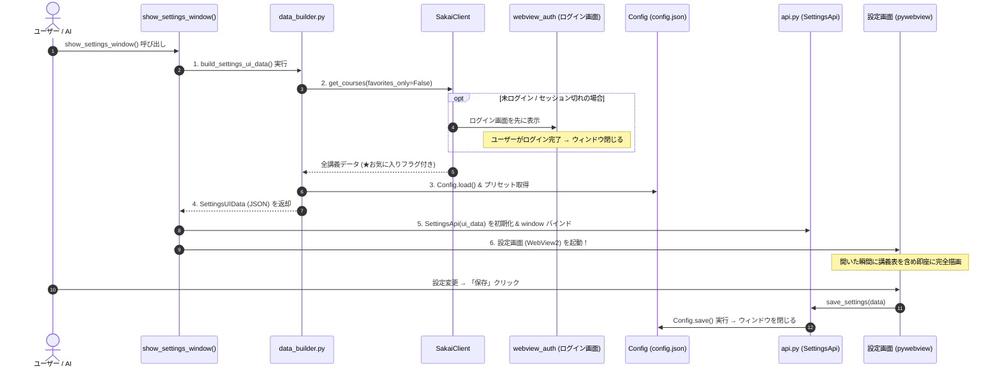

---

#### 6.2.1 UI データ構築モジュール (`src/gui/data_builder.py`)

* **役割**: `SakaiClient` から全講義一覧とお気に入り情報を取得し、既存の `config.json` 設定とマージして、UI が必要とする単一のデータモデル `SettingsUIData` を構築する。
* **特徴**: GUI に依存しない純粋関数・モデル定義であり、単体テスト（`test_gui_data_builder.py`）が容易。

```python
import asyncio
from pydantic import BaseModel
from src.config import Config, AIPolicyMode
from src.client.sakai_client import SakaiClient


class CourseSettingItem(BaseModel):
    """設定表に 1 行として並ぶ講義データ"""
    id: str                          # 講義サイト ID (例: "2024_01_AI101")
    title: str                       # 講義名 (例: "人工知能基礎 (2024前期)")
    is_favorite: bool                # お気に入り講義フラグ (★判定用)
    current_policy: AIPolicyMode     # 現在設定されているポリシー (デフォルト: TEXT_ONLY)


class SettingsUIData(BaseModel):
    """設定画面の初期描画に必要な全データ"""
    sakai_host: str                  # 現在の Sakai ホスト名
    presets: dict[str, str]          # 大学ドメインプリセット一覧
    default_deadline_days: int       # 直近締切の取得対象日数 (デフォルト 30)
    default_announcement_limit: int  # お知らせ取得の最大件数 (デフォルト 7)
    courses: list[CourseSettingItem] # 講義一覧 (お気に入り優先順)


async def build_settings_ui_data() -> SettingsUIData:
    """
    Sakai から全講義一覧を取得し、既存の config.json とマージして
    UI 用データ (SettingsUIData) を構築する。
    """
    # 1. 講義一覧とお気に入り情報を SakaiClient から取得 (未ログインなら自動ログイン)
    async with SakaiClient() as client:
        courses = await client.get_courses(favorites_only=False)

    # 2. 現在の config.json をロード
    config = Config.load()

    # 3. 講義データと既存ポリシーをマージ (お気に入り講義を先頭にソート)
    course_items = []
    sorted_courses = sorted(courses, key=lambda c: (not c.is_favorite, c.name))
    for c in sorted_courses:
        # 未設定時は Config.DEFAULT_POLICY (TEXT_ONLY: 強) を適用
        policy = config.policies.get(c.id, Config.DEFAULT_POLICY)
        course_items.append(
            CourseSettingItem(
                id=c.id,
                title=c.name,
                is_favorite=c.is_favorite,
                current_policy=policy,
            )
        )

    return SettingsUIData(
        sakai_host=config.sakai_host,
        presets=Config.UNIVERSITY_PRESETS,
        default_deadline_days=config.default_deadline_days,
        default_announcement_limit=config.default_announcement_limit,
        courses=course_items,
    )
```

##### UI が受け取る JSON の具体例
```json
{
  "sakai_host": "tact.ac.thers.ac.jp",
  "presets": {
    "名古屋大学 (TACT)": "tact.ac.thers.ac.jp",
    "京都大学 (PandA)": "panda.ecs.kyoto-u.ac.jp",
    "岡山大学 (Moodle/Sakai)": "sakai.okayama-u.ac.jp",
    "法政大学 (学習支援システム)": "hoppii.hosei.ac.jp"
  },
  "default_deadline_days": 30,
  "default_announcement_limit": 7,
  "courses": [
    {
      "id": "2024_01_AI101",
      "title": "人工知能基礎 (2024前期)",
      "is_favorite": true,
      "current_policy": "text_only"
    },
    {
      "id": "2024_01_SE102",
      "title": "ソフトウェア工学演習",
      "is_favorite": true,
      "current_policy": "allow_all"
    },
    {
      "id": "2023_02_LA101",
      "title": "線形代数学 I (2023後期)",
      "is_favorite": false,
      "current_policy": "schedule_only"
    }
  ]
}
```

---

#### 6.2.2 JS 通信ブリッジモジュール (`src/gui/api.py`)

* **役割**: `pywebview` の `js_api` としてウィンドウにバインドされ、JavaScript からの初期データ要求および設定保存要求を処理する。

```python
import webview
from src.config import Config, AppConfigData
from src.gui.data_builder import SettingsUIData


class SettingsApi:
    """pywebview (JavaScript) から非同期に呼び出される API クラス"""

    def __init__(self, initial_data: SettingsUIData):
        self._initial_data = initial_data
        self._window: webview.Window | None = None

    def set_window(self, window: webview.Window) -> None:
        """バインドされた Window インスタンスを保持する"""
        self._window = window

    def get_initial_data(self) -> dict:
        """設定画面起動時に JS から呼ばれ、SettingsUIData を即時返却 (0ms)"""
        return self._initial_data.model_dump()

    def save_settings(self, data: dict) -> bool:
        """ユーザーが「保存」をクリックした際に呼ばれ、config.json を更新してウィンドウを閉じる"""
        # JS から渡された courses 配列を policies 辞書 (site_id -> AIPolicyMode) にマッピング変換
        policies = {}
        for c in data.get("courses", []):
            if "id" in c and "current_policy" in c:
                policies[c["id"]] = AIPolicyMode(c["current_policy"])

        app_config = AppConfigData(
            sakai_host=data.get("sakai_host", Config.SAKAI_HOST),
            policies=policies,
            default_deadline_days=int(data.get("default_deadline_days", Config.DEFAULT_DEADLINE_DAYS)),
            default_announcement_limit=int(data.get("default_announcement_limit", Config.DEFAULT_ANNOUNCEMENT_LIMIT)),
            request_timeout=float(data.get("request_timeout", Config.REQUEST_TIMEOUT)),
            cache_ttl=float(data.get("cache_ttl", Config.CACHE_TTL)),
        )
        Config.save(app_config)
        if self._window:
            self._window.destroy()
        return True
```

---

#### 6.2.3 ウィンドウ起動制御モジュール (`src/gui/settings_window.py`)

* **役割**: `pywebview` ウィンドウの生成・起動を司るエントリポイント。
* **単一ライフサイクル設計**:
  * OS のメインスレッド制約および `pywebview.start()` の 1 回呼び出し制約を遵守するため、**設定画面を開く前に「セッション確認 $\rightarrow$ 必要に応じて認証 $\rightarrow$ 全講義取得 $\rightarrow$ UIデータ構築」を完了** させ、構築済みデータをバインドした単一の WebView ウィンドウで即座に設定画面を描画します。

```python
import asyncio
import sys
import webview
from pathlib import Path
from src.config import Config
from src.gui.data_builder import build_settings_ui_data
from src.gui.api import SettingsApi


def show_settings_window() -> None:
    """
    ユーザー詳細設定画面 (WebView GUI) を起動する。
    別プロセス (--settings) からメインスレッドで直接呼び出される。
    起動前にセッション確認および UI データ構築 (SettingsUIData) を同期完了させ、
    設定画面 HTML (settings.html) を即座に完全描画する。
    """
    template_path = Path(__file__).parent / "templates" / "settings.html"

    # 1. UI データの事前構築 (未ログイン時は内部で get_valid_cookies が呼ばれ、必要に応じ WebView ログインが完了)
    try:
        ui_data = asyncio.run(build_settings_ui_data())
    except Exception as e:
        print(f"設定データの読み込みに失敗しました: {e}", file=sys.stderr)
        return

    # 2. JS 通信ブリッジを初期化
    api = SettingsApi(initial_data=ui_data)

    # 3. 設定画面ウィンドウをメインスレッドで直接生成して起動
    window = webview.create_window(
        title="Sakai Tasks MCP 設定",
        url=template_path.as_uri(),
        js_api=api,
        width=Config.WEBVIEW_WINDOW_WIDTH,
        height=Config.WEBVIEW_WINDOW_HEIGHT,
        resizable=True,
    )
    api.set_window(window)

    # webview.start はメインスレッドで起動 (OS 制約遵守)
    webview.start(storage_path=str(Config.WEBVIEW_DATA_DIR), private_mode=False)


def show_initial_setup_window() -> str | None:
    """
    初回起動時やインストーラ、CLI (--setup) から呼び出される大学プリセット選択ダイアログ。
    """
    template_path = Path(__file__).parent / "templates" / "initial_setup.html"
    # プリセット選択ダイアログ処理 (選択されたドメインを返却して Config.save)
    ...
```

---

#### 6.2.4 設定 GUI 画面 UI 要件一覧

ユーザー設定画面（`show_settings_window`）は、学生が迷わず安全に設定を調整できるよう、上から順に以下の要素を配置して構成します。

| セクション / 要素 | 要件種別 | UI 動作・仕様要件 |
| :--- | :--- | :--- |
| **1. ドメイン設定行** | **必須要件** | - **Sakai LMS 接続先ドメインの入力・選択**。<br/>- 手動テキスト入力欄 ＋ 主要大学（名大/京大等）のプリセット選択プルダウンを併設し、プルダウン選択時にテキスト欄へ即座に反映。 |
| **2. 権限詳細説明** | **必須要件** | - **各 AI 利用権限（`全て` / `強` / `弱` / `無効`）の詳しい説明**。<br/>- 画面を圧迫しないよう、**デフォルトでは折りたたまれた状態（アコーディオン / `<details>`）** とし、クリックで展開可能。 |
| **3. ポリシー一括設定バー** | **必須要件** | - 講義数が多い場合の操作負荷を軽減するため、表上部に **「すべて『全て』」「すべて『強』」「すべて『弱』」「すべて『無効』」の一括適用ボタン** を配置。 |
| **4. 講義絞り込み検索** | *推奨要件* | - 登録講義数が多い学生向けに、表上部に **講義名リアルタイム検索テキストボックス** を配置（JavaScript によるインクリメンタルフィルタ）。 |
| **5. 講義別ポリシー設定表** | **必須要件** | - **講義（行）× 権限（列）の行列（マトリクス）形式** で一覧表示。<br/>- 各セルにラジオボタンを配置（1 講義につき 1 つの権限を選択）。<br/>- **お気に入り講義（★）を最上部に優先表示** し、その下に非お気に入り講義を配置。<br/>- 新規・未設定講義は **デフォルトで「強」が選択された状態** で初期表示。 |
| **6. 詳細パラメータ設定行** | **必須要件** | - 1 行ずつ分かりやすく詳細数値を設定可能。<br/>- **直近締切の取得対象日数**（数値入力、デフォルト 30 日）。<br/>- **お知らせ取得件数上限**（数値入力、デフォルト 7 件）。 |
| **7. 保存・アクションフッター** | **必須要件** | - 画面最下部に **「保存して閉じる」ボタン** および **「キャンセル」ボタン** を配置。<br/>- 保存完了時に `SettingsApi.save_settings(...)` を呼び出して設定を即時永続化し、ウィンドウを安全に閉じる。 |

---

#### 6.2.5 設定 GUI 画面 UI イメージテキスト図

```text
┌─────────────────────────────────────────────────────────────────────────────┐
│ ⚙️ Sakai Tasks MCP 設定                                                      │
├─────────────────────────────────────────────────────────────────────────────┤
│ 🌐 Sakai 接続先ドメイン                                                      │
│ [ tact.ac.thers.ac.jp                       ] [ 🏛️ プリセットから選ぶ ▼ ]     │
├─────────────────────────────────────────────────────────────────────────────┤
│ ▶ 📖 各利用権限の詳しい説明を見る（クリックで展開）                          │
├─────────────────────────────────────────────────────────────────────────────┤
│ 🛡️ 講義別 AI 利用ポリシー設定                                                │
│ [すべて全て] [すべて強] [すべて弱] [すべて無効]      [🔍 講義名で絞り込み...] │
│ ┌───────────────────────────────────────────────┬──────┬──────┬──────┬──────┐ │
│ │ 講義名 (★お気に入り優先)                     │ 全て │  強  │  弱  │ 無効 │ │
│ ├───────────────────────────────────────────────┼──────┼──────┼──────┼──────┤ │
│ │ ★ 人工知能基礎 (2024前期)                     │ ( )  │ (●)  │ ( )  │ ( )  │ │
│ │ ★ ソフトウェア工学演習                       │ (●)  │ ( )  │ ( )  │ ( )  │ │
│ │ ★ コンピュータネットワーク                   │ ( )  │ (●)  │ ( )  │ ( )  │ │
│ ├───────────────────────────────────────────────┼──────┼──────┼──────┼──────┤ │
│ │   線形代数学 I (2023後期)                     │ ( )  │ ( )  │ (●)  │ ( )  │ │
│ │   全学情報リテラシー                         │ ( )  │ (●)  │ ( )  │ ( )  │ │
│ └───────────────────────────────────────────────┴──────┴──────┴──────┴──────┘ │
├─────────────────────────────────────────────────────────────────────────────┤
│ ⏱️ 詳細パラメータ設定                                                       │
│ ・直近締切の取得対象日数 : [  30 ] 日間                                     │
│ ・お知らせ取得の最大件数 : [   7 ] 件                                       │
├─────────────────────────────────────────────────────────────────────────────┤
│                                            [ キャンセル ]  [ 💾 保存して閉じる ] │
└─────────────────────────────────────────────────────────────────────────────┘
```

---

## 7. ポータブルパッケージ配布 & テスト方針

### 7.1 配布パッケージング仕様 (Portable Python Distribution)

本プロジェクトでは、学生が Python の事前インストールなしですぐに使える利便性を確保しつつ、セキュリティ上の課題（アンチウイルスの誤検知や不透明な実行ファイルへの警戒感）を回避するため、**公式ポータブル Python ランタイムを同梱するディレクトリパッケージ配布方式** を採用します。

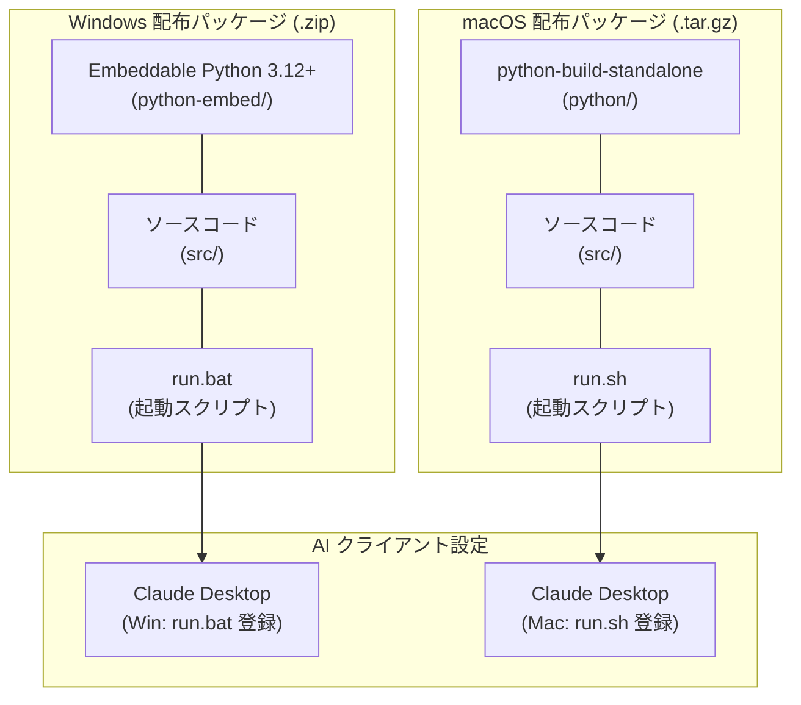

---

#### 1. 背景と設計方針 (なぜ単一 exe 配布を避けるのか)

1. **アンチウイルス誤検知 (False Positive) の完全回避**:
   * PyInstaller などの単一 `.exe` 化ツールは、ブートローダの挙動がマルウェアに類似するため、Windows Defender や大学推奨のウイルス対策ソフト（Trend Micro, Symantec 等）によって誤検知・自動削除される事例が多発します。
   * 公式の Embeddable Python / standalone ビルドを利用することで、バイナリは Python 公式の署名済み・信頼された実行ファイルとなり、誤検知のリスクを減らします。
2. **コードの透明性と安心感**:
   * `src/` ディレクトリ内に Python ソースコードがそのまま配置されるため、ユーザーや大学管理者が挙動をいつでも確認・監査でき、不審なマルウェアではないという心理的安心感を提供できます。
3. **ゼロ・インストール (Zero Setup)**:
   * 配布 ZIP を展開するだけで、必要なライブラリ（`httpx`, `mcp`, `pydantic`, `pywebview` 等）が内蔵されたポータブル Python から MCP サーバーが stdio 起動します。

---

#### 2. Windows 配布パッケージ構成 (`Embeddable Python`)

* **ベースランタイム**: Python 公式 Windows embeddable package (`python-3.12.x-embed-amd64.zip`)
* **ディレクトリ構成**:

```text
sakai-tasks-mcp-windows/
├── python-embed/                # 公式 Embeddable Python ランタイム + site-packages
│   ├── python.exe
│   ├── python312._pth           # import パス設定 (Lib/site-packages を追加)
│   └── Lib/site-packages/       # 事前インストール済み依存ライブラリ
├── src/                         # アプリケーションソースコード (アセット含む)
│   ├── server.py
│   └── ...
└── run.bat                      # MCP 起動ランチャースクリプト
```

* **起動ランチャー (`run.bat`)**:
  標準入出力（stdio）をそのまま子プロセスに透過して MCP 通信を確立します。
  パッケージルートを `PYTHONPATH` に設定し、`from src...` のインポートを確実に解決します。

```bat
@echo off
setlocal
cd /d "%~dp0"
set "PYTHONPATH=%~dp0"
"%~dp0python-embed\python.exe" "%~dp0src\server.py" %*
```

---

#### 3. macOS 配布パッケージ構成 (`python-build-standalone`)

* **ベースランタイム**: Astral / Gregory Szorc 提供のスタンドアロン Python ビルド (`python-build-standalone`)
* **ディレクトリ構成**:

```text
sakai-tasks-mcp-macos/
├── python/                      # スタンドアロン Python ランタイム
│   ├── bin/python3
│   └── lib/python3.12/site-packages/
├── src/                         # アプリケーションソースコード (アセット含む)
│   ├── server.py
│   └── ...
└── run.sh                       # MCP 起動ランチャースクリプト (chmod +x)
```

* **起動ランチャー (`run.sh`)**:

```bash
#!/usr/bin/env bash
SCRIPT_DIR="$(cd "$(dirname "$0")" && pwd)"
export PYTHONPATH="$SCRIPT_DIR:${PYTHONPATH:-}"
exec "$SCRIPT_DIR/python/bin/python3" "$SCRIPT_DIR/src/server.py" "$@"
```

---

#### 4. 開発・ローカル検証用単一ビルド (`PyInstaller`)

ローカルでの単体動作確認やデバッグを目的として、単一 `.exe` を生成するコマンド構成も保持します。

```bash
pyinstaller --onefile \
  --name sakai-tasks-mcp \
  --add-data "src/gui/templates;templates" \
  --hidden-import "pywebview.platforms.winforms" \
  --hidden-import "clr" \
  src/server.py
```

---

### 7.2 AI クライアント設定 & 登録仕様 (MCP Client Configuration)

AI クライアント（Claude Desktop, Cursor 等）の設定ファイルに `run.bat` (Win) または `run.sh` (Mac) を登録します。

#### 1. Claude Desktop 設定例 (`claude_desktop_config.json`)

* **Windows 配布パッケージ利用時**:
```json
{
  "mcpServers": {
    "sakai-tasks": {
      "command": "C:\\Users\\username\\sakai-tasks-mcp\\run.bat"
    }
  }
}
```

* **macOS 配布パッケージ利用時**:
```json
{
  "mcpServers": {
    "sakai-tasks": {
      "command": "/Users/username/sakai-tasks-mcp/run.sh"
    }
  }
}
```

* **開発時 (Python 仮想環境直接実行)**:
```json
{
  "mcpServers": {
    "sakai-tasks": {
      "command": "Z:\\home\\sy\\MyPrograms\\web\\sakai-tasks-mcp\\.venv\\Scripts\\python.exe",
      "args": [
        "Z:\\home\\sy\\MyPrograms\\web\\sakai-tasks-mcp\\src\\server.py"
      ]
    }
  }
}
```

---

### 7.3 テスト自動化方針 (Testing Strategy)

本プロジェクトでは、単一責任の原則に従ってモジュールを疎結合化しているため、**外部 Sakai サーバーへの実際の通信や GUI 画面の起動を行わずに、ローカルでモジュールを自動テスト** できます。

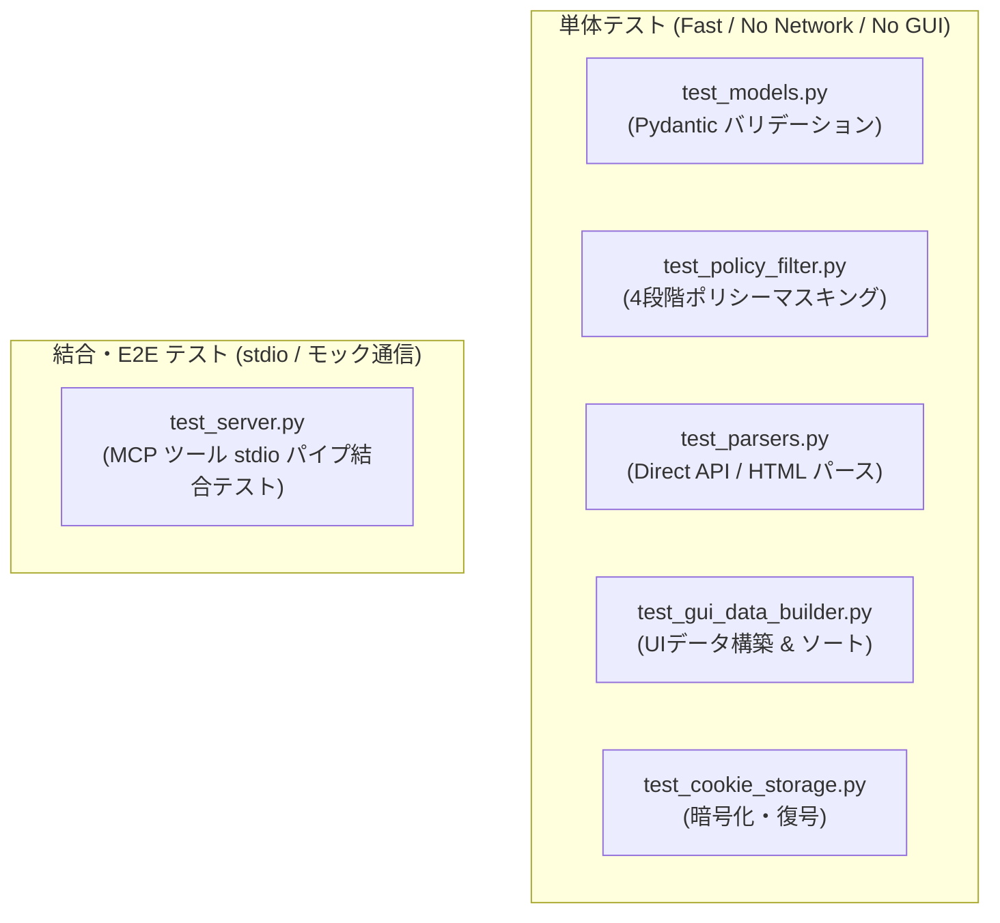

---

#### 1. モジュール別単体テスト方針 (`tests/`)

| テストファイル | テスト対象モジュール | 主な検証内容 |
| :--- | :--- | :--- |
| **`tests/test_models.py`** | `src/models.py` | - 日時文字列・タイムスタンプ（秒/ミリ秒）の自動パース検証。<br/>- Pydantic モデルのシリアライズ・デシリアライズ検証。<br/>- 不正データ入力時のバリデーションエラー検知。 |
| **`tests/test_policy_filter.py`** | `src/policy/policy_filter.py` | - `ALLOW_ALL`: データが完全無加工で返却されること。<br/>- `TEXT_ONLY`: 課題指示文やお知らせ本文は保持され、講義資料一覧の空リスト返却およびダウンロード・添付URLのマスキング/拒否が行われること。<br/>- `SCHEDULE_ONLY`: 指示文・本文が `[講義ポリシーにより非表示]` にマスクされ、添付URLや資料取得が制限されること。<br/>- `BLOCKED`: 該当講義の全データが完全に除外されること。 |
| **`tests/test_parsers.py`** | `src/client/parsers/*` | - Sakai Direct REST API 生 JSON（課題・テスト・お知らせ・カレンダー）のパース整合性。<br/>- `/portal` HTML からのお気に入り講義 ID 抽出ロジック（BeautifulSoup）の検証。 |
| **`tests/test_gui_data_builder.py`** | `src/gui/data_builder.py` | - `build_settings_ui_data()` において、お気に入り講義（★）が先頭に正しくソートされること。<br/>- 新規講義にデフォルトポリシー（`TEXT_ONLY`）が自動注入されること。 |
| **`tests/test_cookie_storage.py`** | `src/auth/cookie_storage.py` | - `Fernet` + `keyring` による Cookie 暗号化保存・復元の整合性検証。 |

---

#### 2. MCP サーバー結合テスト (`test_server.py`)

* **検証内容**:
  * モック HTTP クライアントを注入し、`FastMCP` サーバーを stdio 経由で呼び出し。
  * `list_courses`, `get_upcoming_deadlines`, `get_assignments`, `get_settings` などの MCP ツールが仕様通りの JSON Schema レスポンスを返すことをエンドツーエンドで検証。

#### 3. テスト実行コマンド
```bash
# 全単体テストの実行
pytest tests/ -v

# カバレッジ測定
pytest --cov=src tests/
```


