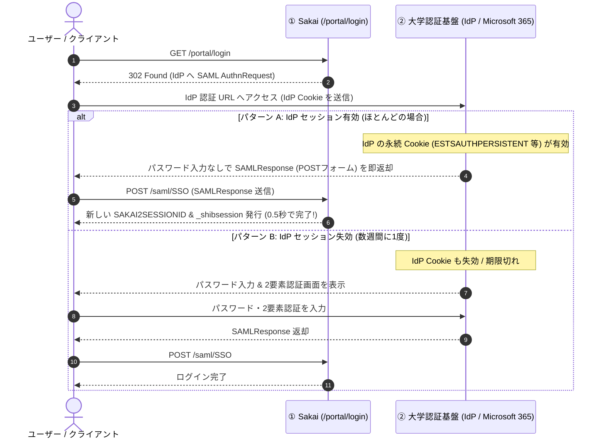
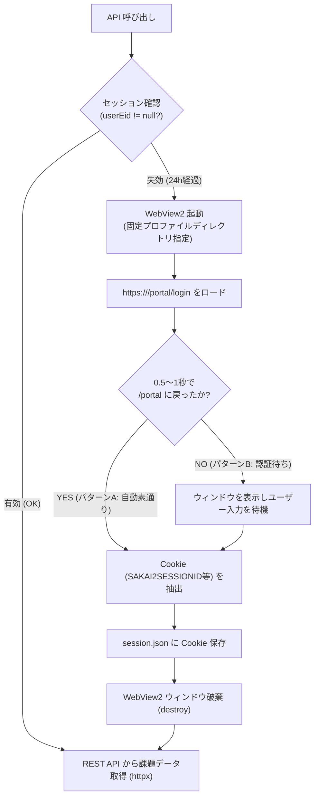

# Sakai 認証 & セッション管理 仕様書

本書は、Sakai LMS におけるセッション管理、大学 SSO（SAML / Shibboleth / Microsoft 365 等）の認証プロトコル、Cookie の詳細仕様、および `sakai-tasks-mcp` における自動再認証設計をまとめた技術仕様書です。

---

## 1. Cookie 一覧 & 役割・ライフタイム

Sakai（およびそのインフラ基盤）との通信では、以下の 4 種別の Cookie が関与します。

| Cookie 名 | 発行元 | 役割 | 有効期限 (Expires) | 変更・更新頻度 |
| :--- | :--- | :--- | :--- | :--- |
| **`SAKAI2SESSIONID`** | Sakai アプリ層 (Apache Tomcat) | ログイン中の Sakai セッション（誰がログインしているか）を特定するキー | `Session` (ブラウザ終了で消滅) | 基本不変（ログイン〜ログアウトまで固定） |
| **`_shibsession_...`** | Shibboleth SP (Webサーバーモジュール) | 大学 SSO (Shibboleth) のサービスプロバイダ側セッション識別子 | `Session` (ブラウザ終了で消滅) | ログイン時に発行 |
| **`AWSALB`<br/>`AWSALBCORS`** | AWS ロードバランサ (ALB) | 複数台の Sakai サーバーのうち、どの物理サーバーに振り分けるかを指定する暗号化トークン | 数分〜数時間 (Max-Age) | **通信のたびに毎回変化** (有効期限更新のため新トークンが発行される) |
| **`_opensaml_req_...`** | Shibboleth / OpenSAML | 認証要求（AuthnRequest）を IdP に送信中の一時的なステート追跡用 | 数分 | 認証フロー中のみ一時的に生成 |
| **IdP 永続 Cookie**<br/>(`ESTSAUTHPERSISTENT`<br/>`idp_session` 等) | 大学統合認証局 (IdP)<br/>(Microsoft 365, CAS等) | 大学の認証サーバー側で「以前ログインした端末・ユーザー」を記憶する認証トークン | **数日〜数週間** (永続 Cookie / ディスク保存) | ログイン時および利用時に更新 |

---

## 2. セッションのライフサイクル & 挙動

### 2.1 Sakai サーバー側のスライディング・セッション（ローリング更新）

`GET /direct/session/current.json` のレスポンスに示される通り、Sakai のセッションは **スライディング・タイムアウト** で管理されています。

```json
{
  "creationTime": 1787971968469,
  "lastAccessedTime": 1788010658650,
  "currentTime": 1788010658650,
  "maxInactiveInterval": 86400,
  "userEid": "student_account_id",
  "userId": "internal-user-uuid",
  "active": true
}
```

* **`maxInactiveInterval: 86400`（無操作許容秒数）**:
  東海国立大学機構（TACT）等の標準設定では **86,400 秒 ＝ 24 時間**。
* **`lastAccessedTime`（最終アクセス時刻）**:
  Sakai にリクエストが届くたびに現在時刻に更新される。
* **挙動ルール**:
  * 前回のアクセスから **24 時間以内** に次のアクセスがあれば、有効期限はさらに 24 時間後へと延長され続ける。
  * **24 時間以上アクセスが途絶える** と、サーバー側のメモリからセッションが破棄され失効する。

---

### 2.2 セッション失効の判定ルール

Sakai Direct API は、**未ログインまたはセッション失効時でも `401/403` エラーコードを返さず、ステータス `200 OK` で空データや `userEid: null` を返す** という特殊な挙動をします。

* **セッション有効判定ロジック (Python)**:
  ```python
  resp = client.get("https://<sakai-host>/direct/session/current.json")
  if resp.status_code == 200:
      data = resp.json()
      # userEid が存在し、かつ null でないことを確認する
      is_authenticated = data.get("userEid") is not None
  ```

---

## 3. 再ログイン時の 2 つのパターン（IdP の仕組み）

ブラウザ再起動や 24 時間放置により `SAKAI2SESSIONID` が消えた状態で、Sakai のログイン直行 URL（`/portal/login`）にアクセスした際、**大学 IdP（認証サーバー）のセッション状態によって挙動が 2 つに分岐** します。



### パターン A: 自動素通り認証（操作不要 / 0.5 秒）
* **条件**: 大学 IdP 側の永続 Cookie（有効期限: 数日〜数週間）がブラウザストレージに残っている場合。
* **動作**: 画面上でのパスワード入力や 2 要素認証は一切発生せず、リダイレクトと POST 送信が全自動で走り、即座に新しい Sakai セッションが発行される。

### パターン B: 完全手動再認証
* **条件**: 大学 IdP 側の最大有効期限が切れた場合、またはブラウザのシークレットモード等でディスク Cookie が存在しない場合。
* **動作**: 大学のログイン画面が表示され、ユーザーによるパスワード・2 要素認証の入力が必要となる。

---

## 4. なぜ純粋な HTTP GET では再ログインできず、WebView2 が必要か？

Python の `httpx.get()` だけで `/portal/login` のリダイレクトを追従しても、以下の理由から自動認証は完了しません。

1. **SAML POST Binding の壁**:
   IdP が認証成功した際、Sakai に戻す方法は `302 リダイレクト (GET)` ではなく、**`200 OK` の HTML フォームと JavaScript（`document.forms[0].submit()`）** です。`httpx` は JavaScript を実行できないため、フォーム自動送信ができません。
2. **IdP の JavaScript 依存**:
   Microsoft 365 などのモダン IdP は、ブラウザの WebCrypto や SPA（Single Page Application）スクリプトを実行してセッション検証を行います。
3. **Cookie のドメイン分離**:
   IdP の永続 Cookie は Windows のブラウザストレージ内に保存されており、Python のセッションには直接含まれていません。

👉 **解決策**: Windows 標準の **Edge (WebView2 / `pywebview`)** を利用し、ブラウザエンジンに JavaScript 実行・POST Binding・Cookie 照合をすべて任せることで、完全かつ安定した自動認証を実現します。

---

## 5. WebView2 による自動再認証の実装設計

### 5.1 基本アーキテクチャ



### 5.2 実装上の重要パラメータ

1. **プロファイルの永続化 (`user_data_dir`)**:
   一時ディレクトリではなく、ローカルの固定パス（例: `%LOCALAPPDATA%\sakai-tasks-mcp\webview_profile`）を指定して WebView2 を起動する。これにより、IdP の永続 Cookie がディスクに維持され、パターン A（自動素通り）が機能する。
2. **ログイン直行 URL**:
   トップページ（`/portal`）ではなく、常に **`https://<sakai-host>/portal/login`** を開くことで、無駄なクリック操作なしに即座に SAML リダイレクトを開始させる。
3. **完了検知**:
   * WebView2 の URL が `/portal` または `/portal/site/...` に戻ったこと
   * または Cookie ストレージに `userEid` を持つ有効な `SAKAI2SESSIONID` が生成されたこと
   を検知した瞬間に `window.destroy()` を実行してバックグラウンドに戻る。

---

## 6. 各大学の Sakai サイトにおける共通点と汎用性

本アーキテクチャは、大学ごとにホスト名を設定するだけで共通して動作します。

| 大学 / システム | ポータル URL | ログイン直行 URL | 認証方式 |
| :--- | :--- | :--- | :--- |
| **京都大学 (PandA)** | `https://panda.ecs.kyoto-u.ac.jp/portal` | `https://panda.ecs.kyoto-u.ac.jp/portal/login` | CAS / Shibboleth SSO |
| **名大・岐大 (TACT)** | `https://tact.ac.thers.ac.jp/portal` | `https://tact.ac.thers.ac.jp/portal/login` | 機構統合認証 (Microsoft 365 / Shibboleth) |
| **京都女子大学 (LMS)** | `https://lms.kyoto-wu.ac.jp/portal` | `https://lms.kyoto-wu.ac.jp/portal/login` | Shibboleth SSO |
| **Sakai 公式 (Nightly)** | `https://trunk-maria.nightly.sakaiproject.org/portal` | `https://trunk-maria.nightly.sakaiproject.org/portal/xlogin` | ローカルフォーム認証 |
