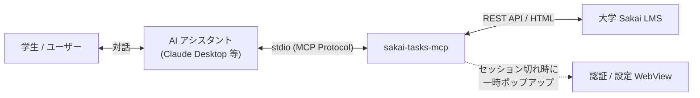
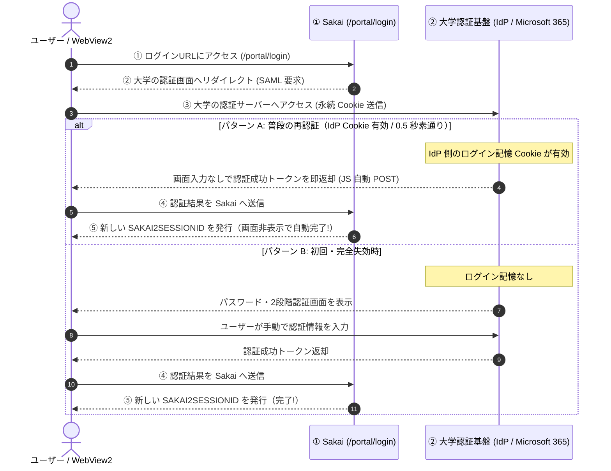

# 開発者向け Sakai-Tasks-MCP ガイド

## 1. 完成品がどう動くかの説明書

本プロジェクトのゴールは、**「AI アシスタント（Claude Desktop, Cursor 等）が、ユーザーの代わりに大学の Sakai（LMS）から課題・テスト・お知らせ・講義資料を安全に取得・要約できるようにする」** ことです。



---

### ユーザー目線での利用フロー

1. **直近締切の確認**:
   * **ユーザー**: 「今週締め切りの課題や小テストはある？」
   * **AI**: `get_upcoming_deadlines` ツールを実行し、「2026/09/05 23:59 締切の『人工知能基礎 レポート課題3』があります」と回答。
2. **課題内容・指示文の確認**:
   * **ユーザー**: 「そのレポート課題3の文字数や提出要件を教えて」
   * **AI**: `get_assignments` ツールで詳細指示文を取得し、要点を分かりやすく整理。
3. **休講・重要連絡の確認**:
   * **ユーザー**: 「直近で休講や教室変更のお知らせはある？」
   * **AI**: `get_announcements` ツールでお知らせ一覧を取得し、最新の連絡を要約。
4. **講義総合ダッシュボードの確認**:
   * **ユーザー**: 「ソフトウェア工学演習の状況を全部教えて」
   * **AI**: `get_course_dashboard` ツールを実行し、未提出課題・テスト・最新連絡・授業資料を 1 発でまとめて報告。
5. **講義ごとの AI 権限設定（設定 GUI の起動）**:
   * **ユーザー**: 「設定画面を開いて」
   * **AI**: `open_settings` ツールを実行し、デスクトップ上に設定画面（ポップアップ）を表示。ユーザー自身が「この講義は資料読み込みを許可する」といった設定を画面上で変更・保存。

---

### システム内部の動作フロー

* **通常時**:
  AI から要求が届くと、ローカルに暗号化保存されたセッション情報（Cookie）を用いて Sakai Direct REST API を叩き、ポリシーフィルタを通過させた安全な構造化データ（JSON Schema）を即座に AI へ返却します（約 0.2〜0.5 秒）。
* **セッション切れ・初回実行時**:
  Cookie の期限切れ（24 時間放置等）を検知すると、OS 備え付けのブラウザエンジン（Edge WebView2）が一時起動し、大学 SSO の永続 Cookie を利用して **0.5 秒で自動素通り認証**（または手動ログイン）を行い、新しいセッションを暗号化保存して本来のリクエストに復帰します。

---

## 2. 使用技術 & ライブラリの説明

本プロジェクトで採用している主要な技術・ライブラリの役割と選定理由は以下の通りです。

| 技術 / ライブラリ | 本プロジェクトでの役割 & 選定理由 |
| :--- | :--- |
| **FastMCP (`mcp`)** | **MCP サーバーフレームワーク**: AI モデルと Python プログラムを繋ぐインターフェース。関数に `@mcp.tool()` デコレータを付与するだけで、stdio 経由で AI 向けツール API を公開可能。 |
| **`httpx`** | **非同期 HTTP クライアント**: `async/await` 構文を用いて、Sakai の Direct REST API や Portal HTML と高速かつ非同期に HTTP 通信を実行。 |
| **`Pydantic v2`** | **データモデル定義 & バリデーション**: Sakai API レスポンスの防御的パース、型安全性確保、および AI 向け JSON Schema の自動生成を担当。 |
| **`pywebview`** | **OS 標準ブラウザ (WebView) 連携**: Windows (Edge WebView2) や macOS (WebKit) のブラウザエンジンを呼び出し、大学 SSO 認証の自動素通りや設定 GUI 画面のポップアップ表示を担当。 |
| **Embeddable Python /<br/>python-build-standalone** | **ポータブルランタイム配布方式**: Python がインストールされていない学生 PC でも、ZIP を解凍するだけで即動作するゼロ・セットアップ環境を提供（アンチウイルス誤検知を完全回避）。 |

---

## 3. Sakai のエンドポイント & データ取得の仕組み

Sakai には公式に **Direct REST API（EntityBroker）** が備わっており、特別なスクレイピングを行わなくても通常の JSON API を叩くだけでデータを取得できます。

### 主要エンドポイント一覧

| エンドポイント / URL | 用途 | 取得形式 | 担当パーサー (`src/client/parsers/`) |
| :--- | :--- | :--- | :--- |
| **`/direct/site.json`** | 履修・所属講義一覧 | REST JSON | `course_parser.py` |
| **`/portal`** (HTML) | お気に入り（★）講義の抽出 | HTML DOM | `favorite_parser.py` (BeautifulSoup) |
| **`/direct/assignment/my.json`** | 全講義の課題一覧（締切・タイトル） | REST JSON | `assignment_parser.py` |
| **`/direct/sam_pub/context/{siteId}.json`** | 指定講義のテスト・クイズ一覧 | REST JSON | `quiz_parser.py` |
| **`/direct/announcement/user.json`** | 全講義のお知らせ一覧 (`?n=...`) | REST JSON | `announcement_parser.py` |
| **`/direct/calendar/my.json`** | カレンダー予定・イベント一覧 | REST JSON | `calendar_parser.py` |
| **`/direct/content/site/{siteId}.json`** | 授業資料・配布ファイル一覧 | REST JSON | `content_parser.py` |
| **`/direct/session/current.json`** | セッション有効性確認 | REST JSON | `session_checker.py` (`userEid` 判定) |

---

### お気に入り講義の抽出ロジック（Comfortable Sakai の知見）

* Sakai 公式の `/direct/site.json` には「お気に入り（ピン留め）」を判別するフラグが含まれていません。
* そこで、京都大学等で使われている Comfortable Sakai の知見に基づき、ログイン済み Cookie で `/portal` の HTML を取得し、`.fav-sites-entry` クラスの DOM 要素から **★お気に入り講義 ID を高速に抽出してマージ** します。

---

### API データを扱う上での 2 大注意点

1. **日時の単位の不統一 (秒 vs ミリ秒)**:
   * 課題 (`/assignment`): 秒単位のオブジェクト `{ "epochSecond": 1712600000, "nano": 0 }`
   * テスト (`/sam_pub`)・お知らせ・カレンダー・教材: ミリ秒数値 `1712600000000`
   * `parsers/base.py` の `parse_datetime` 共通関数で自動判定・正規化します。
2. **ID プロパティ名の揺れ**:
   * 講義・課題は `id`、テストは `publishedAssessmentId`、お知らせは `announcementId` です。これらは各パーサー内で共通データモデル（`SakaiTask` 等）に詰め替えて吸収します。

---

## 4. 認証システム & セキュリティ設計

### ① Cookie ベースのセッション管理 & 失効検知

Sakai API は **`SAKAI2SESSIONID` Cookie** でセッションを識別します。
* **24 時間スライディング・タイムアウト**: 最後のアクセスから 24 時間操作がないと失効します。
* **特殊な失効挙動**: セッション失効時でも `401 Unauthorized` ではなく、**`200 OK` で `{"userEid": null}` を返す** ため、`userEid is not None` で真のログイン状態を判定します。
* **暗号化保存**: Cookie は Windows DPAPI（または Fernet）を用いて `session.enc` に安全に保存されます。

---

### ② 大学統合認証（SSO / Microsoft 365）と WebView 自動素通り



* **自動素通り (0.5秒)**: 固定プロファイル（`webview_profile/`）を指定して WebView2 を起動するため、IdP の永続 Cookie が残り、**画面を出さずに裏で 0.5 秒で新セッションを取得** できます。
* **多重起動の排他制御 (`asyncio.Lock`)**: AI から複数ツールが同時に呼ばれても、ログイン画面が多重に開くのを完全に防止します。

---

### ③ 講義別 AI 利用ポリシー & 設定 GUI

#### 1. 講義ごとの 4 段階権限ポリシー

セキュリティおよび著作権保護の観点（**Secure by Default 原則**）に基づき、新規・未設定講義はすべて **`TEXT_ONLY`（強: ファイルDL禁止）** が自動適用されます。

| 権限レベル (Enum) | 説明 |
| :--- | :--- |
| **`ALLOW_ALL`** (全て) | **完全アクセス**: 資料ダウンロード・課題指示文・お知らせ・締切すべて利用可能。 |
| **`TEXT_ONLY`** (強 / ★デフォルト) | **テキストのみ**: 課題指示文やお知らせ本文は取得できるが、PDF・スライド等のファイル実体ダウンロードを禁止。 |
| **`SCHEDULE_ONLY`** (弱) | **締切・予定のみ**: 課題指示文や本文を `[講義ポリシーにより非表示]` とマスクし、締切管理のみ許可。 |
| **`BLOCKED`** (無効) | **完全除外**: 講義一覧を含め、その講義の存在自体を AI ツールから完全に隠蔽。 |

```json
{
  "sakai_host": "tact.ac.thers.ac.jp",
  "policies": {
    "2024_01_AI101": "allow_all",
    "2024_01_LAW202": "text_only",
    "2024_01_SE303": "schedule_only"
  },
  "default_deadline_days": 30,
  "default_announcement_limit": 7
}
```

---

#### 2. 設定 GUI の 3 ファイル責務分離 (`src/gui/`)

設定画面は単一責任の原則（SRP）に基づき、以下の 3 ファイルに分離されています。

1. **`data_builder.py`**: Sakai から講義一覧を取得し、既存ポリシーとマージしてお気に入り優先にソートした単一 JSON（`SettingsUIData`）を構築（GUI に依存しない純粋関数）。
2. **`api.py`**: JavaScript と Python の通信ブリッジ（`get_initial_data`, `save_settings`）。
3. **`settings_window.py`**: データを注入して `pywebview` ウィンドウを起動する薄いコントローラー。

これにより、**設定画面を開く前にすべてのデータ準備が完了するため、GUI の多重起動や競合が起きず**、フロントエンド担当者もブラウザ単体で独立モック開発が可能です。

---

## 5. モジュール構成 & 実装の進め方

```text
sakai-tasks-mcp/
├── src/
│   ├── models.py             # 共通 Pydantic モデル定義
│   ├── config.py             # 設定・定数管理 (Config, AIPolicyMode)
│   ├── auth/                 # 認証・セッション管理 (session_manager, webview_auth 等)
│   ├── client/               # Sakai API クライアント (sakai_client, parsers/*)
│   ├── policy/               # 講義別 AI ポリシーフィルタ (policy_filter)
│   ├── gui/                  # 設定 GUI (data_builder, api, settings_window, templates)
│   └── server.py             # FastMCP サーバー本体 (stdio エントリポイント)
└── tests/                    # 単体・結合テスト群
```

各ファイルを実装する際は、**`docs/architecture.md` の該当セクションおよび第 1〜3 章** を参照することで、他のモジュールに迷わずに独立して開発・テストを進めることができます。
