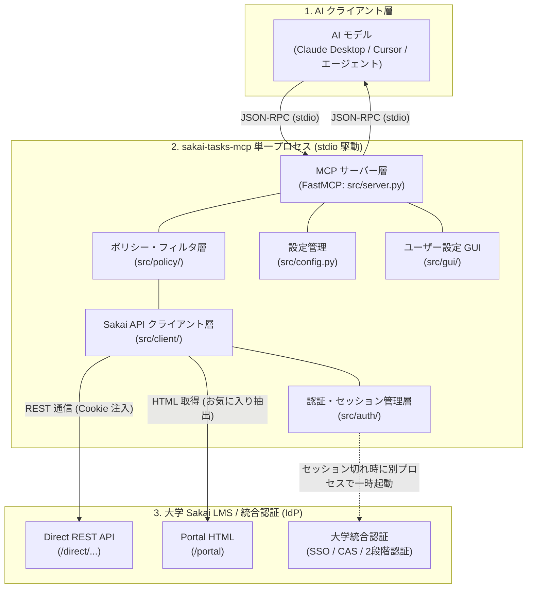
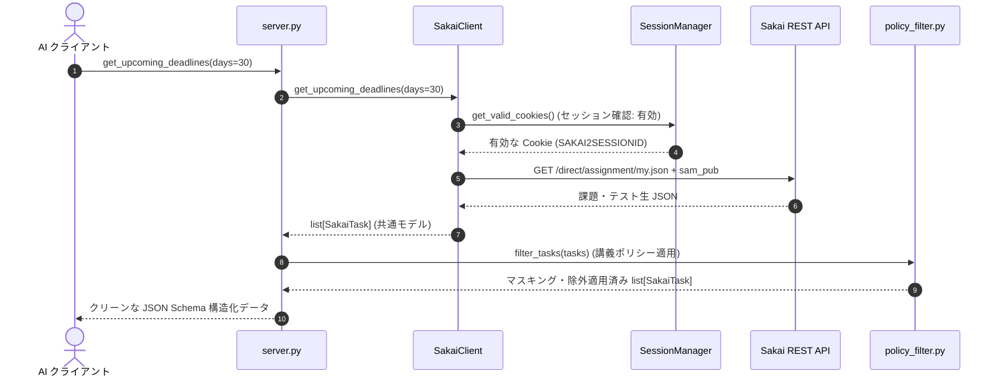
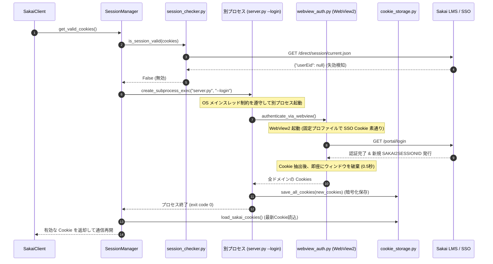
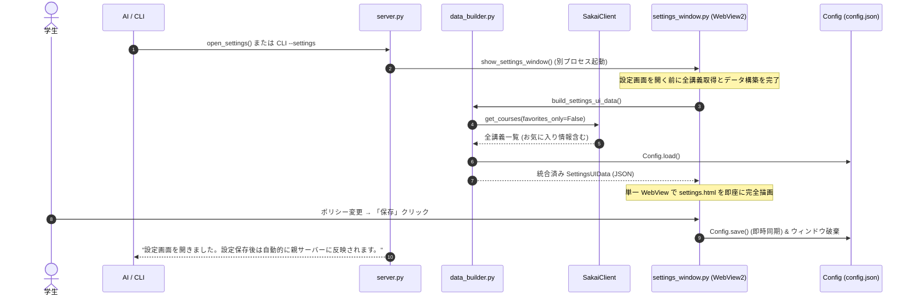
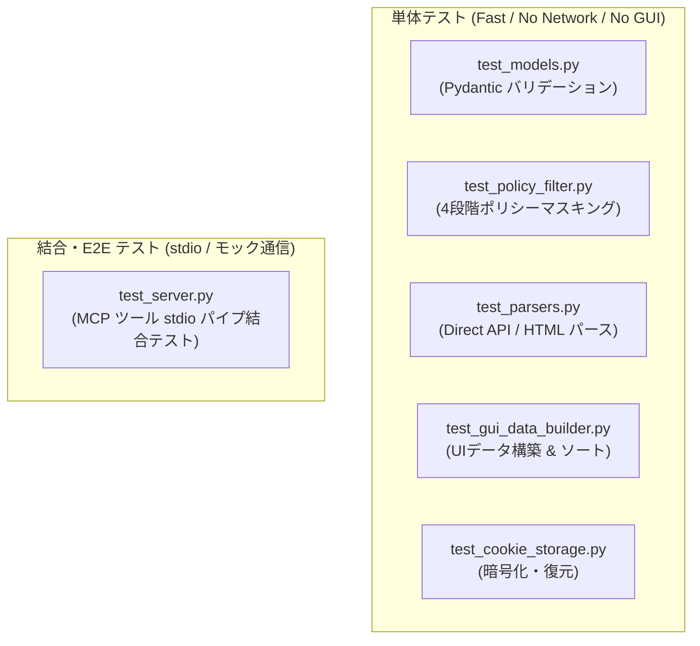

# Sakai-Tasks-MCP システム解説書・開発者ガイド

## 1. プロジェクトの目的と全体アーキテクチャ

### 1.1 システム概要 & 目的

**`sakai-tasks-mcp`** は、大学 LMS「Sakai」とデスクトップ AI アシスタント（Claude Desktop, Cursor 等）を安全に接続するデスクトップ MCP サーバーです。課題・小テスト・お知らせ・講義資料などのタスク情報を、**Model Context Protocol (MCP)** を通じてオンデマンドに AI へ提供します。

常駐プロセスやバックグラウンドサービスは不要です。AI クライアントからサブプロセスとして起動され、標準入出力（stdio）を介してオンデマンドに JSON-RPC 通信を行います。学生は AI との自然言語対話を通じて、直近の締切や重要連絡を瞬時に把握できます。



---

### 1.2 主要アーキテクチャ設計原則

本システムは、堅牢性・セキュリティ・配布容易性を両立するため、以下の 4 大原則に基づいて設計されています。

1. **標準入出力 (stdio) の厳格な保護**:
   * MCP プロトコルは標準入出力を JSON-RPC 通信チャネルとして占有します。`print()` などの stdout 出力は通信プロトコルを破壊するため**厳禁**です。すべてのログ・デバッグ出力は `sys.stderr` または `logging`（stderr ハンドラ）に統一します。
2. **セキュア・バイ・デフォルト (Secure by Default)**:
   * 講義別の AI 利用権限は、未設定・新規講義においてすべて **`TEXT_ONLY`（強: ファイルダウンロード禁止）** をデフォルトとします。教員の講義資料ファイルが意図せず外部 AI に送信される事故を構造的に排除します。
3. **高凝集・疎結合 & 純粋関数設計**:
   * レスポンスパース（`src/client/parsers/`）、セキュリティフィルタ（`src/policy/policy_filter.py`）、UI データ構築（`src/gui/data_builder.py`）は、外部状態や GUI に依存しない**純粋関数**として実装し、高い単体テスト容易性を確保します。
4. **ゼロ・インストール配布 (Zero Setup for Students)**:
   * Python 環境を持たない学生でも、配布 ZIP を展開して設定ファイルにパスを追記するだけで即座に利用できるよう、公式ポータブル Python ランタイム（Windows: Embeddable Python / macOS: python-build-standalone）を同梱して配布します。

---

## 2. 動作機構とエンドツーエンド・データフロー

システムの振る舞いを、代表的な 3 つの実行シナリオに分けて解説します。

### 2.1 シナリオ 1: 課題・直近締切の通常取得フロー

学生が AI に「今週締切の課題はある？」と尋ねた場合のデータフローです。



1. **ツール呼び出し**: AI が stdio 経由で `get_upcoming_deadlines(days=30)` を送信します。
2. **セッション検証**: `SessionManager` がローカルに保存された Cookie の有効性を確認し、即座に返却します。
3. **データ取得 & パース**: `SakaiClient` が Sakai Direct REST API から生データを並行取得し、パーサーが共通モデル `list[SakaiTask]` へ正規化します。
4. **ポリシーフィルタ**: `policy_filter.py` が講義ごとの権限ポリシーを適用し、非許可データのマスキングや除外を行います。
5. **返却**: 安全に整形された構造化データが FastMCP 経由で AI に返却され、ユーザーへの自然言語回答が生成されます。

---

### 2.2 シナリオ 2: セッション失効時のオンデマンド自動再認証フロー

Cookie の有効期限（24 時間スライディングタイムアウト等）が切れていた場合のデータフローです。
WebView2 (pywebview) は OS のメインスレッドで動作する必要があります。そのため、非同期イベントループ内からは直接画面を開けません。本システムでは **別プロセス (`server.py --login`) を起動してメインスレッドで認証を完結** させ、この制約を安全にクリアします。



* **0.5 秒の自動素通り認証**: 固定プロファイル（`WEBVIEW_DATA_DIR`）に保存された大学 SSO（IdP / Microsoft 365 等）の永続 Cookie を利用するため、画面を表示することなく裏で高速にセッションが更新されます（※SSO Cookie 自体が存在しない初期実行時のみ、手動ログイン用ウィンドウが表示されます）。
* **暗号化保存**: 抽出された Cookie は、OS 資格情報ストア（`keyring`）と共通鍵暗号（`Fernet`）により `session.enc` へ安全に保存されます。

---

### 2.3 シナリオ 3: ユーザー設定 GUI 起動・保存フロー

AI または CLI から設定画面を起動し、講義別ポリシーを変更するデータフローです。
設定中も AI との対話を継続できるよう、**設定画面は別プロセス（`--settings`）でポップアップ起動** します。



* **stdio 非ブロッキング**: `open_settings` ツールは `subprocess.Popen` で別プロセスを起動するため、標準入出力通信を一切ブロックしません。
* **事前データ構築**: ウィンドウ表示前に `build_settings_ui_data()` が非同期で全講義一覧とお気に入り情報を取得し、既存設定とマージした `SettingsUIData` を構築します。画面描画時のチラつきや二重起動を防ぎます。
* **動的設定反映**: 設定保存時、親プロセス側の `Config.get_course_policy()` がファイルの更新日時（mtime）を自動検知し、サーバーを再起動することなく最新設定を即時反映します。

---

## 3. 公開 MCP ツール仕様 & AI ユースケース

### 3.1 全 11 種類の公開 MCP ツール仕様一覧

`src/server.py` は、FastMCP デコレータ（`@mcp.tool()`）を用いて以下の 11 個のツールを公開します。すべてのツールは、データ返却直前に対応するポリシーフィルタを適用します。

| MCP ツール名 | 引数 (デフォルト値) | 適用ポリシーフィルタ | 役割・動作仕様 |
| :--- | :--- | :--- | :--- |
| **`list_courses`** | `favorites_only: bool = True` | `filter_courses` | 履修・所属講義一覧を取得。お気に入り講義を優先取得し、未設定時は全講義にフォールバック。 |
| **`get_assignments`** | `site_id: str \| None = None`<br/>`assignment_id: str \| None = None`<br/>`favorites_only: bool = True`<br/>`include_details: bool = True` | `filter_tasks` | 課題一覧または個別課題の詳細指示文・提出期限・添付ファイル情報を取得。 |
| **`get_quizzes`** | `site_id: str \| None = None`<br/>`favorites_only: bool = True` | `filter_tasks` | 小テスト・クイズ一覧を取得。対象講義の SAMIGO API を並行取得して統合。※Sakai の仕様上、全テストが未受験判定となります。 |
| **`get_upcoming_deadlines`** | `days: int \| None = None`<br/>`favorites_only: bool = True` | `filter_tasks` | 直近の未提出課題・テストを締切順に統合取得。未指定時は `Config.DEFAULT_DEADLINE_DAYS` (30日) を適用。**締切質問時の最優先ツール**。 |
| **`get_announcements`** | `site_id: str \| None = None`<br/>`announcement_id: str \| None = None`<br/>`n: int \| None = None`<br/>`favorites_only: bool = True`<br/>`include_details: bool = True` | `filter_announcements` | お知らせ・連絡事項一覧または詳細を取得。`n` 未指定時は `Config.DEFAULT_ANNOUNCEMENT_LIMIT` (7件) を適用。 |
| **`get_calendar_events`** | `site_id: str \| None = None`<br/>`start_date: str \| None = None`<br/>`end_date: str \| None = None`<br/>`event_type: str \| None = None` | `filter_calendar_events` | 講義カレンダーの予定・イベント一覧を取得。日付は ISO 8601 文字列で指定。 |
| **`get_course_materials`** | `site_id: str` (必須)<br/>`files_only: bool = False` | `filter_course_materials` | 指定講義の授業資料・配布ファイル一覧を取得。`files_only=True` でフォルダを除外。 |
| **`get_course_dashboard`** | `site_id: str` (必須) | `filter_dashboard` | 指定講義の課題・テスト・お知らせ・資料を 1 発で並行取得し、統合ダッシュボードモデル（`CourseDashboard`）を返却。 |
| **`download_material`** | `url: str` (必須)<br/>`save_path: str` (必須) | `check_download_allowed_by_url` | 講義資料や課題添付ファイルを指定パスへダウンロード保存。ポリシー違反時はダウンロードを拒否。 |
| **`open_settings`** | *(引数なし)* | *(不要)* | ユーザー設定画面 (WebView GUI) を別プロセスで起動。stdio をブロックせず対話を継続可能。 |
| **`get_settings`** | *(引数なし)* | *(不要)* | 現在の設定一覧（接続ホスト名、講義別ポリシー等）を取得。ポリシー制限理由の説明時などに利用。 |
| **`check_auth_status`** | *(引数なし)* | *(不要)* | セッション有効性を静的確認（`userEid` 検査）。失効時は再ログイン案内を返し、強制的な画面表示は行わない。 |

---

### 3.2 代表的な対話ユースケース (Use Cases)

AI アシスタントと学生の対話例と、内部で実行される MCP ツールの対応関係です。

#### ユースケース 1: 直近締切の確認（第一選択）
* **学生の発言**: 「今週締切の課題やテストはある？」
* **AI の挙動**: `get_upcoming_deadlines(days=7)` を呼び出します。
* **返却データ**: 提出期限順にソートされた未提出の通常課題および小テスト一覧。AI は締切が近い順に整理して分かりやすく回答します。

#### ユースケース 2: 講義の総合状況レポート
* **学生の発言**: 「『アルゴリズム基礎』の課題や連絡事項の状況を全部教えて」
* **AI の挙動**: 講義一覧から ID を特定後、`get_course_dashboard(site_id="2024_algo_01")` を 1 回呼び出します。
* **返却データ**: 当該講義の課題、テスト、最新お知らせ、講義資料が一括返却されます。個別ツールを何度も往復することなく、低遅延で総合ダッシュボードを提示できます。

#### ユースケース 3: 緊急連絡・休講情報の確認
* **学生の発言**: 「最新の休講情報や教室変更の連絡はある？」
* **AI の挙動**: `get_announcements(n=5, include_details=True)` を呼び出します。
* **返却データ**: 全履修講義の最新お知らせ。タイトルや本文から「休講」「教室変更」「緊急」といったキーワードを抽出して要約します。

#### ユースケース 4: 課題指示文のピンポイント抽出
* **学生の発言**: 「第 3 回レポート課題の詳しい要件と提出形式を教えて」
* **AI の挙動**: `get_assignments(assignment_id="...", include_details=True)` を呼び出します。
* **返却データ**: HTML タグが除去・整形された課題本文、提出期限、許容ファイル形式。学生はブラウザを開くことなく要件を確認できます。

#### ユースケース 5: 講義別 AI 利用ポリシーの確認と変更案内
* **学生の発言**: 「この講義のレジュメ PDF を読んで要約してほしい」
* **AI の挙動**: 当該講義が `TEXT_ONLY`（デフォルト）の場合、`download_material` は拒否されます。AI は `get_settings` で現状を確認し、「現在の講義ポリシーが『ファイルDL禁止（TEXT_ONLY）』に設定されています。設定画面を開いてポリシーを変更しますか？」と案内し、`open_settings()` を呼び出して設定画面を起動します。

---

## 4. 内部レイヤ構成 & モジュール詳細仕様

本システムは高凝集・疎結合な 6 つのレイヤで構成されています。

```text
sakai-tasks-mcp/
├── src/
│   ├── config.py             # 設定値・定数・動的同期 (Config, AIPolicyMode)
│   ├── models.py             # 共通 Pydantic データモデル定義
│   ├── auth/                 # 【認証】pywebview 自動再認証・暗号化ストレージ
│   │   ├── session_manager.py
│   │   ├── session_checker.py
│   │   ├── cookie_storage.py
│   │   └── webview_auth.py
│   ├── client/               # 【API】Sakai Direct REST API 通信 & パース
│   │   ├── sakai_client.py
│   │   ├── endpoints.py
│   │   └── parsers/          # 純粋関数パーサー群 (base, course, favorite, assignment 等)
│   ├── policy/               # 【ポリシー】講義別 AI 利用権限マスキング
│   │   └── policy_filter.py
│   ├── gui/                  # 【GUI】ユーザー設定用デスクトップ画面
│   │   ├── data_builder.py
│   │   ├── api.py
│   │   ├── settings_window.py
│   │   └── templates/
│   └── server.py             # 【MCP】FastMCP エントリポイント & ツール公開
└── tests/                    # 単体・結合テスト群
```

---

### 4.1 共通データモデル層 (`src/models.py`)

システム全体で共通利用される Pydantic v2 モデル定義です。全フィールドに `description` を付与し、AI が MCP 経由で各項目の意味を正確に解釈できるようにしています。

* **主要モデル**:
  * `SakaiTask`: 通常課題と小テストを統合したタスク表現モデル（`id`, `title`, `site_id`, `site_title`, `due_time`, `status`, `task_type` 等）。
  * `CourseSite`: 講義情報モデル（`id`, `title`, `is_favorite`, `term` 等）。
  * `Announcement`: お知らせ情報モデル（`id`, `title`, `site_id`, `body`, `created_at` 等）。
  * `CalendarEvent`: カレンダー予定モデル（`id`, `site_id`, `title`, `start_time`, `end_time` 等）。
  * `CourseMaterial`: 講義資料モデル（`id`, `site_id`, `name`, `url`, `is_collection`, `size` 等）。
  * `CourseDashboard`: 講義総合ダッシュボードモデル。
  * `SettingsUIData`: 設定画面描画用の統合データモデル。
* **防御的設計**: 将来の Sakai バージョンアップに伴う未知のフィールド追加に対応するため、`extra = "ignore"` を標準としています。日時文字列はすべて ISO 8601（JST）形式に統一されます。

---

### 4.2 認証・セッション管理層 (`src/auth/`)

Sakai API へのアクセスに必要なセッション Cookie（`SAKAI2SESSIONID`）のライフサイクルを管理します。

* **`session_checker.py`**:
  * `/direct/session/current.json` へ疎通確認を行います。
  * **特殊な失効挙動**: セッション失効時でも `401 Unauthorized` ではなく、**`200 OK` で `{"userEid": null}` を返す** ため、`userEid is not None` で真のログイン状態を判定します。
* **`cookie_storage.py`**:
  * `platformdirs.user_data_dir("sakai-tasks-mcp") / "session.enc"` に Cookie を暗号化保存します。
  * 暗号化キーは OS 資格情報ストア（Windows: DPAPI / macOS: Keychain）へ `keyring` ライブラリ経由で格納し、`Fernet`（AES-128-CBC + HMAC-SHA256）で暗号化します。
* **`session_manager.py`**:
  * セッション失効を検知した場合、`asyncio.Lock` で多重再認証を防止しつつ、`asyncio.create_subprocess_exec(sys.executable, sys.argv[0], "--login", ...)` により別プロセスで `webview_auth.py` を起動します。
* **`webview_auth.py`**:
  * OS メインスレッドで Edge WebView2 / WebKit を起動し、大学 SSO の永続 Cookie を用いて 0.5 秒の自動素通り再認証を実行します。

---

### 4.3 Sakai REST API クライアント & パーサー層 (`src/client/`)

Sakai LMS との非同期 HTTP 通信およびデータ正規化を担います。

* **Direct REST API (EntityBroker) の利用**:
  * 課題（`/direct/assignment/my.json`）、小テスト（`/direct/sam_pub/context/{siteId}.json`）、お知らせ（`/direct/announcement/user.json`）、カレンダー（`/direct/calendar/my.json`）、授業資料（`/direct/content/site/{siteId}.json`）に対して非同期通信（`httpx.AsyncClient`）を行います。
* **お気に入り講義の補正抽出 (`favorite_parser.py`)**:
  * Sakai 公式の講義一覧 API にはお気に入りフラグが含まれないため、京都大学等で開発された Comfortable Sakai の知見に基づき、`/portal` の HTML DOM から `.fav-sites-entry` を解析してお気に入り講義 ID を高速に抽出し、API データとマージします。
* **日時形式の自動正規化 (`parsers/base.py`)**:
  * 課題 API の秒単位オブジェクト `{ "epochSecond": 1712600000, "nano": 0 }` と、テスト・お知らせ・カレンダーのミリ秒数値 `1712600000000` の差異を `parse_datetime()` 関数で自動判別し、ISO 8601（JST）文字列へ正規化します。
* **Singleflight 機構 & インメモリキャッシュ**:
  * 同一エンドポイントへの重複リクエスト合流制御および TTL キャッシュ（既定 300 秒）を備え、Sakai サーバーへの不要な負荷集中を防止します。

---

### 4.4 講義別 AI 利用ポリシー層 (`src/policy/`)

講義ごとに定義された AI 利用権限に基づき、データのマスキングおよび除外を行う純粋関数モジュール（`policy_filter.py`）です。

#### 4 段階の権限レベル (`AIPolicyMode`)
1. **`ALLOW_ALL` (全て)**:
   * 完全アクセス。講義資料ダウンロード、課題指示文、お知らせ本文、締切すべて利用可能。
2. **`TEXT_ONLY` (強 / ★デフォルト)**:
   * テキストのみ。課題指示文やお知らせ本文は取得可能だが、PDF・Office 文書等のファイル実体ダウンロードを禁止。講義資料一覧は空リストを返し、課題の添付ファイル一覧もマスク。
3. **`SCHEDULE_ONLY` (弱)**:
   * 締切・予定のみ。課題指示文やお知らせ本文を `"[講義ポリシーにより非表示]"` とマスキング。ファイルダウンロードも禁止。タイトル・締切日時・ステータス・カレンダー予定のみ利用可能。
4. **`BLOCKED` (無効)**:
   * 完全除外。講義一覧を含め、当該講義のすべてのデータ（課題・テスト・連絡・予定）を AI から完全に隠蔽。

#### ポリシー別マスキング詳細対応表

| 対象データ種別 | `ALLOW_ALL` | `TEXT_ONLY` (デフォルト) | `SCHEDULE_ONLY` | `BLOCKED` |
| :--- | :--- | :--- | :--- | :--- |
| **講義一覧 (`CourseSite`)** | そのまま表示 | そのまま表示 | そのまま表示 | **完全除外 (リストから消失)** |
| **課題・テスト (`SakaiTask`)** | 指示文・添付 URL 保持 | 指示文保持、添付 URL 空配列 | 指示文を `[非表示]` マスク、添付 URL 空配列 | **完全除外** |
| **お知らせ (`Announcement`)** | 本文・添付保持 | 本文保持、添付 URL 空配列 | 本文を `[非表示]` マスク、添付 URL 空配列 | **完全除外** |
| **カレンダー (`CalendarEvent`)** | そのまま表示 | そのまま表示 | そのまま表示 | **完全除外** |
| **講義資料一覧 (`CourseMaterial`)**| 一覧完全取得 | **空リスト `[]` を返却** | **空リスト `[]` を返却** | **空リスト `[]` を返却** |
| **資料ダウンロード (`download_material`)** | **ダウンロード許可** | **拒否 (`PermissionError`)** | **拒否 (`PermissionError`)** | **拒否 (`PermissionError`)** |

---

### 4.5 設定管理 & ユーザー設定 GUI 層 (`src/config.py`, `src/gui/`)

設定値の一元管理と、学生向けの設定変更デスクトップ画面を提供します。

* **設定管理 (`src/config.py`)**:
  * `platformdirs.user_data_dir("sakai-tasks-mcp") / "config.json"` に設定を保存。
  * `sakai_host`（接続ドメイン名）、`policies`（講義別ポリシー）、`default_deadline_days`（締切日数）、`default_announcement_limit`（お知らせ件数）を管理。
  * `Config.get_course_policy(site_id)` はファイルの mtime を監視しており、別プロセスでの GUI 設定保存を即時に検知してリロードします。
* **GUI の 3 ファイル責務分離 (`src/gui/`)**:
  1. **`data_builder.py`**: Sakai から講義一覧を取得し、既存設定とマージしてお気に入り優先にソートした単一 JSON モデル（`SettingsUIData`）を非同期構築（GUI 非依存の純粋関数）。
  2. **`api.py`**: JavaScript と Python の通信ブリッジ（`get_initial_data()`, `save_settings(json)`）。
  3. **`settings_window.py`**: 事前構築済みデータをバインドした単一 WebView ウィンドウを起動するコントローラー。

---

### 4.6 MCP サーバーエントリポイント (`src/server.py`)

CLI 引数の処理とサーバー起動を司るメインモジュールです。

```python
# CLI オプション処理の概要
parser = argparse.ArgumentParser(description="Sakai Tasks MCP Server")
parser.add_argument("--host", type=str, help="Sakai LMS のホスト名")
parser.add_argument("--settings", action="store_true", help="ユーザー設定 GUI 画面を起動")
parser.add_argument("--setup", action="store_true", help="初回大学プリセット選択ダイアログを起動")
parser.add_argument("--login", action="store_true", help="WebView ログイン画面を別プロセスで実行して Cookie を保存")
```

* `--login` 指定時: メインスレッドで `authenticate_via_webview()` を実行し、Cookie を保存して即座に終了（終了コード 0）。
* `--settings` 指定時: 設定画面 GUI（`show_settings_window()`）を起動して終了。
* `--setup` 指定時: 初回大学プリセット選択ダイアログを起動して終了。
* 通常起動時: `Config.init()` を実行後、`mcp.run(transport="stdio")` により stdio 通信を開始。

---

## 5. ポータブルパッケージ配布 & クライアント設定

### 5.1 配布パッケージング仕様 (Portable Python Distribution)

#### 単一 exe 配布を避ける理由
* **アンチウイルス誤検知 (False Positive) の完全回避**: PyInstaller 等の単一 exe は Windows Defender や大学推奨セキュリティソフトに誤検知されやすいため、Python 公式の署名済み Embeddable Python ランタイムをそのまま配布します。
* **コードの透明性**: `src/` 配下にソースコードがそのまま配置されるため、ユーザーや大学管理者が挙動をいつでも監査できます。

#### パッケージ構成一覧
* **Windows 配布パッケージ (`sakai-tasks-mcp-windows/`)**:
  * `python-embed/`: 公式 Embeddable Python 3.12 ランタイム + `Lib/site-packages/`
  * `src/`: アプリケーションソースコード
  * `run.bat`: MCP 起動ランチャースクリプト
* **macOS 配布パッケージ (`sakai-tasks-mcp-macos/`)**:
  * `python/`: スタンドアロン Python ランタイム (`python-build-standalone`)
  * `src/`: アプリケーションソースコード
  * `run.sh`: MCP 起動ランチャースクリプト (`chmod +x`)

#### 起動ランチャー (`run.bat` / `run.sh`)
標準入出力を子プロセスへ透過し、パッケージルートを `PYTHONPATH` に設定して `from src...` のインポートを確実に解決します。

* **Windows (`run.bat`)**:
  ```bat
  @echo off
  setlocal
  cd /d "%~dp0"
  set "PYTHONPATH=%~dp0"
  "%~dp0python-embed\python.exe" "%~dp0src\server.py" %*
  ```
* **macOS (`run.sh`)**:
  ```bash
  #!/usr/bin/env bash
  SCRIPT_DIR="$(cd "$(dirname "$0")" && pwd)"
  export PYTHONPATH="$SCRIPT_DIR:${PYTHONPATH:-}"
  exec "$SCRIPT_DIR/python/bin/python3" "$SCRIPT_DIR/src/server.py" "$@"
  ```

---

### 5.2 AI クライアント設定例 (MCP Client Configuration)

AI クライアントの設定ファイル（例: `claude_desktop_config.json`）に本サーバーを登録します。

#### Claude Desktop 設定例

* **Windows 配布パッケージ利用時**:
  ```json
  {
    "mcpServers": {
      "sakai-tasks": {
        "command": "C:\\Users\\username\\sakai-tasks-mcp\\run.bat"
      }
    }
  }
  ```

* **macOS 配布パッケージ利用時**:
  ```json
  {
    "mcpServers": {
      "sakai-tasks": {
        "command": "/Users/username/sakai-tasks-mcp/run.sh"
      }
    }
  }
  ```

* **開発時（仮想環境 Python を直接指定する場合）**:
  ```json
  {
    "mcpServers": {
      "sakai-tasks": {
        "command": "Z:\\home\\sy\\MyPrograms\\web\\sakai-tasks-mcp\\.venv\\Scripts\\python.exe",
        "args": [
          "Z:\\home\\sy\\MyPrograms\\web\\sakai-tasks-mcp\\src\\server.py"
        ]
      }
    }
  }
  ```

---

## 6. 開発ワークフローとテスト方針

### 6.1 開発環境セットアップ

```bash
# 1. 仮想環境の作成と有効化
python -m venv .venv
source .venv/bin/activate   # Windows: .\.venv\Scripts\activate

# 2. 依存パッケージのインストール
pip install -r requirements.txt
```

#### ブランチ運用ルール
* 本プロジェクトでは 1 ファイルに対して 1 つの Issue を割り当てています。
* Issue から作業ブランチを作成する際は、**必ず `dev` ブランチをソース** とし、ブランチ名は `feat/<issue番号>-<issue名>`（例: `feat/1-src-server`）とします。

---

### 6.2 テスト自動化方針

モジュール間の疎結合・純粋関数設計により、**外部 Sakai サーバーへの実通信や GUI 画面の起動を行わずに、ローカルで自動テストを完結** できます。



| テストファイル | テスト対象モジュール | 主な検証内容 |
| :--- | :--- | :--- |
| **`tests/test_models.py`** | `src/models.py` | 日時文字列・タイムスタンプ（秒/ミリ秒）の自動パース、Pydantic モデルのバリデーション。 |
| **`tests/test_policy_filter.py`** | `src/policy/policy_filter.py` | 4 段階のポリシー（`ALLOW_ALL`, `TEXT_ONLY`, `SCHEDULE_ONLY`, `BLOCKED`）に応じた正確なマスキング・除外・DL 拒否挙動。 |
| **`tests/test_parsers.py`** | `src/client/parsers/*` | Sakai 生 JSON の共通モデル変換、`/portal` HTML からのお気に入り講義 ID 抽出。 |
| **`tests/test_gui_data_builder.py`** | `src/gui/data_builder.py` | お気に入り講義（★）の先頭ソート、新規講義へのデフォルトポリシー（`TEXT_ONLY`）の自動注入。 |
| **`tests/test_cookie_storage.py`** | `src/auth/cookie_storage.py` | Fernet + keyring による Cookie 暗号化・復号の整合性。 |
| **`tests/test_server.py`** | `src/server.py` | stdio 経由での FastMCP ツールの呼出と正しい JSON Schema レスポンス返却。 |

#### テスト実行コマンド
```bash
# 全単体テストの実行
pytest tests/ -v

# カバレッジ測定
pytest --cov=src tests/
```

---

### 6.3 実装時の重要ルール

* **stdio 汚染厳禁**:
  * 開発中のデバッグであっても、`print()` を残してはなりません。JSON-RPC 通信が壊れ、MCP クライアントでツール呼び出しがタイムアウトまたは構文エラーになります。ログは必ず `sys.stderr.write()` または `logging` を使用してください。
* **純粋関数の維持**:
  * パーサーやポリシーフィルタ、UI データ構築モジュールには外部副作用（直接のネットワーク呼び出しや GUI 呼び出し）を持ち込まず、入力に対する純粋な変換ロジックとして保ちます。
