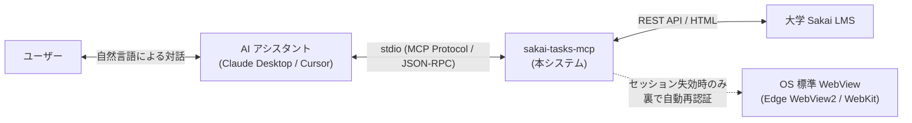
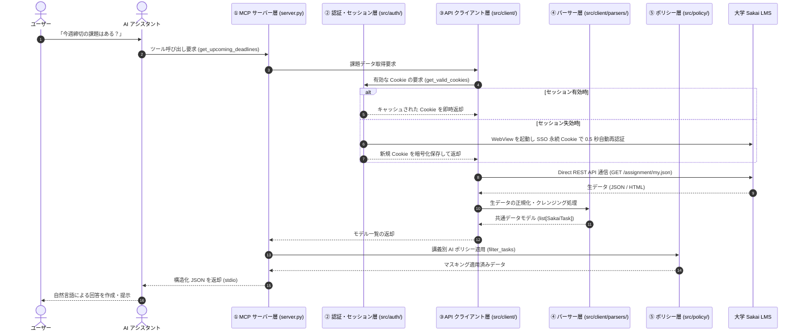

# Sakai-Tasks-MCP システム解説書

## 1. プロジェクトの目的

**`sakai-tasks-mcp`** は、大学等の教育機関で広く導入されている LMS（Learning Management System）「Sakai」と、デスクトップ上の AI アシスタント（Claude Desktop, Cursor 等）を **Model Context Protocol (MCP)** を介して安全に接続するデスクトップ MCP サーバーである。

ユーザーが AI アシスタントと自然言語で対話することにより、Sakai LMS 内のタスクや重要連絡をオンデマンドで取得・要約し、以下の機能を提供する。

* **直近締切の自動抽出**: 直近に提出期限を迎える課題および小テストの一括把握
* **課題要件の迅速な確認**: 課題の指示文や提出要件のピンポイント抽出および要約
* **重要アナウンスの集約**: 全履修講義における休講・教室変更・緊急連絡の要約
* **講義総合ダッシュボードの生成**: 講義ごとの課題・テスト・連絡・資料の一括レポート作成
* **セキュア・バイ・デフォルトの適用**: 講義ごとの厳格な AI 利用権限制御による著作権・プライバシー保護

---

## 2. 動作機構と処理フロー

本システムは、AI アシスタントからのツール要求を受信してから最終的な応答を返却するまでの **一連の処理フロー** に基づき、高凝集・疎結合に設計された各モジュールが順次連携して動作する。

---

### 2.1 要求受付と通信ルーティング（MCP サーバー層: `src/server.py`）
1. AI クライアント（Claude Desktop 等）は、標準入出力（stdio）経由で JSON-RPC 形式のツール呼び出し（例: `get_upcoming_deadlines`, `get_course_dashboard` 等）を送信する。
2. FastMCP フレームワークを実装した `server.py` がリクエストを受け付け、スキーマ検証を行った上で内部のデータ取得処理へルーティングする。
3. **stdio の保護原則**: MCP プロトコルでは標準出力が JSON-RPC の通信チャネルとして占有されるため、システム内のすべてのログ・デバッグ出力は標準エラー出力（`stderr`）に統一して出力される。

---

### 2.2 セッション管理と自動再認証（認証層: `src/auth/`）
Sakai API へのアクセスにはログイン済みのセッション Cookie（`SAKAI2SESSIONID`）が必要となる。本層は外部モジュールに対してセッション管理の詳細を隠蔽し、常に有効な Cookie を提供する。

1. **セッション有効性判定 (`session_checker.py`)**:
   Sakai のセッション確認エンドポイント（`/direct/session/current.json`）に対し、ローカルに保存された Cookie を用いて疎通確認を行う。`userEid` が有効な値を持つか否かでログイン状態を判定する。
2. **WebView による自動素通り再認証 (`webview_auth.py`)**:
   セッション切れ検知時、OS 組み込みのブラウザエンジン（Windows: Edge WebView2 / macOS: WebKit）をバックグラウンドで起動する。固定プロファイルに保持された大学 SSO（IdP / Microsoft 365 等）の永続 Cookie を利用し、**画面を表示することなく約 0.5 秒で自動再認証** を完了する（※初期実行時など SSO Cookie 自体が存在しない場合のみ、ユーザー入力用ログイン画面を前面表示する）。
3. **暗号化ストレージ (`cookie_storage.py`)**:
   抽出された Cookie 群は、OS の資格情報ストアと連携した共通鍵暗号（Fernet / AES-128-CBC）により暗号化され、ローカルストレージへ安全に保存される。

---

### 2.3 データ取得と通信制御（API クライアント層: `src/client/`）
有効な Cookie を付与し、Sakai LMS に対する非同期 HTTP 通信（`httpx`）を実行する。

* **Direct REST API (EntityBroker) の利用**:
  課題（`/direct/assignment/my.json`）、小テスト（`/direct/sam_pub/...`）、お知らせ（`/direct/announcement/...`）等の公式 REST エンドポイントに対して非同期通信を行い、JSON データを高速に一括取得する。
* **お気に入り講義の補正抽出**:
  Sakai 公式の講義一覧 API には「お気に入り（ピン留め）」フラグが含まれないため、ポータル画面（`/portal`）の HTML から DOM 解析によりお気に入り講義 ID を抽出し、API データと統合する。
* **Singleflight 機構とキャッシュ**:
  同一エンドポイントに対する並行リクエストの合流処理（Singleflight）およびインメモリキャッシュ（TTL）を備え、Sakai サーバーへの負荷集中を防止する。

---

### 2.4 データ正規化とモデル変換（パーサー層: `src/client/parsers/` & モデル層: `src/models.py`）
Sakai API の生レスポンスには、日時の単位不統一（秒単位とミリ秒単位の混在）、不要な HTML タグの混入、プロパティ命名規則の揺れが存在する。

各パーサーは外部副作用を持たない**純粋関数**として設計されており、以下の正規化を行ってシステム共通の Pydantic v2 モデル（`SakaiTask`, `CourseSite`, `Announcement`, `CourseMaterial` 等）へ変換する。

* **日時形式の標準化**: ISO 8601（タイムゾーン付き標準フォーマット）への変換
* **HTML タグの除去**: 指示文・お知らせ本文からの不要タグ除去とテキスト整形
* **共通タスクモデルへの統合**: 通常課題と小テストの異なる API 構造を統合タスクモデル（`SakaiTask`）に吸収

---

### 2.5 セキュリティ・著作権ポリシー適用（ポリシー層: `src/policy/`）
正規化されたデータに対し、講義ごとに定義された AI 利用権限ポリシーを適用し、データのフィルタリングおよびマスキングを行う。

* **Secure by Default 原則**:
  新規登録された講義および未設定の講義には、自動的に **`TEXT_ONLY`（ファイルダウンロード禁止）** が適用される。教員の講義資料ファイルが意図せず外部 AI に送信される事故を構造的に排除する。
* **4 段階の権限レベル**:
  | 権限レベル (Enum) | 動作仕様 |
  | :--- | :--- |
  | **`ALLOW_ALL`** | 完全アクセス。資料ファイルのダウンロード、課題指示文、お知らせ、締切すべてを利用可能。 |
  | **`TEXT_ONLY`** (デフォルト) | テキストのみ。課題指示文やお知らせ本文は取得可能だが、PDF・Office 文書等のファイル実体ダウンロードを禁止。 |
  | **`SCHEDULE_ONLY`** | 締切・予定のみ。課題指示文や本文を `[非表示]` とマスキングし、締切日時のみ利用可能。 |
  | **`BLOCKED`** | 完全除外。講義一覧を含め、当該講義の存在自体を AI ツールから完全に隠蔽。 |

---

### 2.6 レスポンス返却および設定管理 GUI（設定・GUI 層: `src/gui/`, `src/config.py`）

1. **AI への返却**:
   ポリシー適用後の安全な構造化 JSON データが FastMCP を通じて AI クライアントへ返却され、AI がユーザー向けの回答を生成する（通常 0.2〜0.5 秒で完了）。
2. **ユーザー設定 GUI (`src/gui/`)**:
   ユーザーが講義ごとの権限ポリシーを変更する際、OS 標準の WebView ウィンドウを起動して設定画面を表示する。
   * **`data_builder.py`**: 講義一覧と設定ファイルを事前にマージし、画面描画用の統合データモデルを構築する。
   * **`settings_window.py`**: WebView ウィンドウを起動し、初期データを即座に画面へ注入する。
   * **`api.py`**: 画面上の設定変更を受け取り、ローカルの `config.json` に即時反映する。

---

### 2.7 モジュール構成と処理ステップ対応一覧

| ディレクトリ / ファイル | 処理フロー上のステップ | 主要な責務 |
| :--- | :--- | :--- |
| **`src/server.py`** | 2.1 / 2.6 | FastMCP サーバーのエントリポイント、ツール公開、通信調停 |
| **`src/auth/`** | 2.2 | Cookie の暗号化保存、セッション有効性検証、WebView 自動素通り認証 |
| **`src/client/`** | 2.3 | Sakai Direct REST API / Portal HTML との非同期 HTTP 通信 |
| **`src/client/parsers/`** | 2.4 | 生データのクレンジング、日時正規化、共通データモデル変換 |
| **`src/models.py`** | 2.4 | Pydantic v2 による型安全なシステム共通エンティティ定義 |
| **`src/policy/`** | 2.5 | 講義別 AI 利用ポリシーに基づくデータのマスキングおよび除外 |
| **`src/gui/`** | 2.6 (設定変更時) | 講義別権限設定を行うためのデスクトップ GUI 画面の提供 |
| **`src/config.py`** | 全体 | 設定ファイル（`config.json`）の管理およびシステム定数の定義 |
| **`scripts/`** | 配布・実行 | ポータブル Python 同梱パッケージのビルドおよび起動スクリプト |

